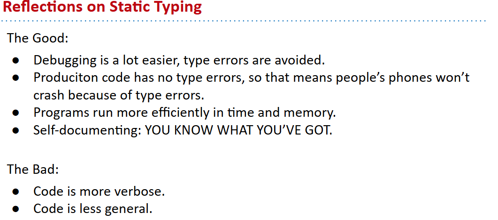

# 61B-1: Intro, Hello World Java

## java oop
Java is an object oriented language with strict requirements:
- Every Java file must contain a class declaration*.
- All code lives inside a class*, even helper functions, global constants, etc.
- To run a Java program, you typically define a main method using        
```java
public static void main(String[] args)
```
*: This is not completely true, e.g. we can also declare “interfaces” in .Java files that may contain code. We’ll cover these later.
## Java and Static Typing
The compiler checks that all the types in your program are compatible **before the program ever runs!**
This is unlike a language like Python, where type checks are performed DURING execution.

