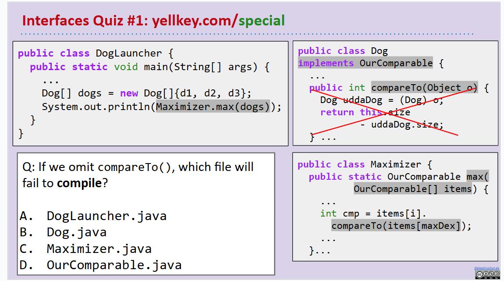

# 61B-10: Subtype Polymorphism vs. HoFs

# Subtype Polymorphism
**指的是可以使用父类类型的对象来引用子类类型的实例。**


# DIY Comparison
比较Object类对象时产生问题，如何比较？？？

考虑写一个**比较器**，比较两个Object对象

加深编译理解



# Comparable Interface
```java
public interface Comparable<T> {
    public int compareTo(T obj);
}
```


# Comparator Interface
```java
public interface Comparator<T> {
    public int compare(T obj1, T obj2);
}
```
### 两者的关系↓


总结
