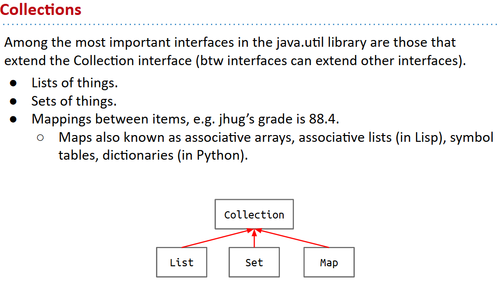
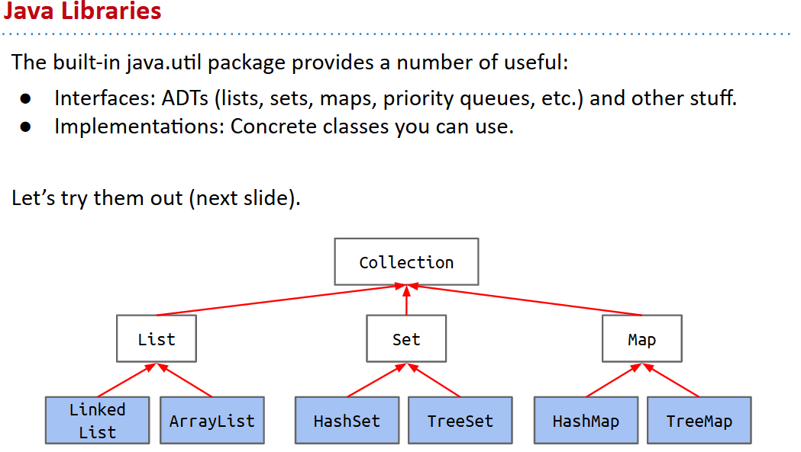
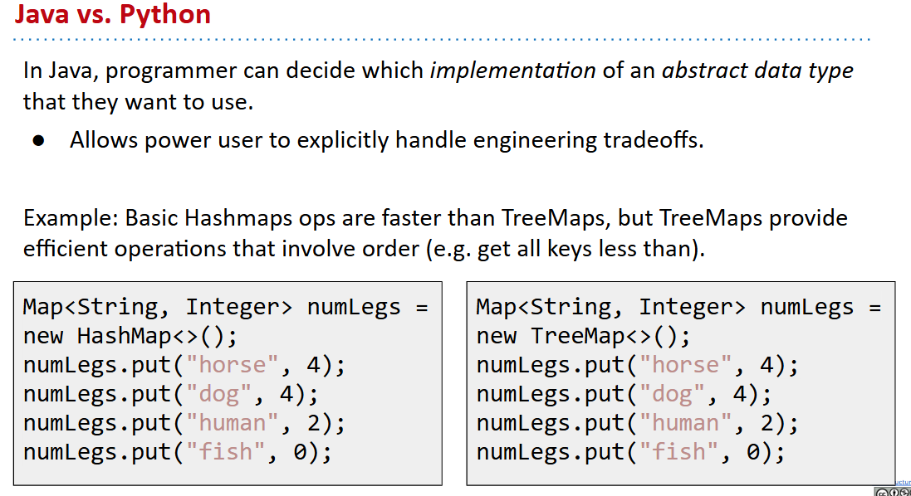
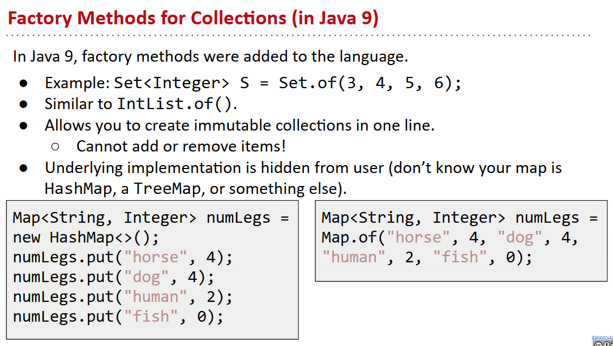
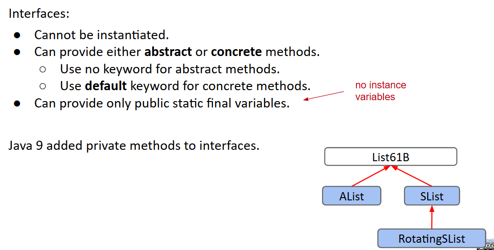
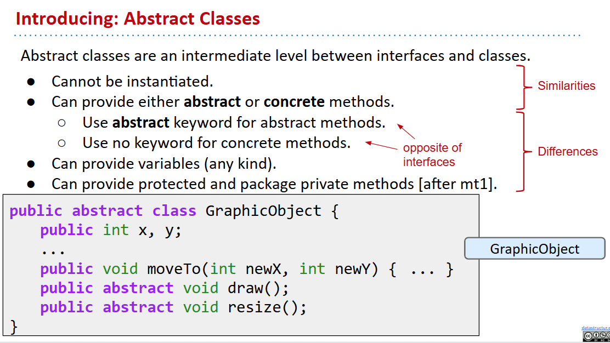
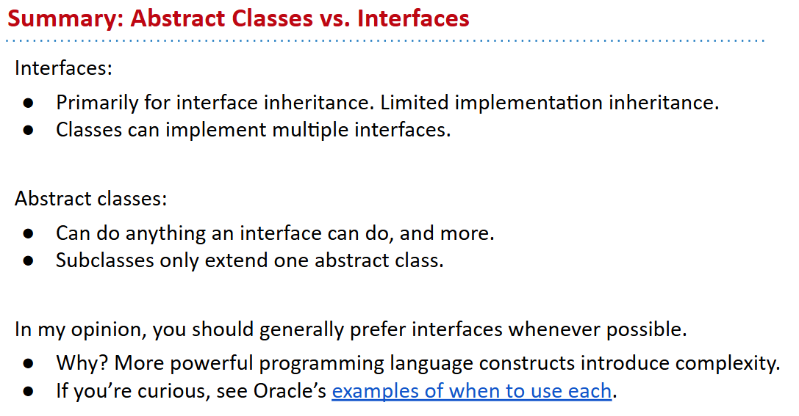
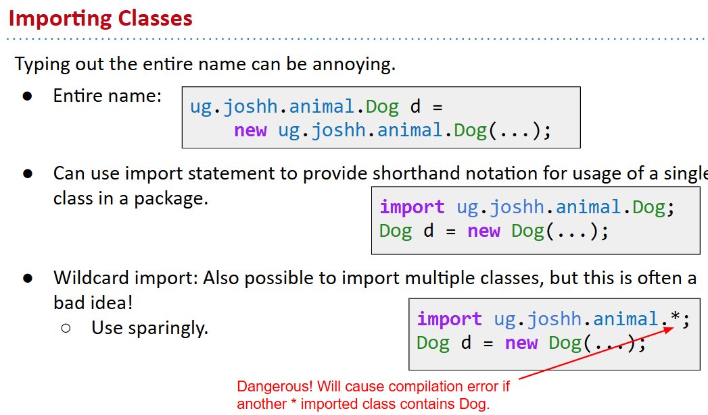

# 61B-11: Libraries, Abstract Classes, Packages


# Java Libraries
## Collections
- `Collections` is a package in Java that provides various utility classes for working with collections.


## Tasks引入
3 tasks, given the text of a book:
- Create a list of all words in the book.
- Count the number of unique words.
- Keep track of the number of times that specific words are mentioned.
#### #1 way set
```java
public static int countUniqueWords(List<String> words) {
	Set<String> ss = new HashSet<>();
	for (String s : words) {
   	    ss.add(s);    	
	}
	return ss.size();
}
public static int countUniqueWords(List<String> words) {
	Set<String> ss = new HashSet<>();
	ss.addAll(words);
	return ss;
}
```

#### #2 way map
```java
public static Map<String, Integer> 
        collectWordCount(List<String> words, List<String> targets) {
	Map<String, Integer> wordCounts = new HashMap<>();
	for (String s : targets) {
   	    wordCounts.put(s, 0);
	}
	for (String s : words) {
   	    if (wordCounts.containsKey(s)) {
          	int oldCount = wordCounts.get(s);
         	wordCounts.put(s, oldCount + 1);
   	    }      	
	}
	return wordCounts;
}
```
Python里面则是dict实现，咋一看似乎更好？但是？

Java9新特点：


# Interfaces and Abstract Classes 
More interface details:
- Can provide variables, but they are `public static final`.
- `final` means the value can never change.
- A class can implement multiple interfaces.

## interface summary

## abstract class intro

## 两者对比


# Packages
A **package** is a **namespace** that organizes classes and interfaces.

