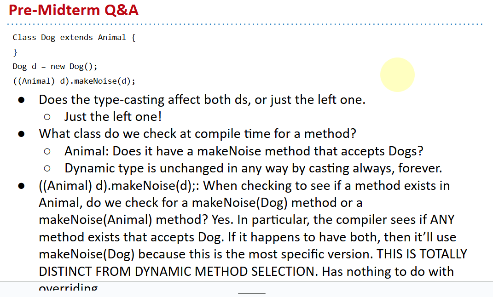
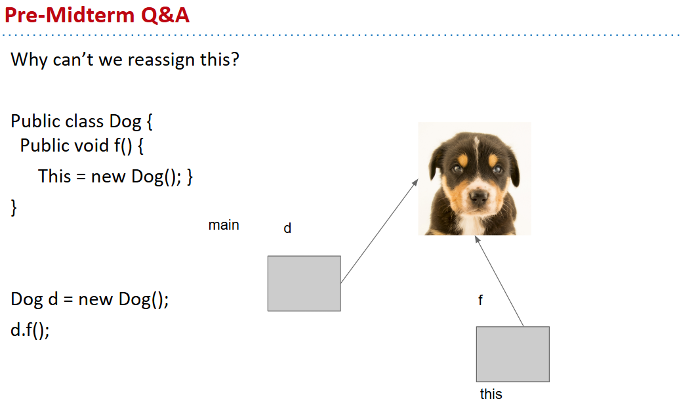

# 61B-12:  Coding in the Real World, Review

# Programming in the Real World
对技术要敬畏

# midterm review
- Comparing strings for equality using == vs .equals ---> see in **autoboxing** lecture




在Java中，`this` 是一个指向当前对象实例的引用。它通常用于引用当前类的实例成员，或者在方法中区分成员变量和局部变量。然而，你不能将 `this` 重新赋值为另一个对象的引用，因为 `this` 是一个固定的概念，它代表当前对象本身。

你提供的代码示例中，尝试将 `this` 赋值为一个新的 `Dog` 对象，这是不允许的。Java 编译器会报错，因为它违反了 `this` 的使用规则。


```java
public class Dog {
  public void f() {
      this = new Dog(); // 这行代码会导致编译错误，因为不能重新赋值this
  }
}

Dog d = new Dog();
d.f(); // 调用f()方法，但由于上面的错误，这行代码实际上无法执行
```

如果你想要创建一个新的 `Dog` 对象并将其引用赋给 `this`，你需要使用另一个变量，比如 `anotherDog`。下面是修改后的代码示例：

```java
public class Dog {
  public void f() {
      Dog anotherDog = new Dog(); // 创建一个新的Dog对象
      // 这里你可以使用anotherDog来引用新创建的Dog对象
  }
}

Dog d = new Dog();
d.f(); // 现在f()方法可以正常执行，没有编译错误
```

在这段修改后的代码中，`anotherDog` 变量用于存储新创建的 `Dog` 对象的引用，而 `this` 仍然保持其原始含义，即指向当前的 `Dog` 对象实例。

