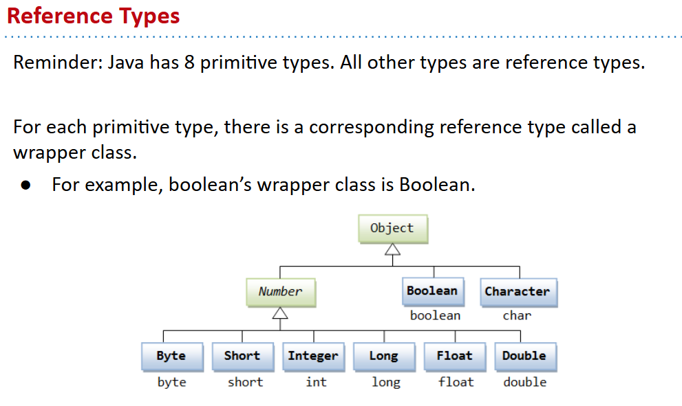
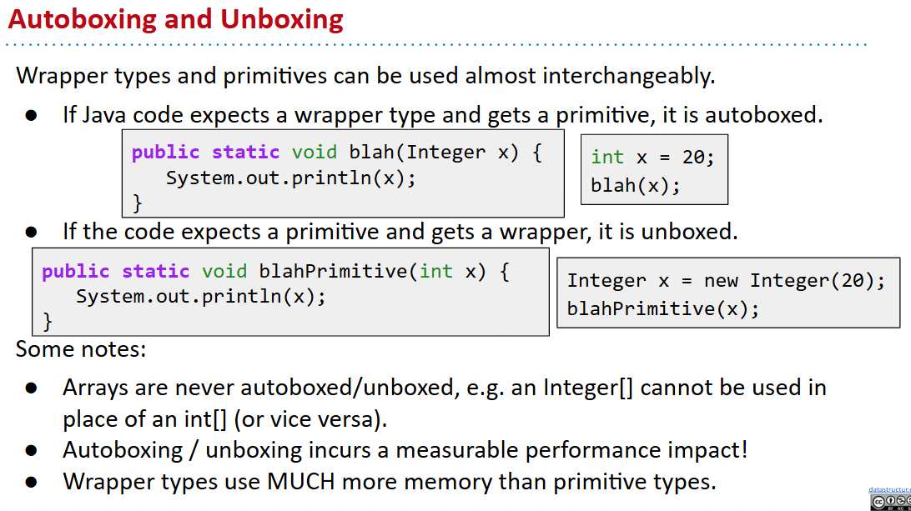
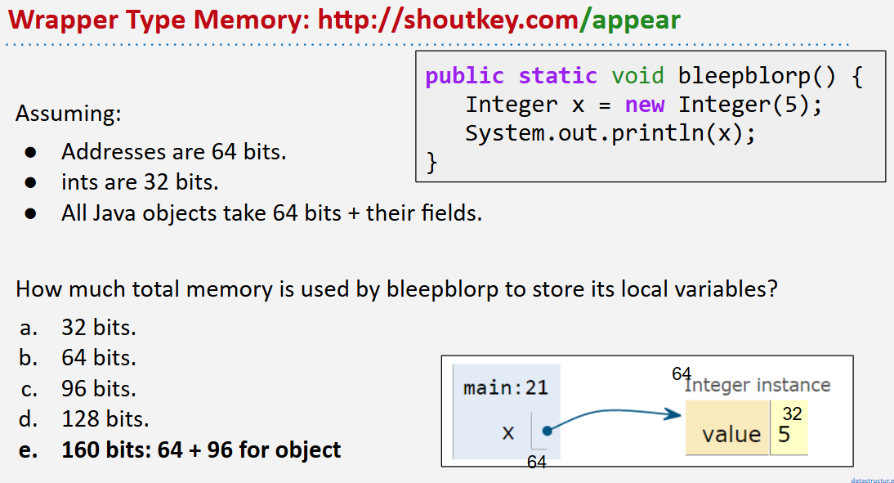

# 61B-13: Generics, Autoboxing


13-16几乎是java语法讲解:smile:
## Primitives Cannot Be Used as Actual Type Arguments

## Autoboxing

Wrapper Types Are (Mostly) Just Like Any Class



8种基本类型之间转换也存在widening

# Immutability
类似于`const`在cpp
```java
public class Date {
  public final int month;
  public final int day;
  public final int year;
  private boolean contrived = true;
  public Date(int m, int d, int y) {
    month = m; day = d; year = y;
  }
}
```
Warning: Declaring a reference as Final does not make object immutable.
- Example: public final ArrayDeque<String> d = new ArrayDeque<String>(); 
- The d variable can never change, but the referenced deque can!

见指针常量与常量指针的区别in C++

# Defining Generic Classes
Goal 1: Create a class ArrayMap with the following methods:
- put(key, value): Associate key with value. If -1, adds k and v to the last position of the arrays.
- containsKey(key): Checks to see if arraymap contains the key.
- get(key): Returns value, assuming key exists..
- keys(): Returns a list of all keys.
- size(): Returns number of keys.

```java
public class ArrayMap<K, V> {
    private K[] keys; 
    private V[] values;
    private int size;

    public ArrayMap() {
        keys = (K[]) new Object[100];
        values = (V[]) new Object[100];
        size = 0;
    }
    private int findKey(K key) {
        for (int i = 0; i < size; i++) {
            if (keys[i].equals(key)) {
                return i;
            }
        }
        return -1;
    }
    private int getKeyIndex(K key) {
        for (int i = 0; i < size; i++) {
            if (keys[i].equals(key)) {
                return i;
            }
        return -1;
        }
    }
    public void put(K key, V value) {
        int i = getKeyIndex(key);
        if (i > -1) {
            values[i] = value; return; }
        keys[size] = key;
        values[size] = value;
        size += 1;	
    } 
    public V get(K key) {       
        return values[findKey(key)];
    }
    public boolean containsKey(K key) {
   	int i = findKey(key);
   	return (i > -1);
    }
    public List<K> keys() {
        List<K> list = new ArrayList<K>();
        for (int i = 0; i < size; i++) {
            list.add(keys[i]);
        }
        return list;
    }
    public int size() {
        return size;
    }
}
```

# Generic Methods
Goal: Create a class MapHelper with two methods:
- get(Map61B, key): Returns the value corresponding to the given key in the map if it exists, otherwise null.
Unlike the ArrayMap’s get method, which crashes if the key doesn’t exist.
- maxKey(Map61B): Returns the maximum of all keys in the given ArrayMap. Works only if keys can be compared.
```java
public class MapHelper {
    public static <X,Z> Z get(ArrayMap<X,Z> map, X key) {
        if (map.containsKey(key)) {
            return map.get(key);
        } else {
            return null;
        }
    }
    public static <X extends Comparable<X>,Z> X maxKey(ArrayMap<X,Z> map) {
        X max = null;
        for (X key : map.keys()) {
            if (max == null || key.compareTo(max) > 0) {
                max = key;
            }
        }
        return max;
    }
}
```
