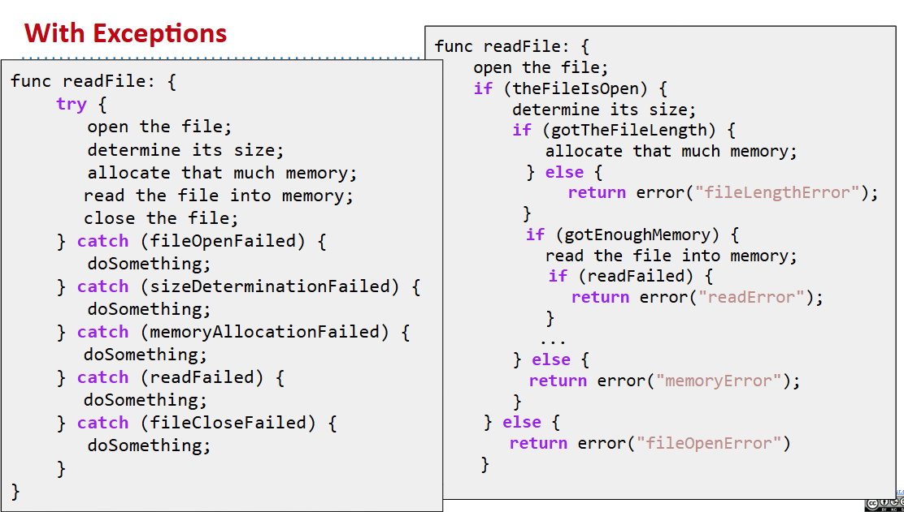
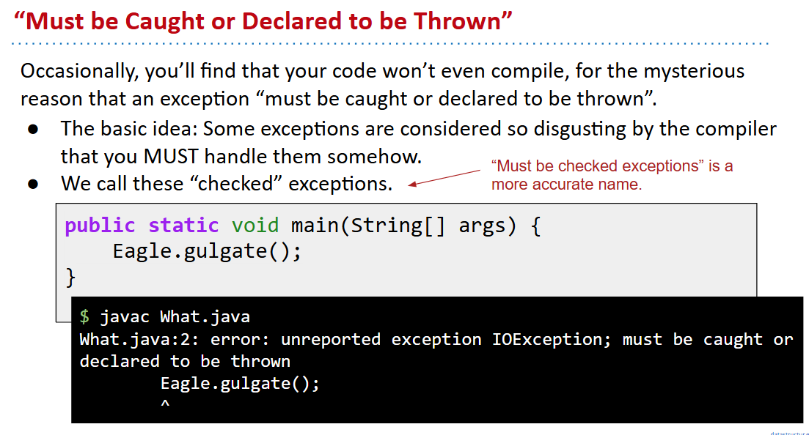
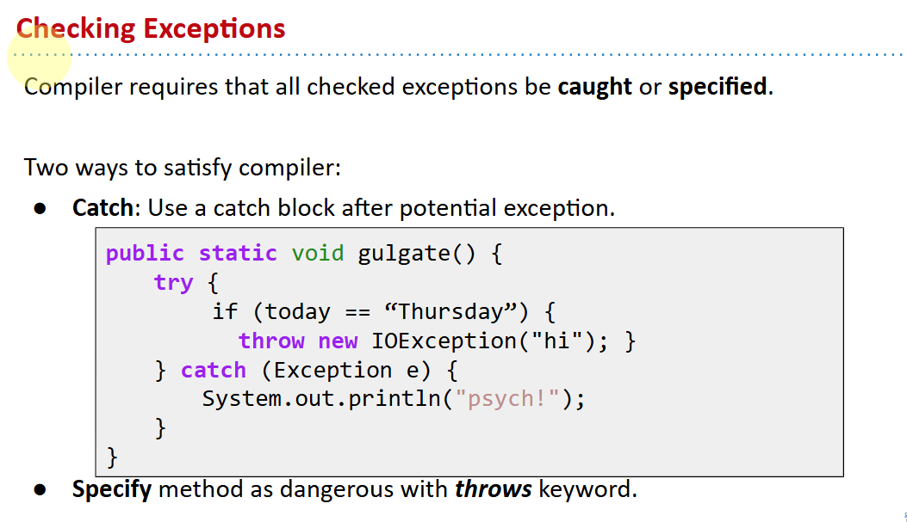
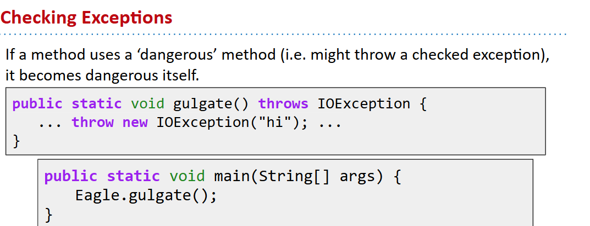
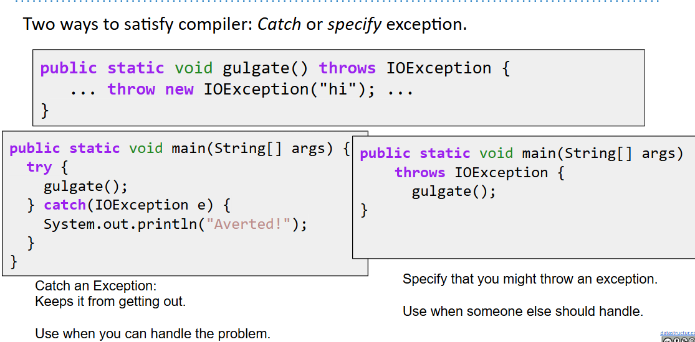
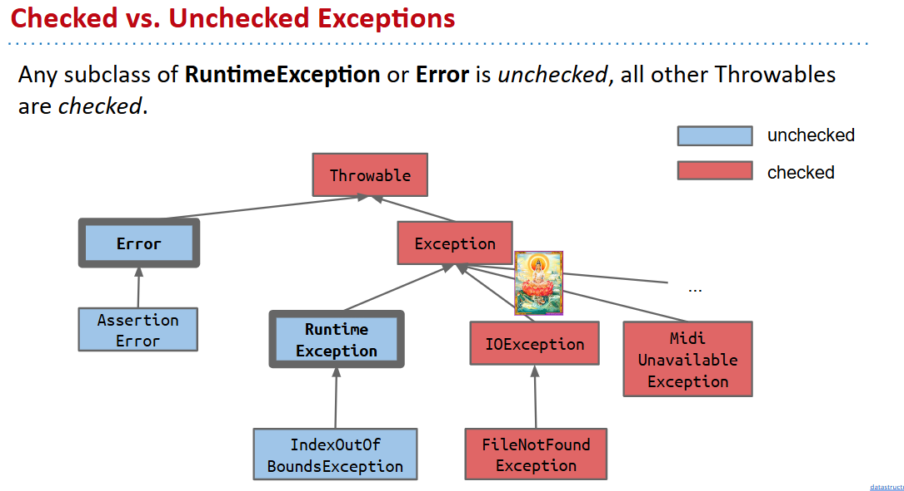
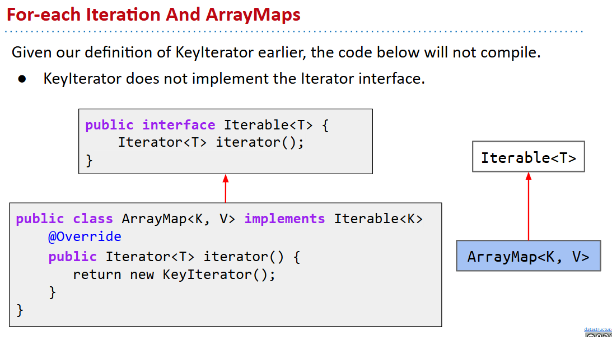
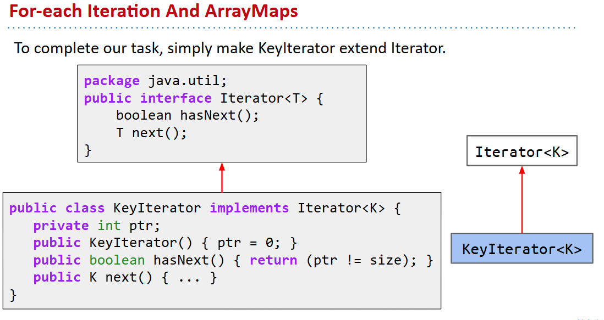

# 61B-14: Exceptions, Iterators, Iterables

# Exceptions
`throw` statement: throws an exception
```java
public V get(K key) {
   int location = findKey(key);
   if (location < 0) { throw new IllegalArgumentException("Key " + 
                            key + " does not exist in map.");  }
   return values[findKey(key)];
}
```
显式抛出异常
```java
public static void main(String[] args) {
    System.out.println("ayyy lmao");
    throw new RuntimeException("For no reason.");
}
```
## What has been Thrown, can be Caught
```java
Dog d = new Dog("Lucy", "Retriever", 80);
d.becomeAngry();
 
try {
    d.receivePat();
} catch (Exception e) {
    System.out.println(
     	"Tried to pat: " + e);
}
 
System.out.println(d);
```

由callstack顺序

exception是一种对象，有时可能见到的错误↓

最好明确怎么处理exception

```java
public static void gulgate() throws IOException {
   ... throw new IOException("hi"); ...
}
```

有时需要考虑main情况

上面没有明确处理

checked与否见种类


# Iteration
创建能支持`for (Item i : someIterable)`的情况
## The Iterable Interface
```java
public interface Iterable<T> {
    Iterator<T> iterator();
}
```

```java
package java.util;
public interface Iterator<T> {
    boolean hasNext();
    T next();
}
```
### 假如要遍历ArrayMap，需要对key进行操作


到此完成，可以执行遍历
