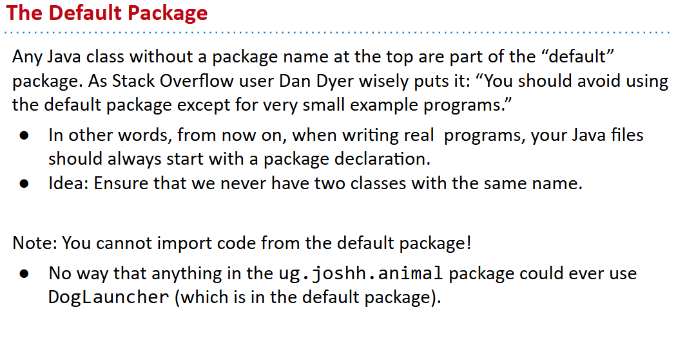
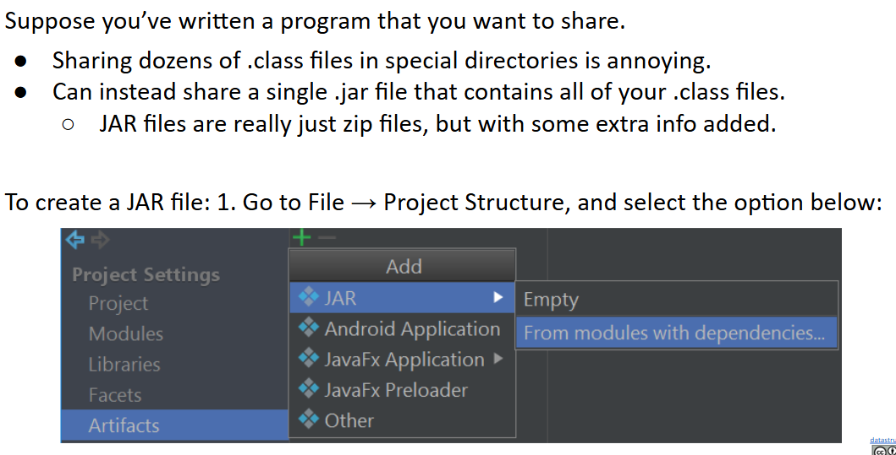
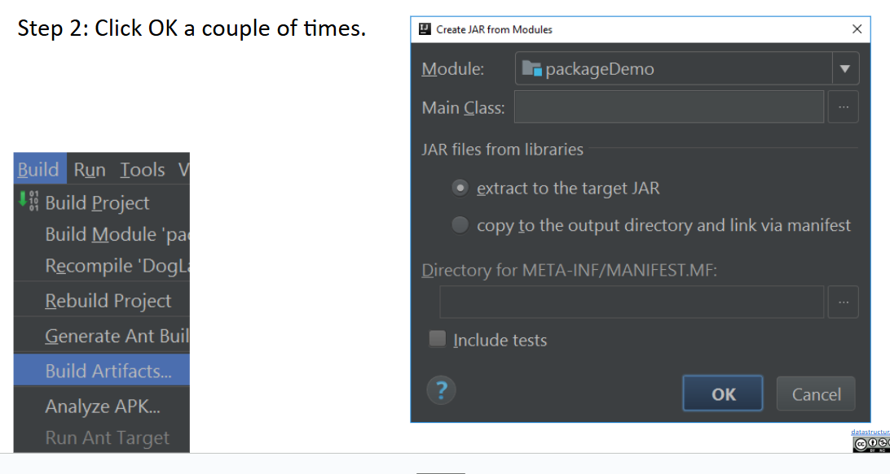
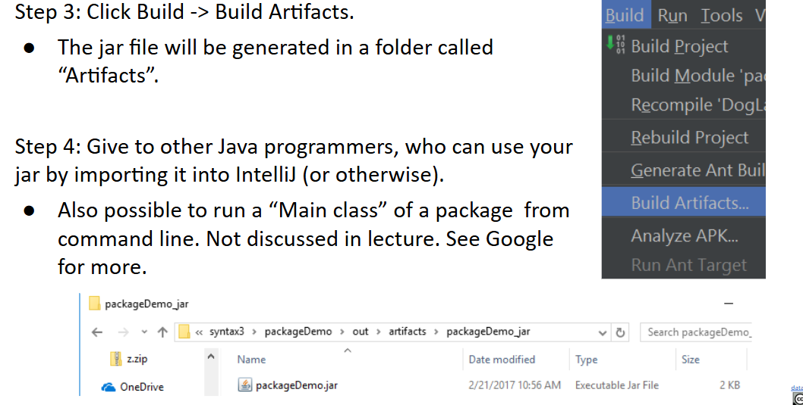
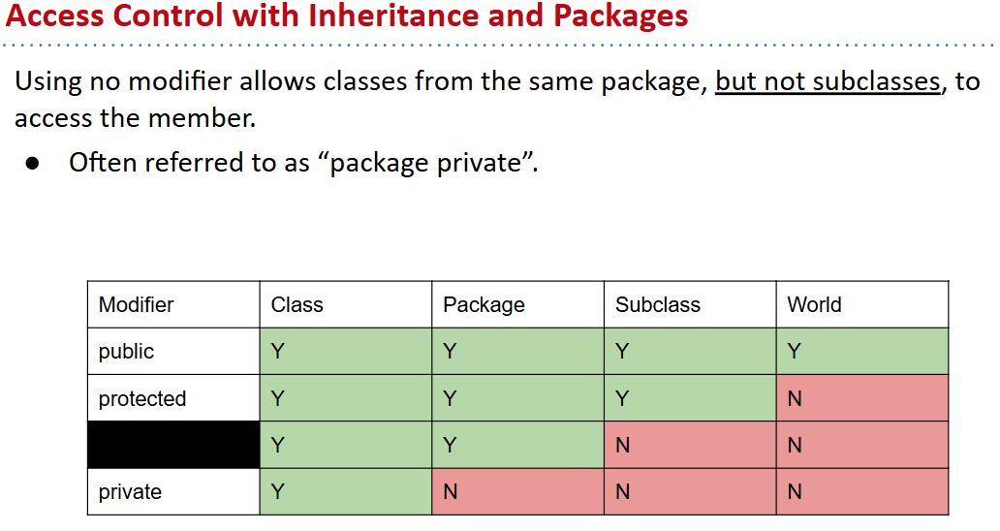
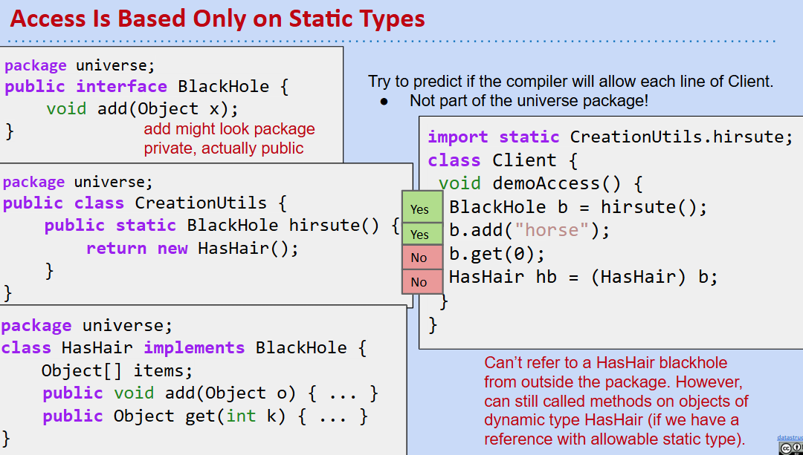
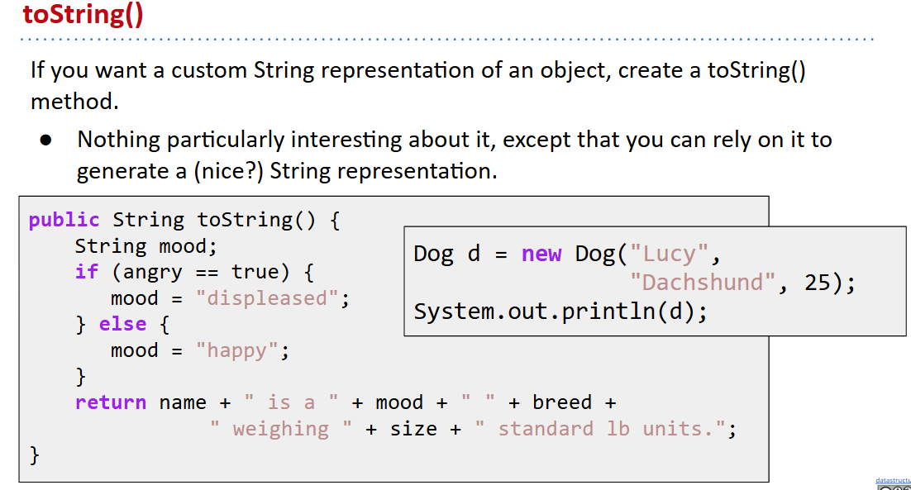

# 61B-15: Packages, Access Control, Objects

# Packages and JAR Files
## 创建包
- At the top of every file in the package, put the package name.
- Make sure that the file is stored in a folder with the appropriate folder name. For a package with name ug.joshh.animal, use folder ug/joshh/animal.

要用的时候`import`即可

## default package


## JAR Files




# Access Control



# Object Methods: Equals and toString( )
## toString( )


## == vs equals( )
- `==` compares references
- `equals( )` compares values, but pay attention to the type!
```java
public class Date {
    private final int month;
    private final int day;
    private final int year;
    
    public Date(int m, int d, int y) {
        month = m; day = d; year = y;
    }

    public boolean equals(Object x) {
        if (this == x) return true;
        if (x == null) return false;
        if (this.getClass() != x.getClass()) {
            return false;
        }
        Date that = (Date) x;
        if (this.day != that.day) {
            return false;
        }
        if (this.month != that.month) {
            return false;
        }
        if (this.year != that.year) {
            return false;
        }
            return true;
    }
}
```
## Rules for Equals in Java
- 反身性：`x.equals(x) == true`
- 对称性
- 传递性

注意实现equals方法时，不要违背这些性质！
