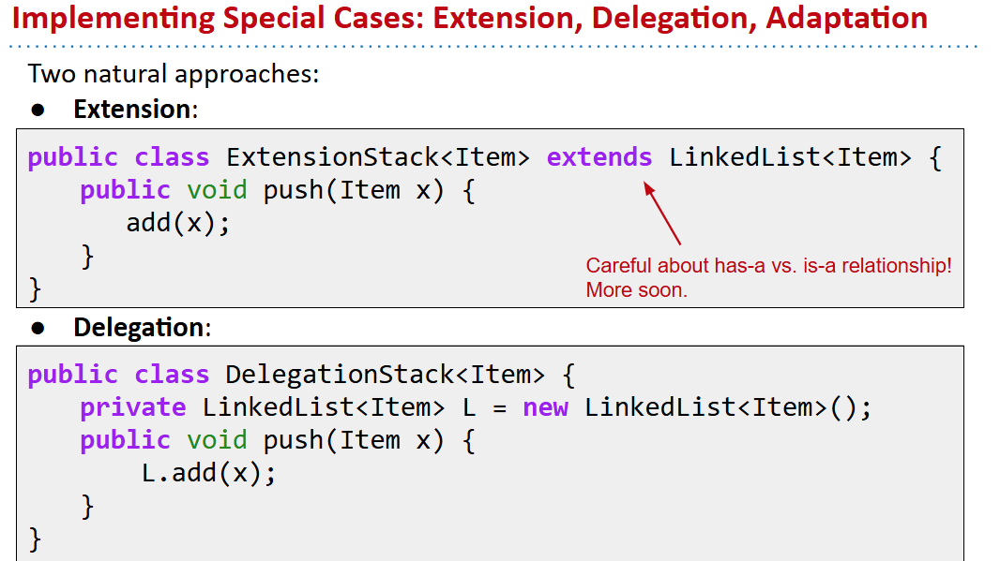
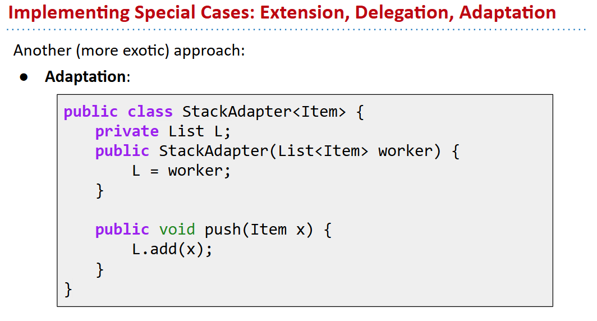
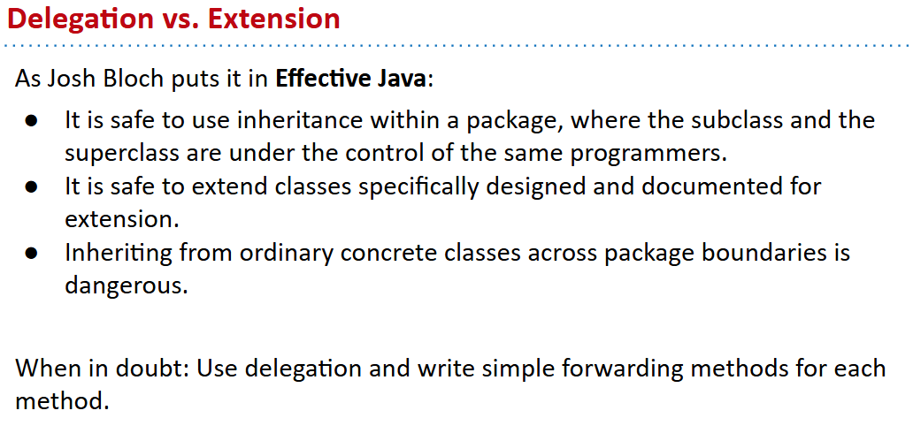
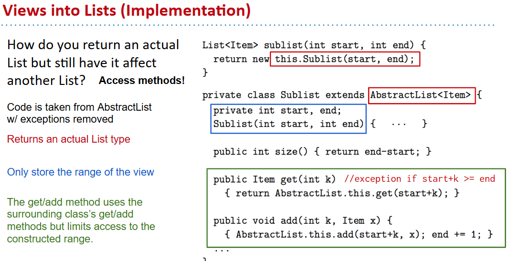

# 61B-16: Encapsulation, Lists, Delegation vs. Extension

## 61B: Writing Efficient Programs
- Programming cost.
    - How long does it take to develop your programs?
    - How easy is it to read, modify, and maintain your code?
        - More important than you might think!
        - Majority of cost is in maintenance, not development!

自顶向下，逐层抽象，分而治之，化整为零

# ADT Implementations

# Designing ADTs

虽然extension简单，但是委托delegation更加灵活

# Views 视图

在Java中，"view"通常指的是一种数据结构的视图，它提供了一种访问和操作底层数据的方式，而不需要复制整个数据集。视图的主要优点是它们提供了一种高效的方式来操作数据子集，而不需要复制数据，从而节省内存和提高性能。然而，视图也有一些限制，例如固定大小的视图不能添加或删除元素。

Occasionally, implementation details may allow for views that are too difficult to implement for an abstract type.
