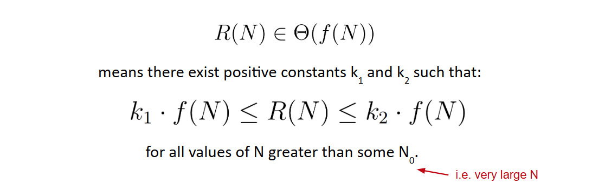
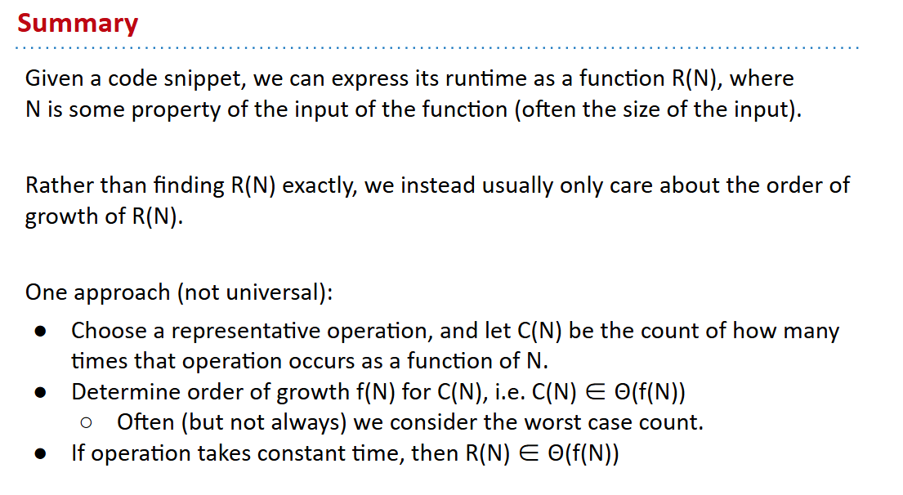

# 61B-17: Asymptotics I

## Runtime Characterizations
In most cases, we care only about asymptotic behavior, i.e. what happens             for very large N.

## Intuitive Simplification
-  Consider only the worst case.
-  Restrict Attention to One Operation. 找得好并且巧的话可很快看出，退而求其次的话可以考虑画图分析
-  Eliminate low order terms.
-  Eliminate multiplicative constants.

## Big-Theta Notation $\Theta(f(n))$
The only difference is that we use the Θ symbol anywhere we would have said “order of growth”.

