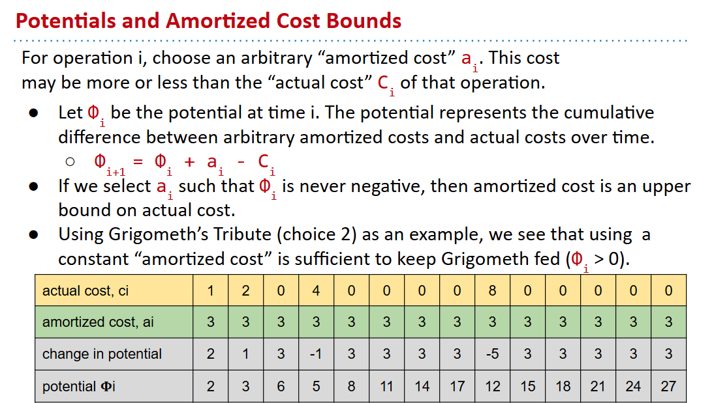

# 61B-19: Asymptotics III

## Big-O Notation

## 细节分析

## 局限性

## 对比

***Important: Big O does not mean “worst case”! Often abused to mean this.***

## 大O记号的用处

## Big-Omega Notation $\Omega(f(n))$

## 大Ω记号的用处

## 非严格证明和严格证明

