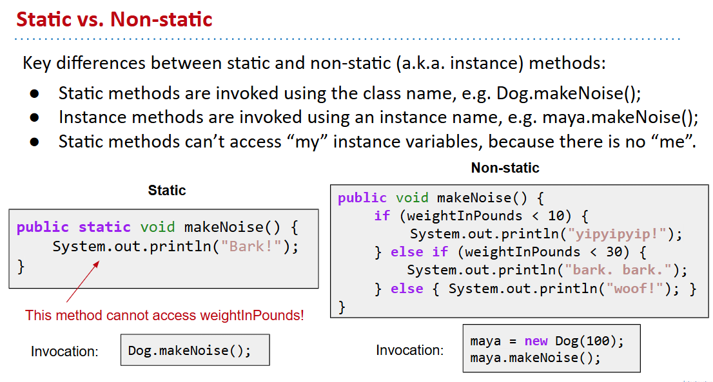

# 61B-2: Defining and Using Classes

## 编译初看

## Defining and Instantiating Classes

# Static vs. Instance Members
## Static vs. Non-static

# public static void main(String[] args)

# Using Libraries
