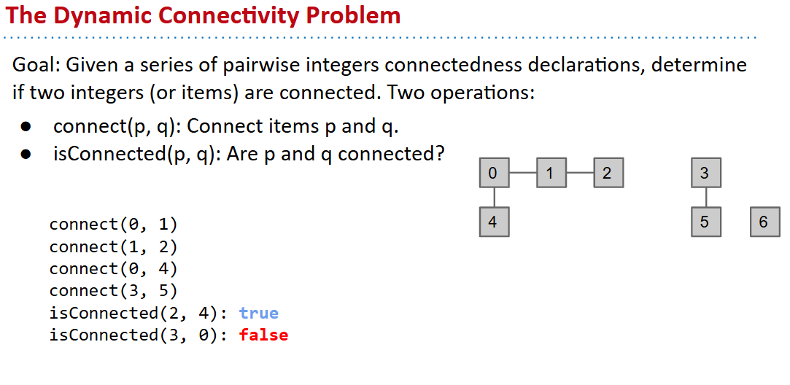
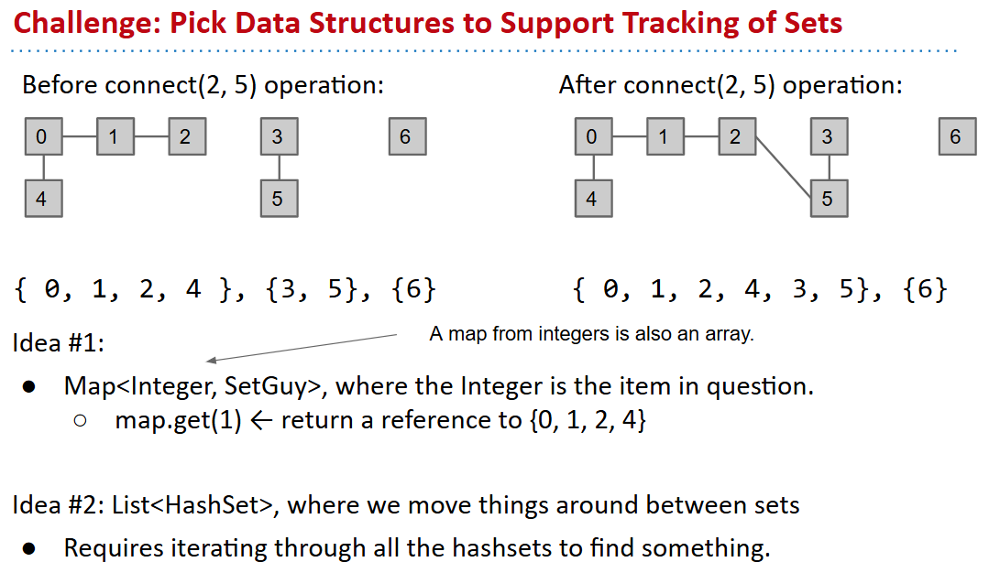
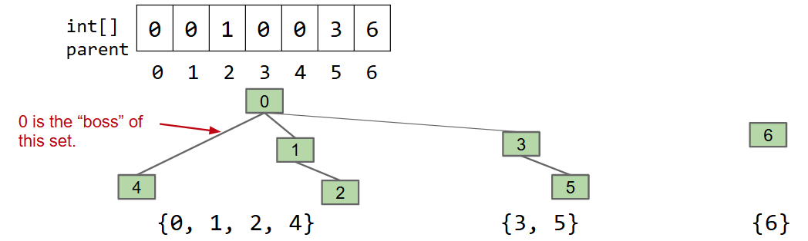
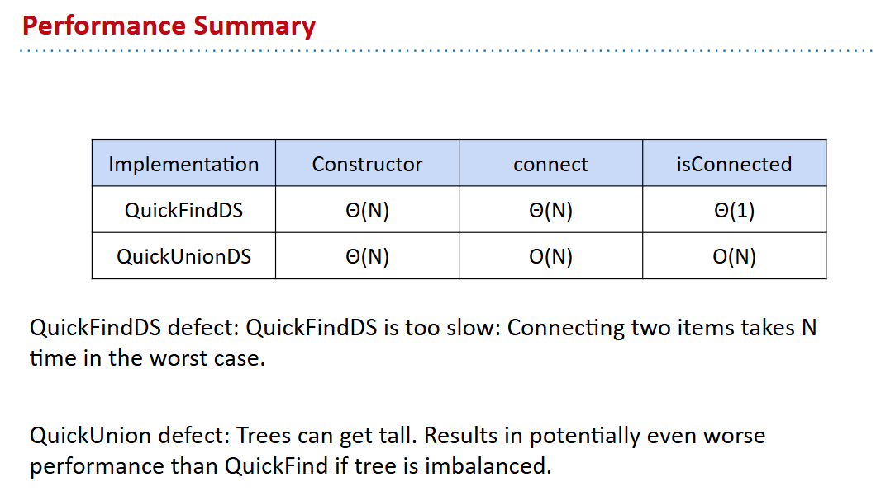
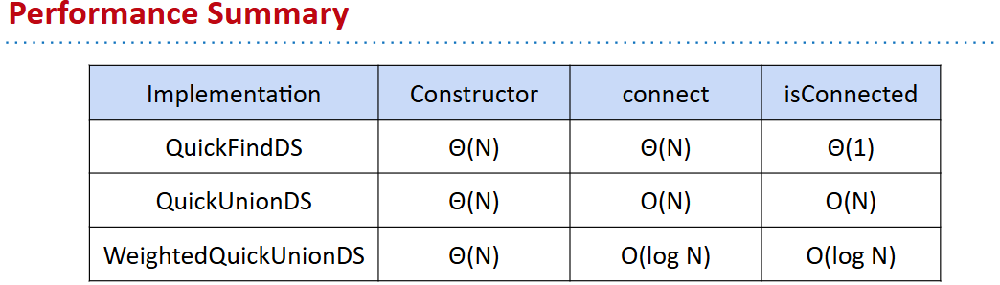
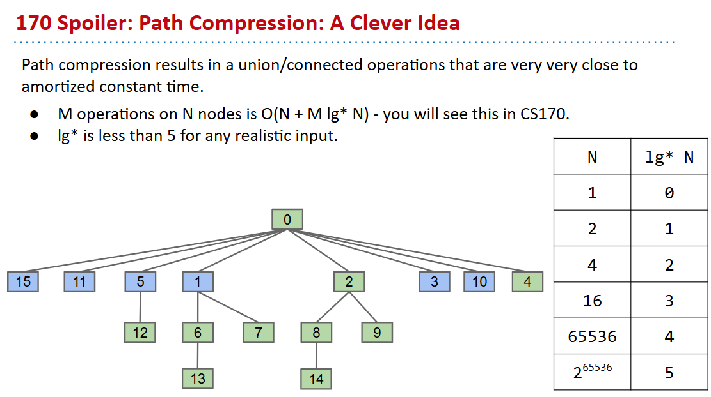
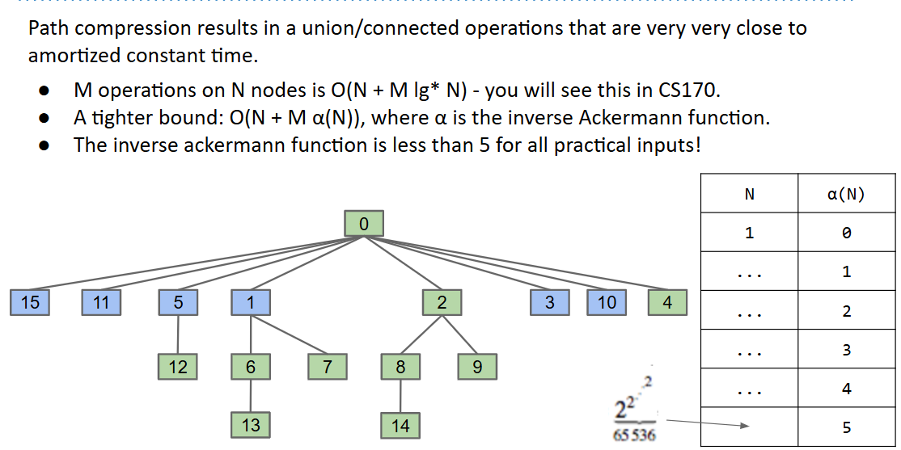
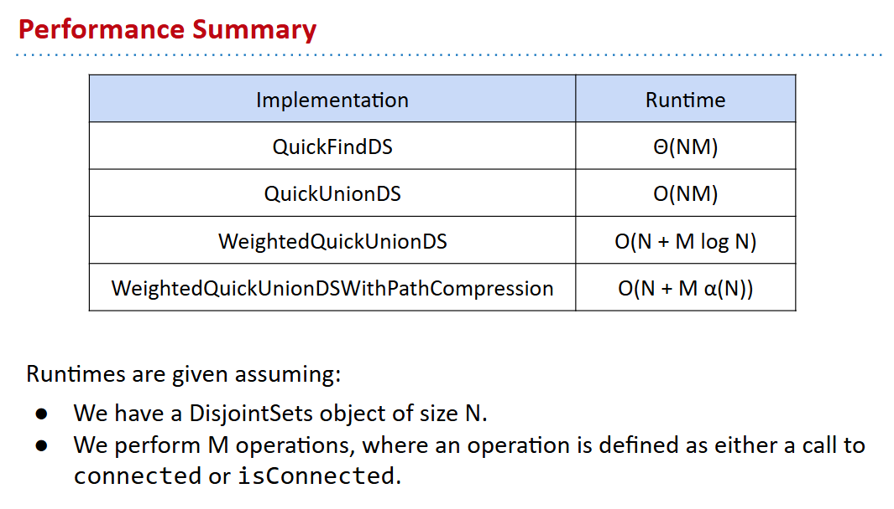

# 61B-20: Disjoint Sets

# 不相交集问题



```java
public interface DisjointSets {
	/** Connects two items P and Q. */
	void connect(int p, int q);
 
	/** Checks to see if two items are connected. */
	boolean isConnected(int p, int q);
}
```
### naive implementation
真的链接两个元素，然后考虑遍历整个集合，判断是否有两个元素是连通的。
### better implementation
- Better approach: Model connectedness in terms of ***sets***.
  - How things are connected isn’t something we need to know.:wink:

## quick-find

```java
public class QuickFindDS implements DisjointSets {
	private int[] id;
    // really fast
	public boolean isConnected(int p, int q) {
    	    return id[p] == id[q];
	}
 
	public void connect(int p, int q) {
    	    int pid = id[p];
        	int qid = id[q];
       	for (int i = 0; i < id.length; i++) {
            if (id[i] == pid) {
              	id[i] = qid;
            }
    	    }...
    }
    // constructor
    public QuickFindDS(int N) {
   	id = new int[N];
   	for (int i = 0; i < N; i++)
       	id[i] = i;
	}
}  
```


## quick-union
考虑不用数组，用 🌳:yum:

- tree can not be too tall: 树不能太高，否则会退化成链表:warning:

```java
public class QuickUnionDS implements DisjointSets {
	private int[] parent;
	public QuickUnionDS(int N) {
    	    parent = new int[N];
    	    for (int i = 0; i < N; i++)
        	    parent[i] = i;
   	    } // linear time to create N trees
 
  	private int find(int p) {
    	while (p != parent[p])
        	p = parent[p]; // p[i] and i 很重要！
       	return p;
    }
    public boolean isConnected(int p, int q) {
	    return find(p) == find(q);
    }
 
    public void connect(int p, int q) {
        int i = find(p);
        int j = find(q);
        parent[i] = j; // 合并两个树
    }
}
```


## weighted quick-union
- 希望平衡权重
- 权重可以是树的大小，也可以是树的深度。
- 以下考虑元素个数（树的大小）
  - ***New rule（目前是不加证明的经验公式）: Always link root of smaller tree to larger tree.***

```java
public class WeightedQuickUnionDS implements DisjointSets {
	private int[] parent;
	private int[] size; // size of each tree
	public WeightedQuickUnionDS(int N) {
    	    parent = new int[N];
    	    size = new int[N]; // 增加了size array记录
    	    for (int i = 0; i < N; i++) {
        	    parent[i] = i;
        	    size[i] = 1; // each tree is of size 1
    	    }
    }

    // find and isConnected are the same as before!
    private int find(int p) {
    	while (p != parent[p])
        	p = parent[p]; // p[i] and i 很重要！
       	return p;
    }
    public boolean isConnected(int p, int q) {
	    return find(p) == find(q);
    }

    public void connect(int p, int q) {
        int i = find(p);
        int j = find(q);
        if (size[i] < size[j]) {
            parent[i] = j;
            size[j] += size[i]; // add size of i to j
        } else {
            parent[j] = i;
            size[i] += size[j]; // add size of j to i
        }
    }
}
```


## path compression（UCB-CS170:yum:）
- 路径压缩：将树的根节点指向树的根节点，减少树的高度。
- 路径压缩的好处：
  - 减少树的高度，使得find和isConnected的效率更高。
  - 减少内存消耗。



*log\*(n) is the iterated log - it’s the number of times you need to apply log to n to go below 1. Note that 2^65536 is higher than the number of atoms in the universe.*

### 不加证明给出目前最极限的情况 $\alpha(N)$


```java
public class WeightedQuickUnionDSWithPathCompression implements DisjointSets {
	private int[] parent; private int[] size;
	public WeightedQuickUnionDSWithPathCompression(int N) {
         parent = new int[N]; size = new int[N];
         for (int i = 0; i < N; i++) {
          	parent[i] = i;
              size[i] = 1;
         }
	}
    // find 并不会太难 乐
	private int find(int p) {
         if (p == parent[p]) {
            return p;
         } else {
             parent[p] = find(parent[p]);
             return parent[p];
         }
	}
    public boolean isConnected(int p, int q) {
        return find(p) == find(q);
    }
    public void connect(int p, int q) {
        int i = find(p);
        int j = find(q);
        if (i == j) return;
        if (size[i] < size[j]) {
            parent[i] = j; size[j] += size[i];
        } else {
            parent[j] = i; size[i] += size[j];
        }
    }
}
```




## references
Nazca Lines: http://redicecreations.com/ul_img/24592nazca_bird.jpg

Implementation code adapted from Algorithms, 4th edition and Professor Jonathan Shewchuk’s lecture notes on disjoint sets, where he presents a faster one-array solution. I would recommend taking a look.
(http://www.cs.berkeley.edu/~jrs/61b/lec/33)

The proof of the inverse ackermann runtime for disjoint sets is given here:
http://www.uni-trier.de/fileadmin/fb4/prof/INF/DEA/Uebungen_LVA-Ankuendigungen/ws07/KAuD/effi.pdf
as originally proved by Tarjan here at UC Berkeley in 1975.


