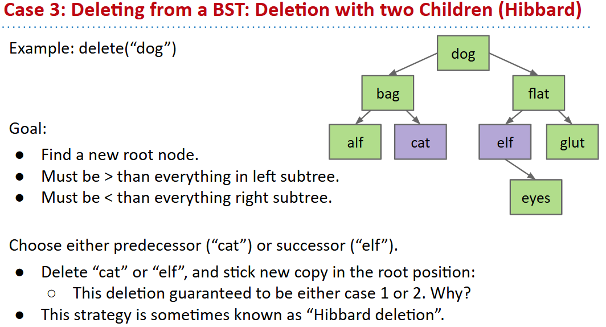
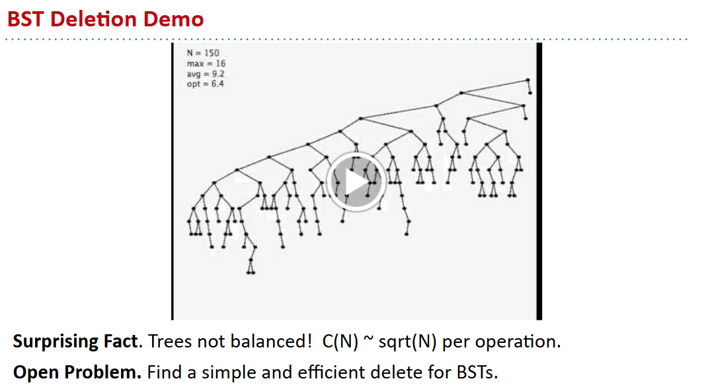
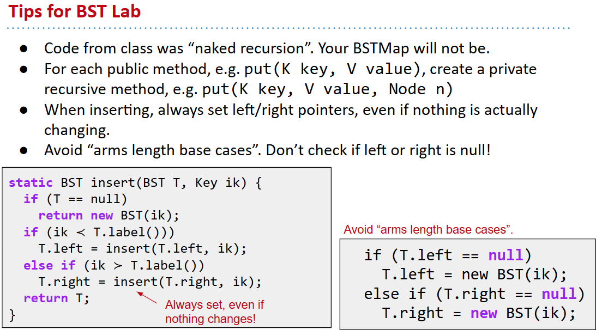

# 61B-21: Trees, BSTs

***ordered linked list***---> binary search tree or skip list (out of course)

# BST Definitions
A tree consists of:
- A set of nodes.
- A set of edges that connect those nodes.
    - Constraint: There is exactly one path between any two nodes.

In a rooted tree, we call one node the root.
- Every node N except the root has exactly one parent, defined as the first node on the path from N to the root.
- Unlike (most) real trees, the root is usually depicted at the top of the tree.
- A node with no child is called a leaf.

In a rooted binary tree, every node has either 0, 1, or 2 children (subtrees).
## Properties of BSTs
A binary search tree is a rooted binary tree with the BST property.

BST Property. For every node X in the tree:
- Every key in the left subtree is less than X’s key.
- Every key in the right subtree is greater than X’s key.
One consequence of these rules: No duplicate keys allowed!

# BST Operations
## Finding a searchKey in a BST
```java
static BST find(BST T, Key sk) {
   if (T == null)
      return null;
   if (sk.keyequals(T.label()))
      return T;
   else if (sk ≺ T.label())
      return find(T.left, sk);
   else
      return find(T.right, sk);
}
```
***runtime:*** $O(h)$, where $h$ is the height of the tree, i.e., $O(log (N))$, where $N$ is the number of nodes in the tree.

## Inserting a new key into a BST
```java
static BST insert(BST T, Key ik) {
  if (T == null)
    return new BST(ik);
  if (ik ≺ T.label())
    T.left = insert(T.left, ik);
  else if (ik ≻ T.label())
    T.right = insert(T.right, ik);
  return T;
}
```
## Deleting a key from a BST
- no child: simply remove the node.
- one child: replace the node with its child.
- two children: find the inorder successor (smallest in the right subtree) and replace the node with it. Then recursively delete the inorder successor from the right subtree.


# BST Performance
## Tree Height
Performance of spindly trees can be just as bad as a linked list!

usually, the height of a BST is $O(log(N))$, where $N$ is the number of nodes in the tree.
## Insertion demo
Random inserts take on average only Θ(log N) each. 
## Deletion demo

https://docs.google.com/presentation/d/1rEHpAx8Xu2LnJBWsRPWy8blL20qb96Q5UhdZtQYFkBI/edit#slide=id.g75707c75c_0224


