# 61B-22: Balanced BSTs

To avoid the worst-case time complexity of O(n), we need to use a balanced binary search tree.

# Tree Rotation
Non-obvious fact: Rotation allows balancing of any BST.
One way to achieve balance:
- Rotate after each insertion and deletion to maintain balance. 
- … the mystery is to know which rotations. We’ll come back to this.

# B-trees / 2-3 trees / 2-3-4 trees 
## search tree
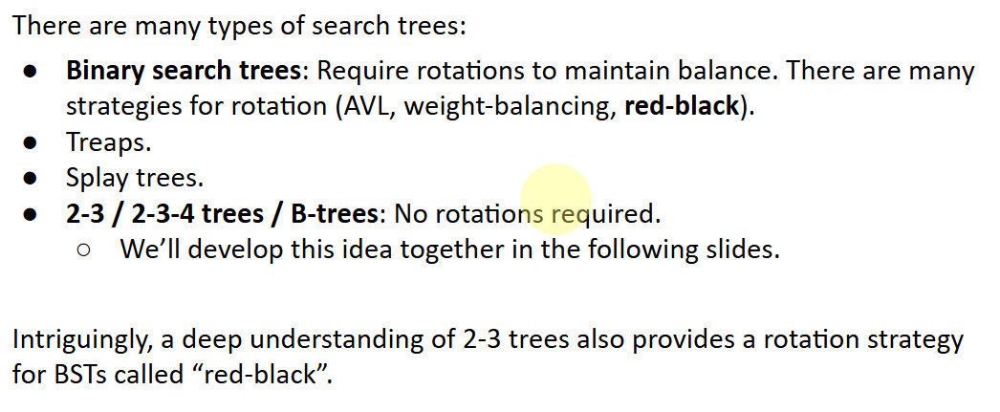
## weird solution to achieve balance
- add leaf
- overstuff leaf, but can not be too juicy!
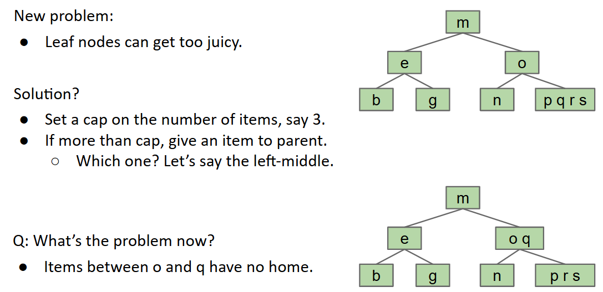
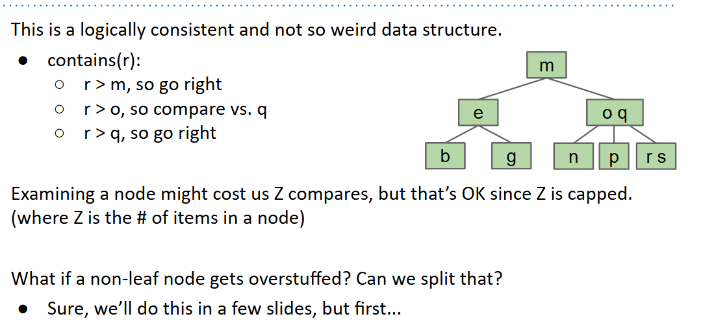

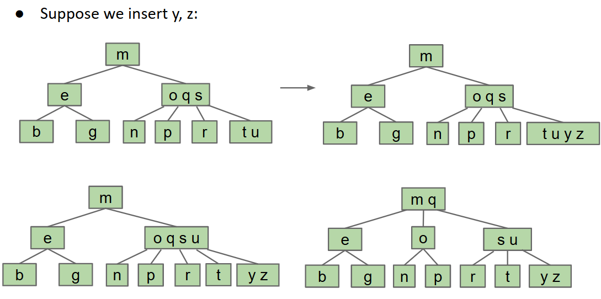
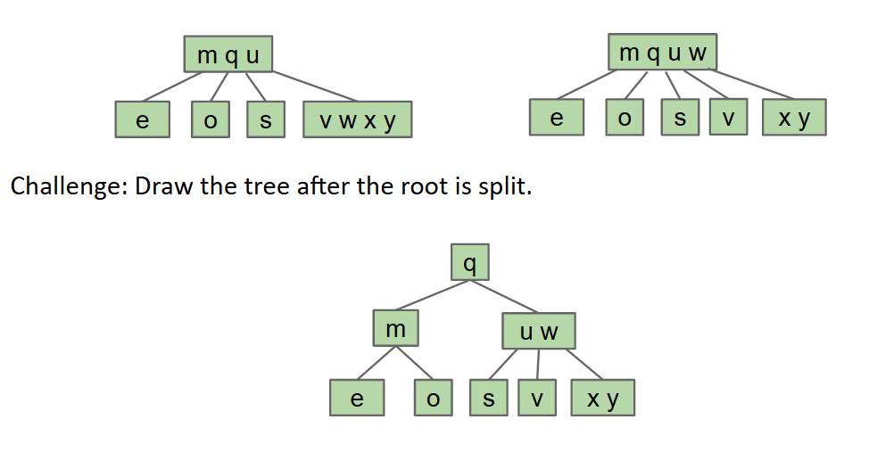
## Performance of B-trees
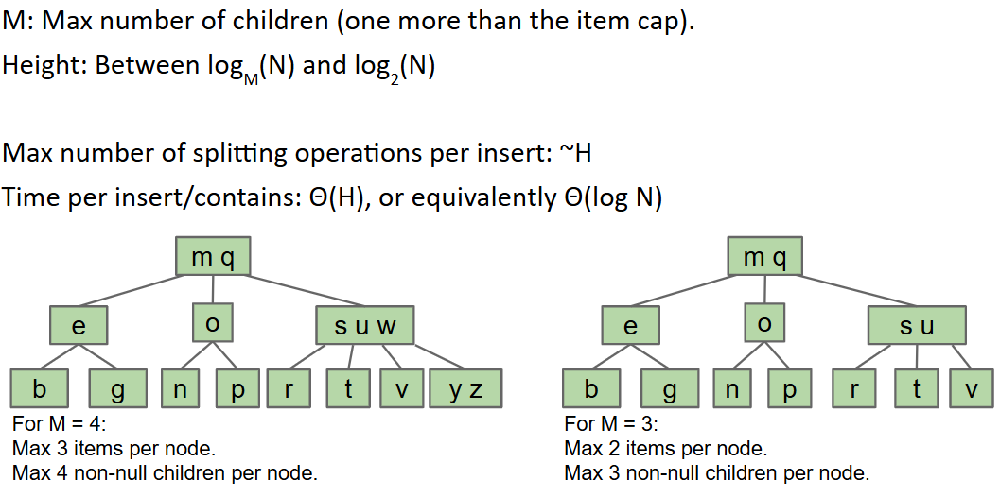
Splitting tree is a better name, but I didn’t invent them, so we’re stuck with their real name: B-trees.
- A B-tree of order M=4 (like we used today) is also called a 2-3-4 tree or a 2-4 tree. 
    - The name refers to the number of children that a node can have, e.g. a 2-3-4 tree node may have  2, 3, or 4 children.
- A B-tree of order M=3 (like in the textbook) is also called a 2-3 tree.
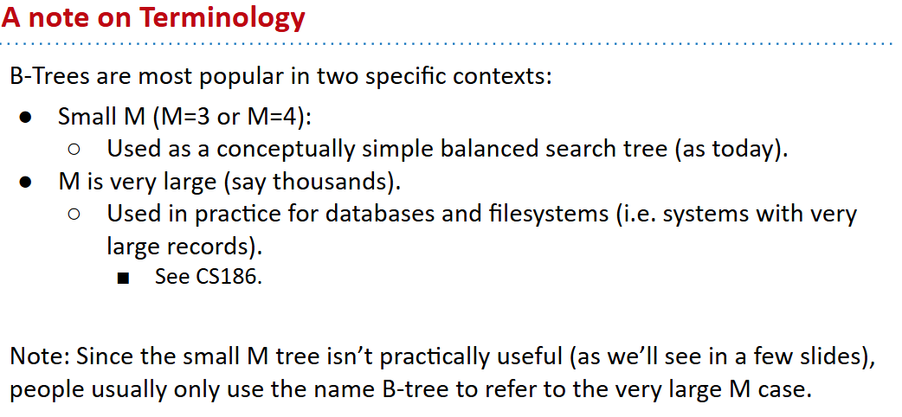

# Red-Black Trees
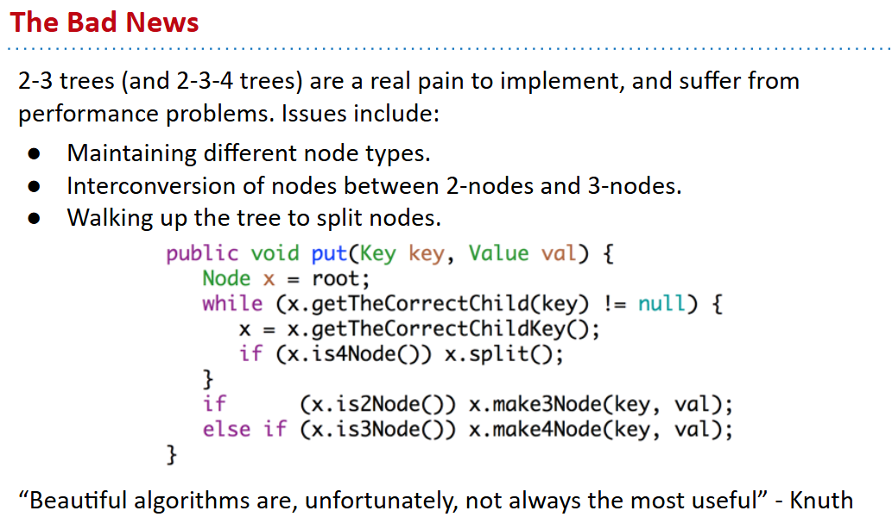
There are many types of search trees:
- Binary search trees: Require rotations to maintain balance. There are many strategies for rotation. Coming up with a strategy is hard.
- 2-3 trees: No rotations required.

Clever (and strange idea): Build a BST that is isometric (structurally identical) to a 2-3 tree.
- Use rotations to ensure the isometry.
- Since 2-3 trees are balanced, rotations on BST will ensure balance.
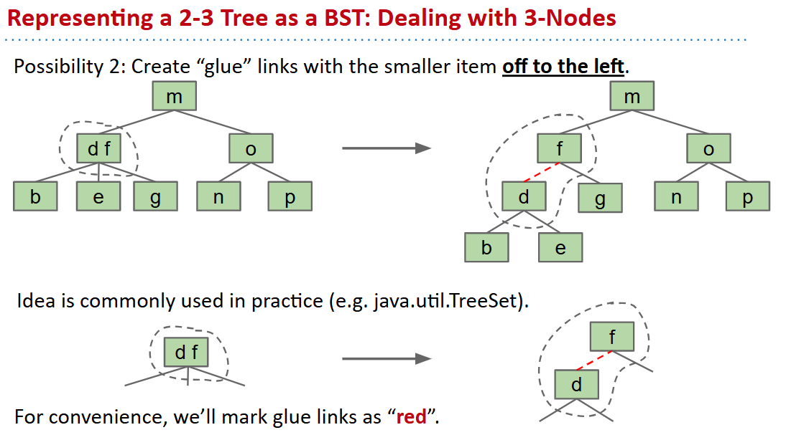
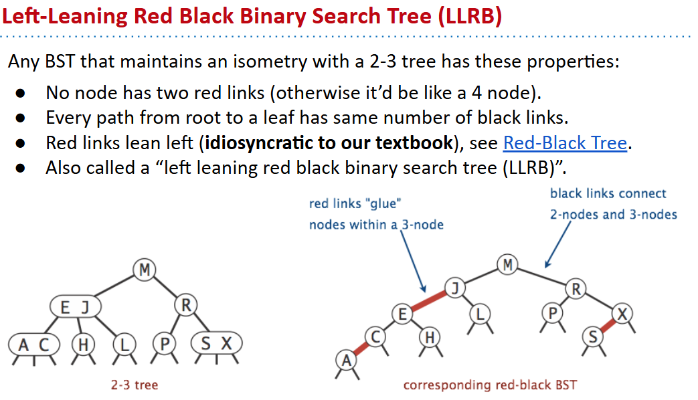
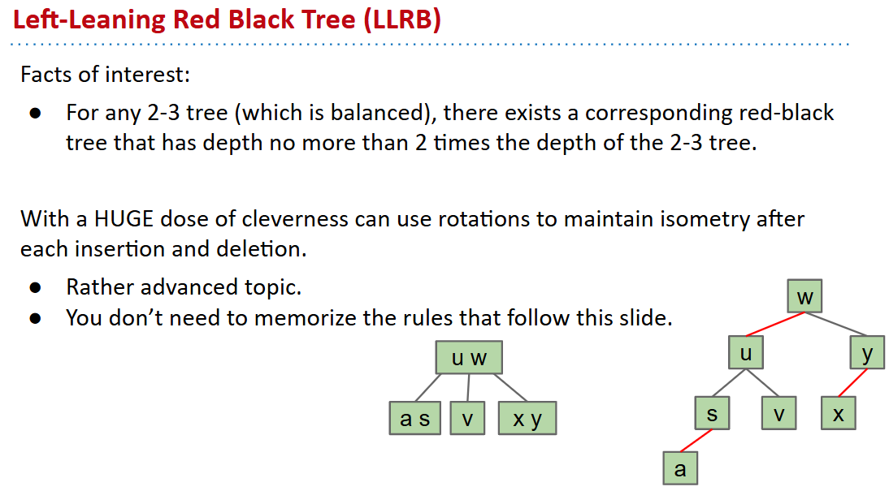

# Maintaining Isometry Through Rotations (Optional)
Violations for LLRBs:
- Two red children.
- Two consecutive red links.
- Right red child.

Operations for Fixing LLRB Tree Violations: ***Tree rotations and Color Flips***!

- when `insert` , use red link
  - if right-insert happens, `rotateLeft`
  - two red children?
  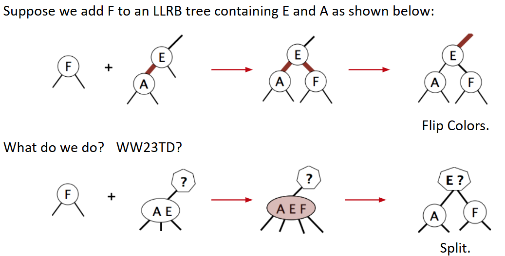
  - two reds in a row?
    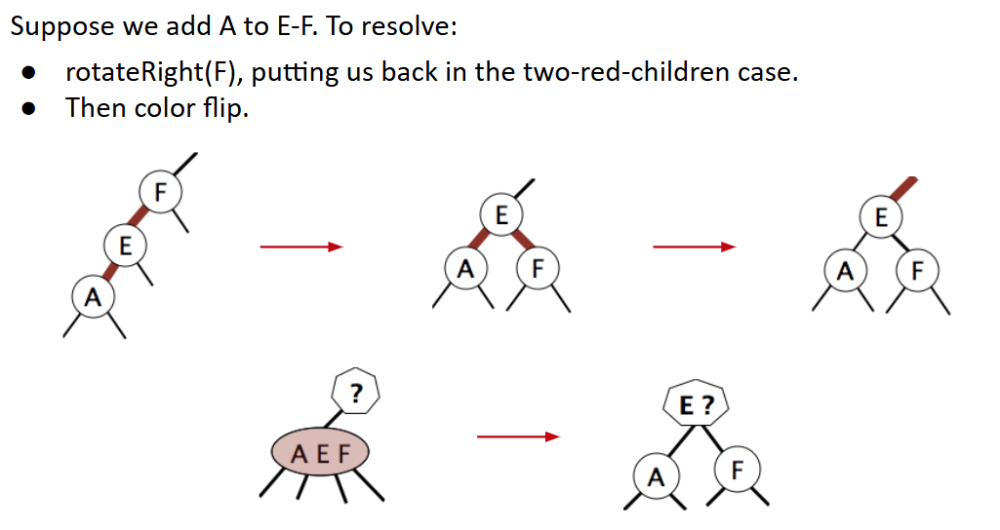
  - Left-Red-Right-Red?
    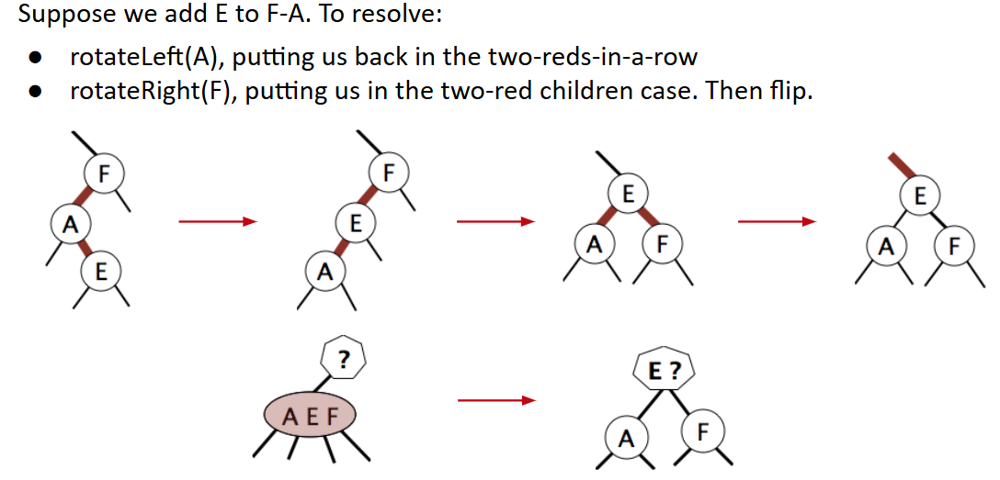

## summary
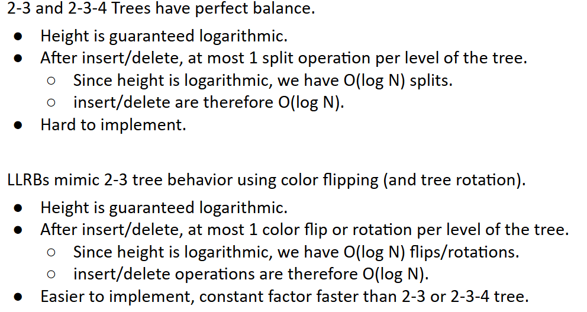
