# 61B-23: Hashing


起因，无序array
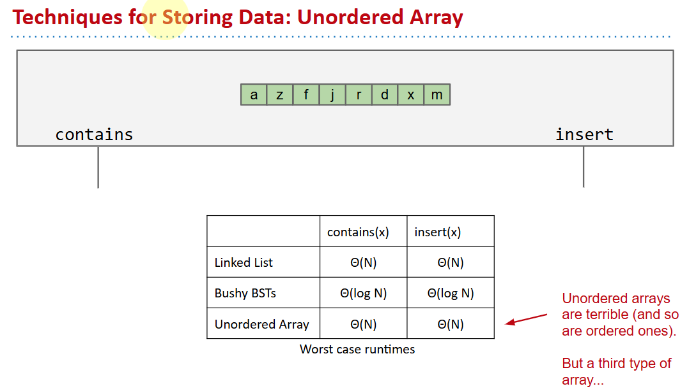
## Using data as an Index
One extreme approach: All data is really just bits.
- Use data itself as an array index.
- Store true and false in the array.
- Extremely wasteful of memory. To support checking presence of all positive integers, we need 2 billion booleans.
- Need some way to generalize beyond integers.
```java
public class DataIndexedIntegerSet {
	boolean[] present;
 
	public DataIndexedIntegerSet() {
    	present = new boolean[16];
	}
 
	public insert(int i) {
    	present[i] = true;
	}
 
	public contains(int i) {
    	return present[i];
	}
}
```
# Binary Representations DataIndexedSet
insert a `cat`
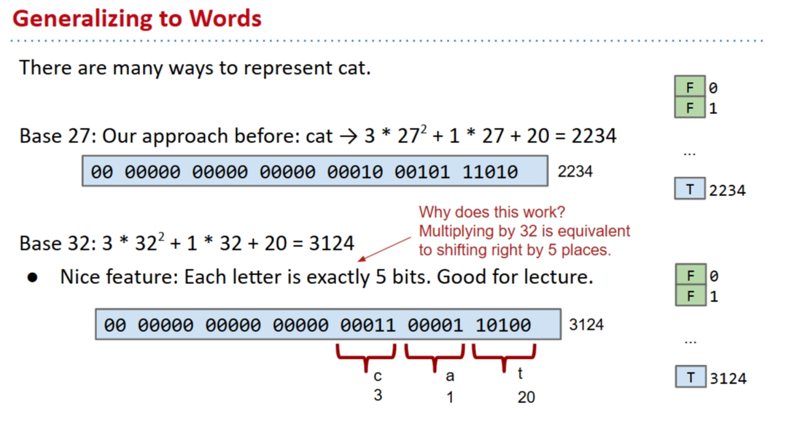
但是有弱点↓
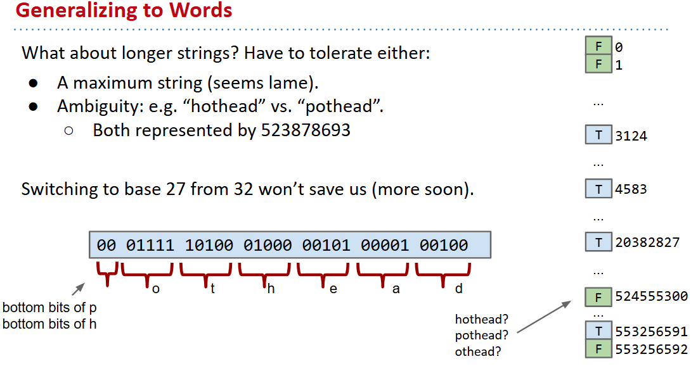
`collision handling` & `computing a hashCode`！

# Handling Collisions
抽屉原理告诉我们，不可以只靠扩展数组容量来处理之。

Suppose N items have the same hashcode h:
- Instead of storing true in position h, store a list of these N items at position h.


## external chaining

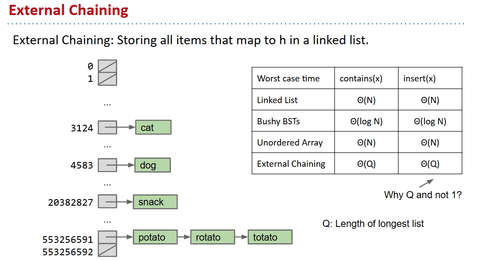
Depends on the number of items in the ‘bucket’.
- If N items are distributed across M buckets, average time grows with   N/M = L, also known as the load factor.
  - Average runtime is Θ(L).
- Whenever L=N/M exceeds some number, increase M by resizing.

负数索引
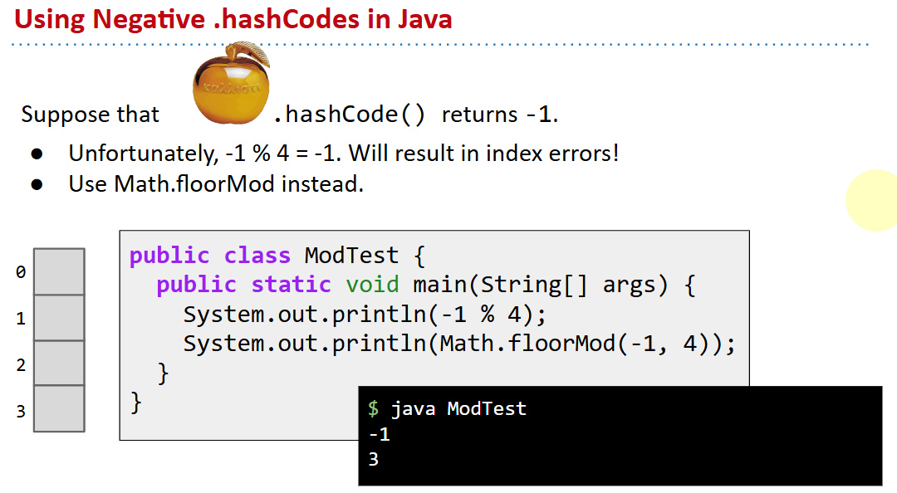
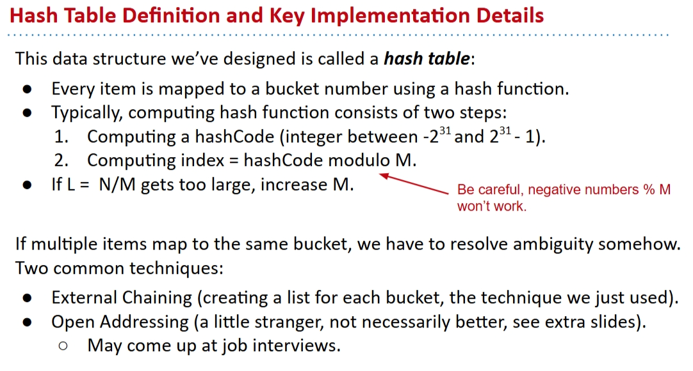
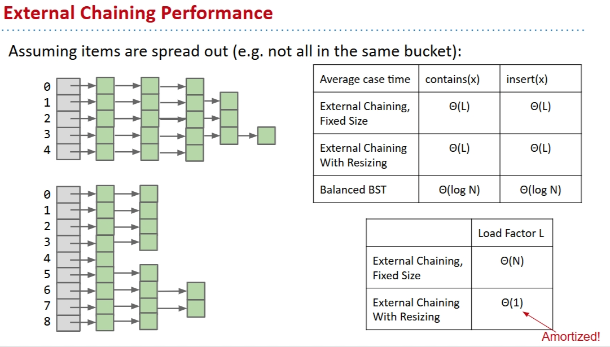

# Hash Functions
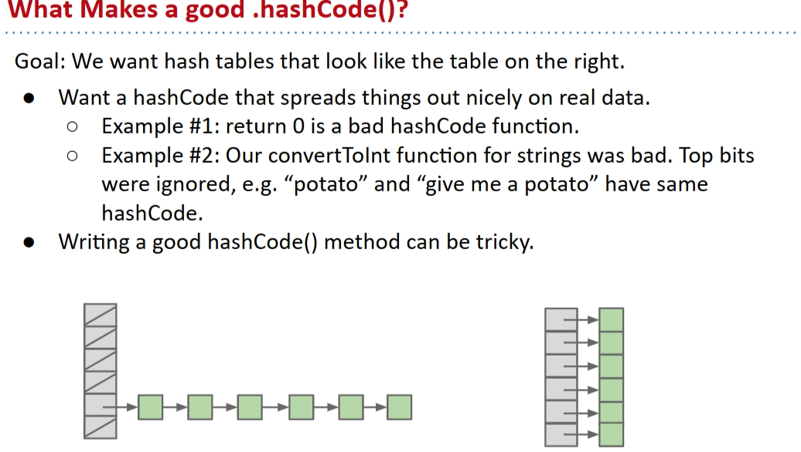
## str example
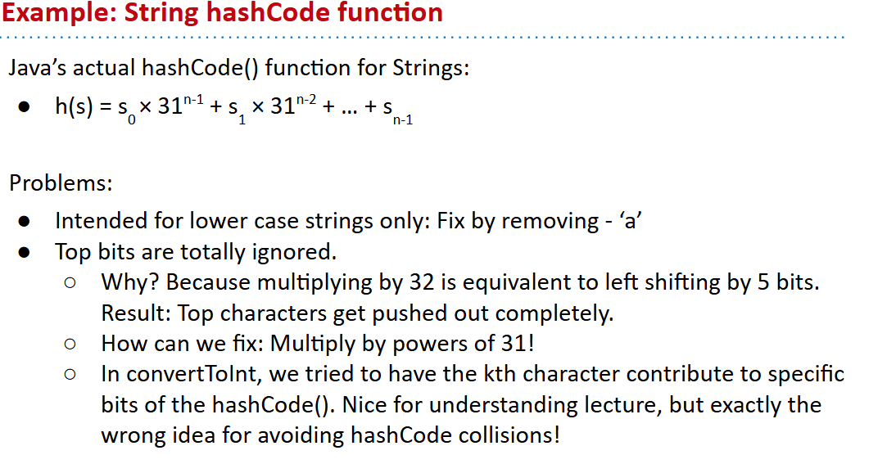
```java
@Override
public int hashCode() {
   int hashCode = 1;
   for (Object o : this) {
       hashCode = hashCode * 31;
       hashCode = hashCode + o.hashCode();
   	}
return hashCode;
}

```

## recursive example
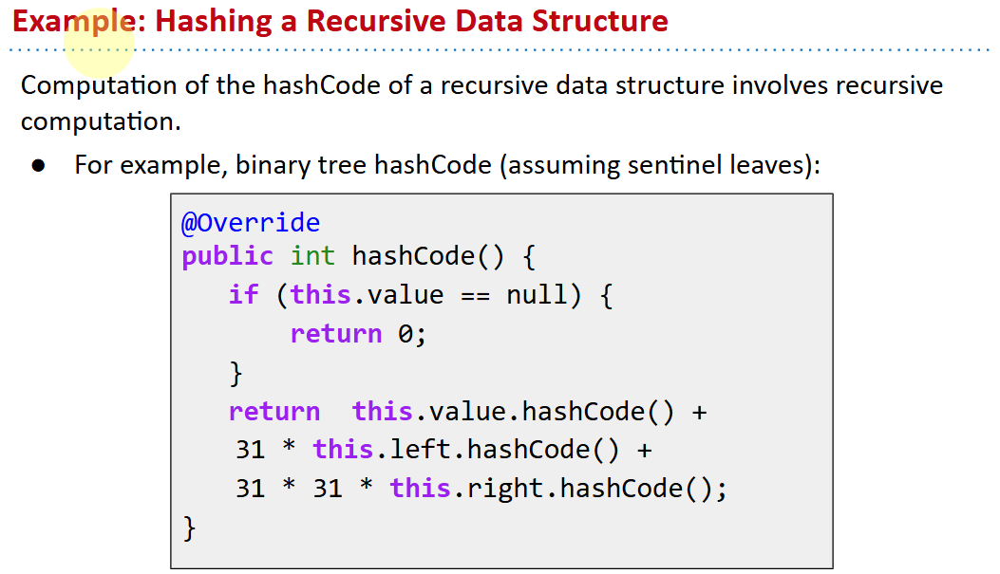

## default hashCode()
All Objects have hashCode() function.
- Default: returns this (i.e. address of object).
  - Can have strange consequences: “hello”.hashCode() is not the same as (“h” + “ello”).hashCode()
- Can override for your type.
- Hash tables (HashSet, HashMap, etc.) are so important that Java requires that all objects implement hashCode().


## HashSets and HashMaps
Java provides a hash table based implementation of sets and maps.
- Idea is very similar to what we’ve done in lecture.
- Warning: Never store **mutable** objects in a HashSet or HashMap!
- Warning #2: ***Never override `equals` without also overriding `hashCode`.***

# extra
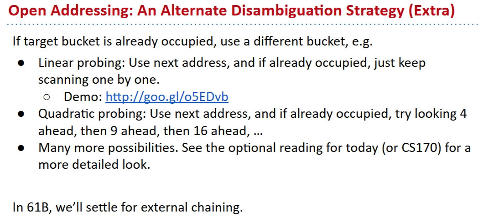
