# 61B-24: Priority Queues and Heaps

interface

```java
/** (Min) Priority Queue: Allowing tracking and removal of the
  * smallest item in a priority queue. */
public interface MinPQ<Item> {
	/** Adds the item to the priority queue. */
	public void add(Item x);
	/** Returns the smallest item in the priority queue. */
	public Item getSmallest();
	/** Removes the smallest item from the priority queue. */
	public Item removeSmallest();
	/** Returns the size of the priority queue. */
	public int size();
}
```
全记录下来然后排序？naive way!

better way
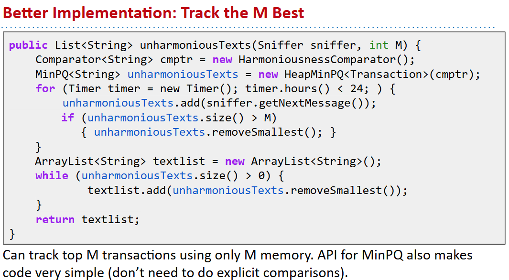

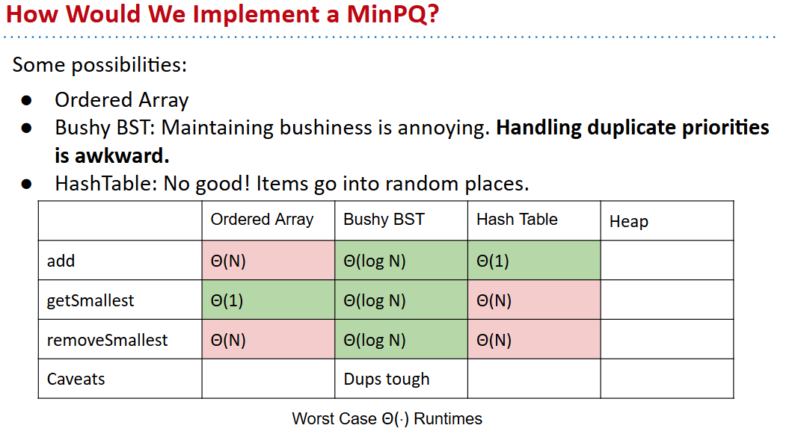
# heaps
## bst way
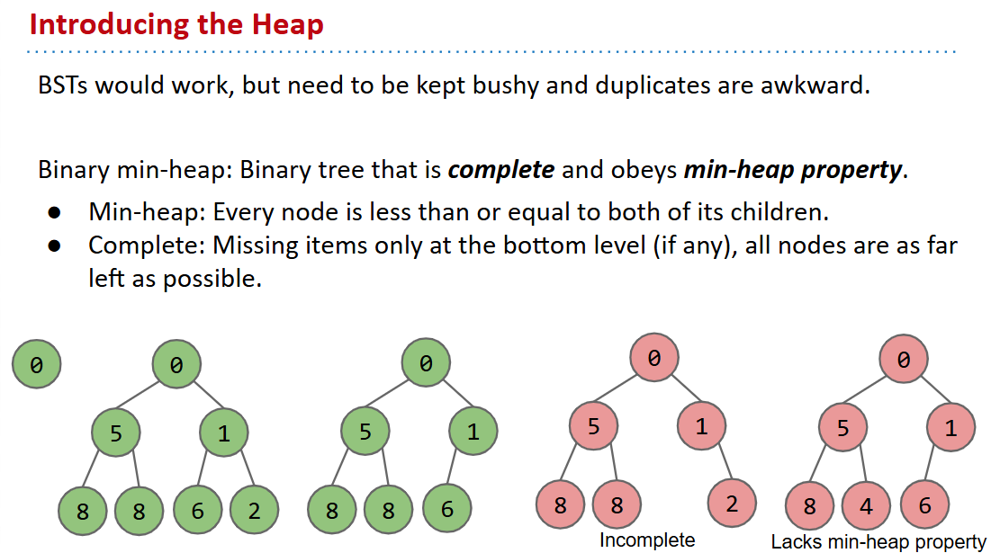

see https://goo.gl/wBKdFQ 

Given a heap, how do we implement PQ operations?
- getSmallest() - return the item in the root node.
- add(x) - place the new employee in the last position, and promote as high as possible.
- removeSmallest() - assassinate the president (of the company), promote the rightmost person in the company to president. Then demote repeatedly, always taking the ‘better’ successor.


# Tree Representations
## How do we Represent a Tree in Java? 
### 1a
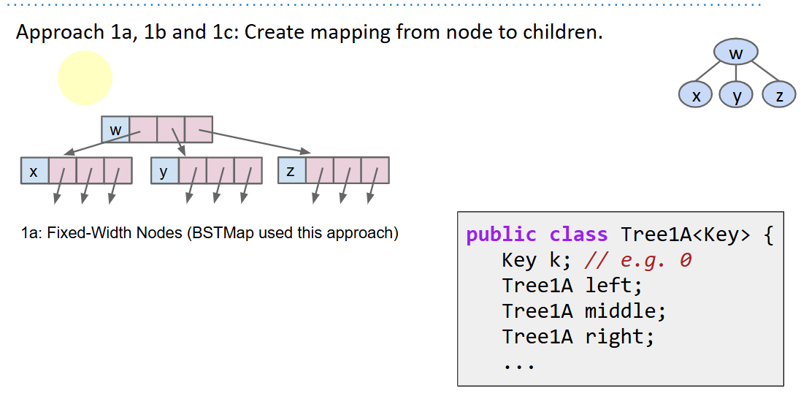

### 1b
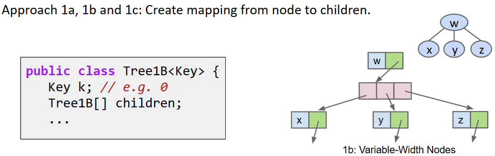

### 1c
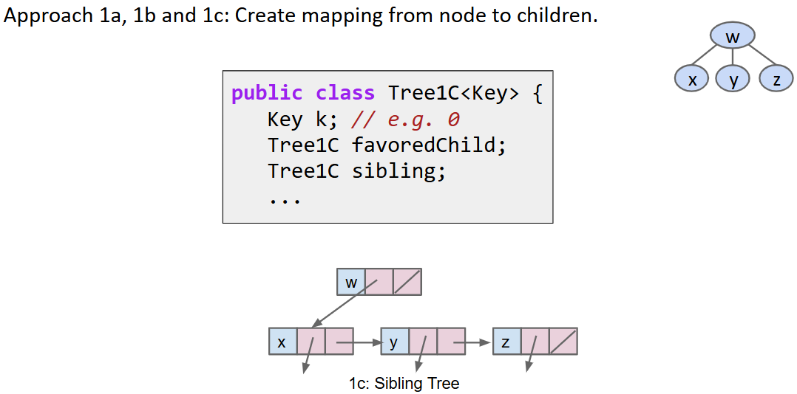

### 2  Store keys in an array. Store parentIDs in an array.
Similar to what we did with disjointSets.
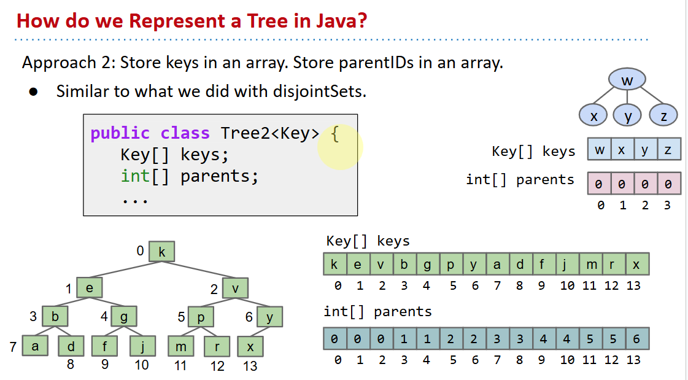

### 3 Store keys in an array. Don’t store structure anywhere.
从左到右分层级编码进入数组
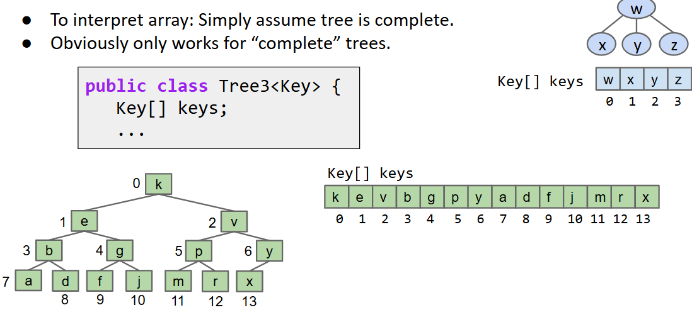

```java
public class Tree3<Key> {
    Key[] keys;
    ...

    public void swim(int k) {
        if (keys[parent(k)] ≻ keys[k]) {
        swap(k, parent(k));
        swim(parent(k));              
        }
    }

    public int parent(int k) {
        return (k - 1) / 2;
    } // 观察法
```

#### 3b
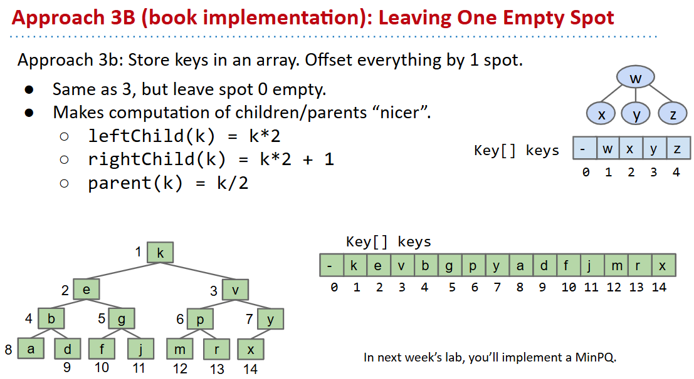

# 对比
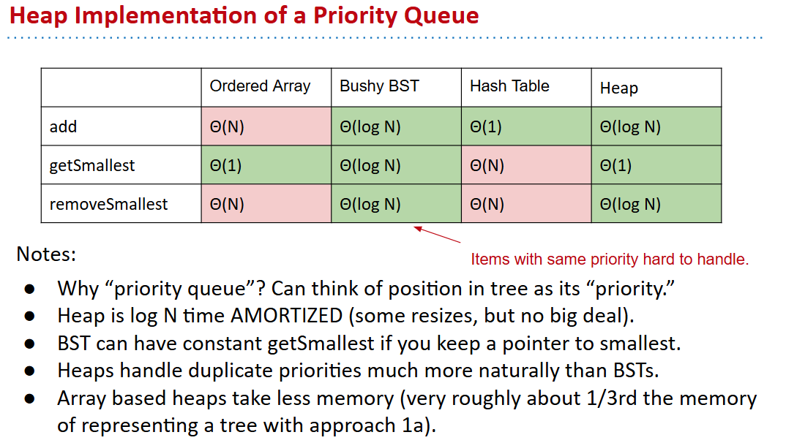

# Data Structures Summary
## Search Data Structures (The particularly abstract ones)
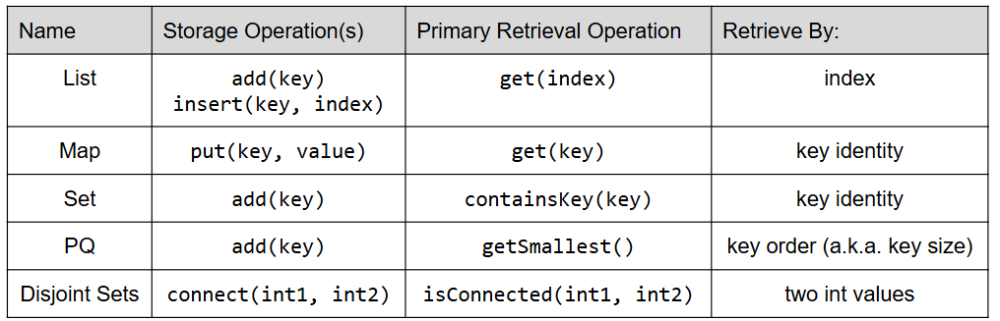
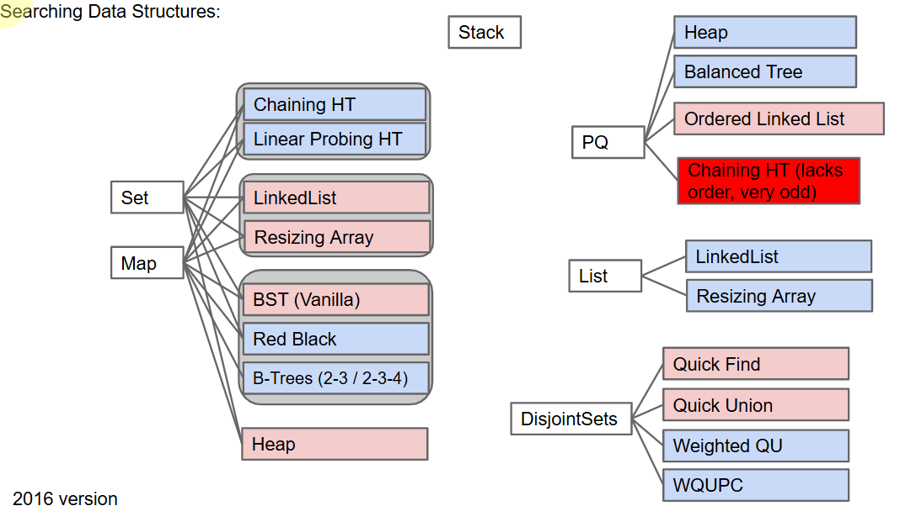
