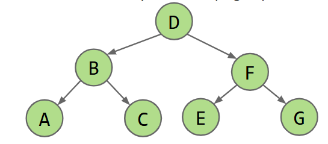
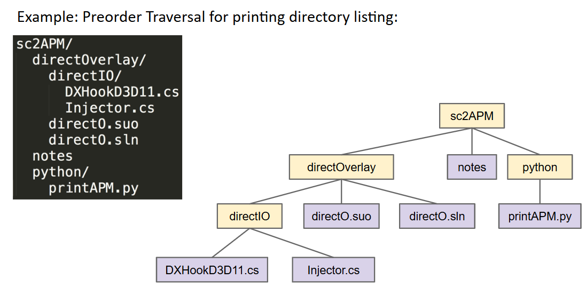
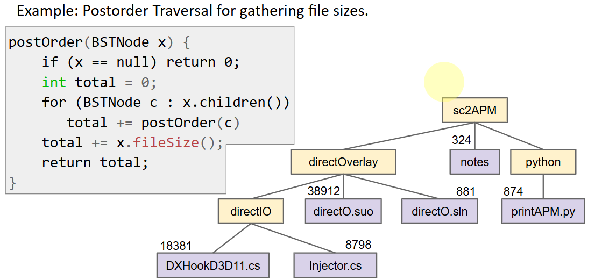
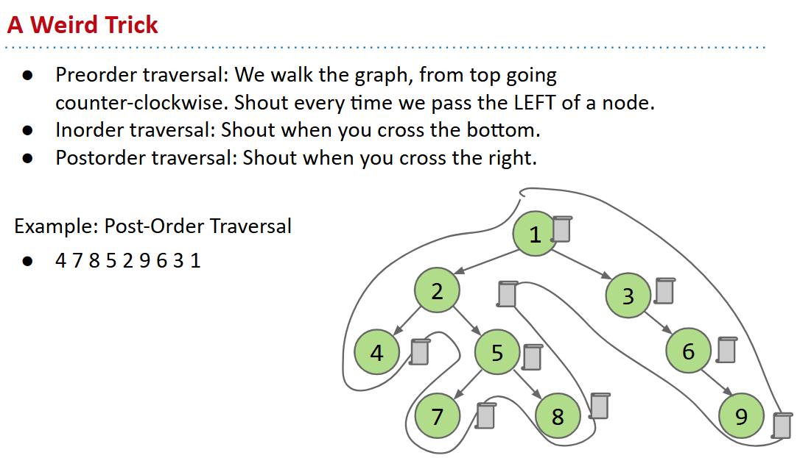
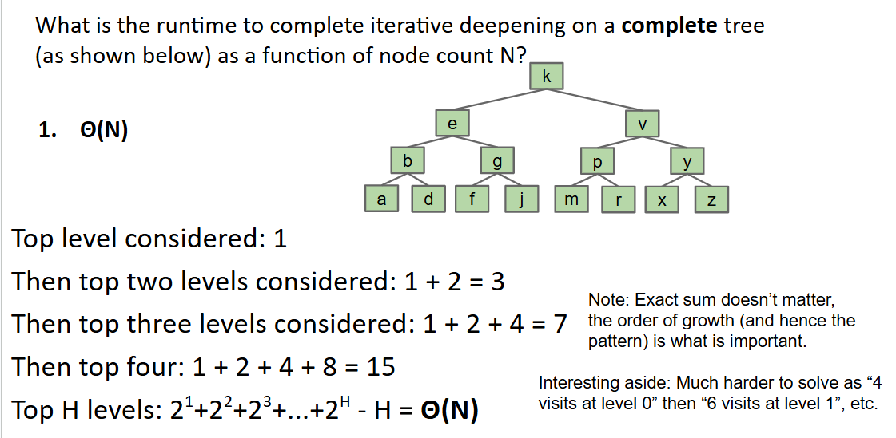
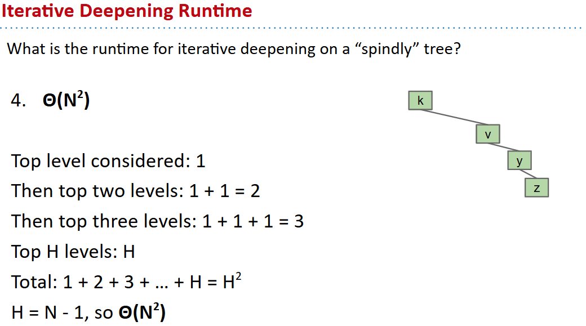
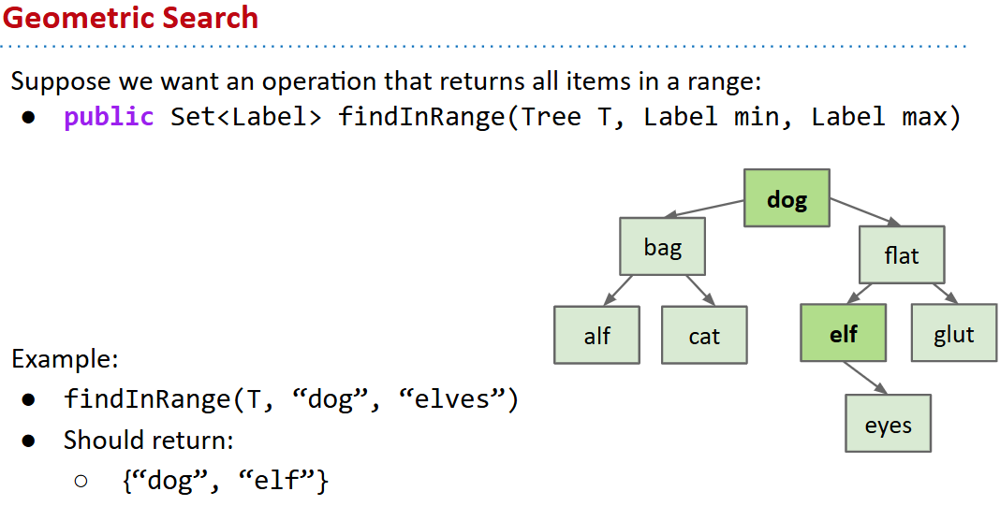
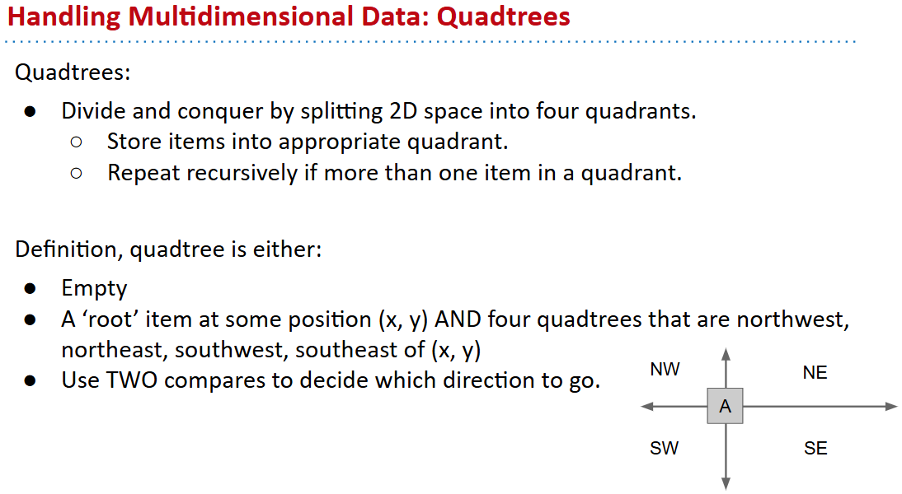
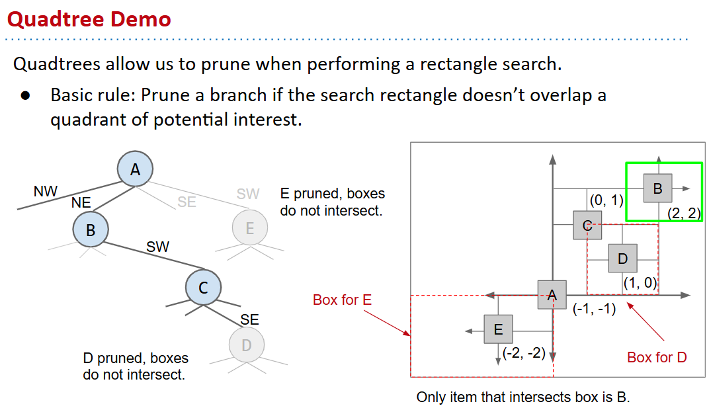

# 61B-25: Advanced Trees, incl. Geometric


# Traversals
Level Order
- Traverse top-to-bottom, left-to-right (like reading in English): 
- We say that the nodes are ‘visited’ in the given order.

Depth First Traversals
- Preorder, Inorder, Postorder
- Basic (rough) idea: Traverse “deep nodes” (e.g. A) before shallow ones (e.g. F).



### preorder
```java
preOrder(BSTNode x) {
    if (x == null) return;
    print(x.key)
    preOrder(x.left)
    preOrder(x.right)
}
```
D B A C F E G



### inorder
```java
inOrder(BSTNode x) {
    if (x == null) return;
    inOrder(x.left)
    print(x.key)
    inOrder(x.right)
}
```
A B C D E F G


### postorder
```java
postOrder(BSTNode x) {
    if (x == null) return;
    postOrder(x.left)
    postOrder(x.right)
    print(x.key)
}
```
A C B E G F D

## trick to think about


## visitor pattern

```java
interface Action<Label> {
   void visit(Tree<Label> T);
}

class FindPig implements Action<String> {
   boolean found = false;
   @Override
   void visit(Tree<String> T) {
      if ("pig".equals(T.label))
         { found = true; }
   }
}

```

```java
void preorderTraverse(Tree<Label> T, Action<Label> whatToDo) {
   if (T == null) { return; }
   whatToDo.visit(T); /* before we hard coded a print */
   preorderTraverse(T.left, whatToDo);
   preorderTraverse(T.right, whatToDo);
}
```
```java
preorderTraverse(someTree, new FindPig());
```

What is the runtime of a preorder traversal in terms of N, the number                  of nodes? (in code below, assume the visit action takes constant time)
- Θ(N) : *Every node visited exactly once*. Constant work per visit.

# Level Order Traversal 
## Iterative Deepening
```java
public void levelOrder(Tree T, Action toDo) {
   for (int i = 0; i < T.height(); i += 1) {
      visitLevel(T, i, toDo);
   }
}

    // Run visitLevel H times, one for each level.
public void visitLevel(Tree T, int level, Action toDo) {
   if (T == null)
      { return; }
   if (lev == 0)
      { toDo.visit(T.key); }
   else {
      visitLevel(T.left(), lev - 1, toDo);
      visitLevel(T.right(), lev - 1, toDo);
   }
}
```



For algorithms whose runtime depends on height, difference between            bushy tree and spindly tree can be huge!

# Range Finding

问题描述


Easy approach, just do a traversal of the whole tree, and use visitor                         pattern to collect matching items. $\Theta(N)$

better way: **Pruning**, Restricting our search to only nodes that might contain the answers we seek. $\Theta(log N+R)$ ，其中R是匹配的的个数。


# Spatial Trees
2D Range Finding, Building Trees of Two Dimensional Data



# Optional: Tree Iterators
https://docs.google.com/presentation/d/14pqGRZAN_Q60xqYGR3c8XTqHdQT8BVWGPJPC_G_INJQ/edit#slide=id.g75c09ac94_0284
