# 61B-27: Graphs


# intro
## types of graph
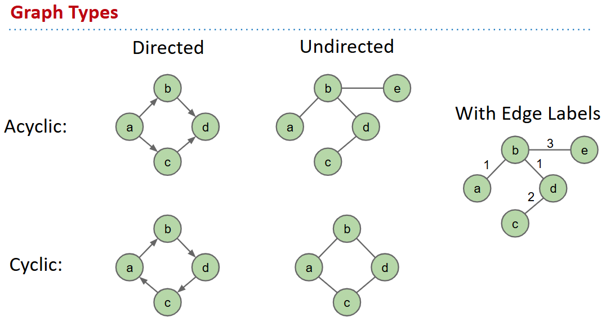
## terminology
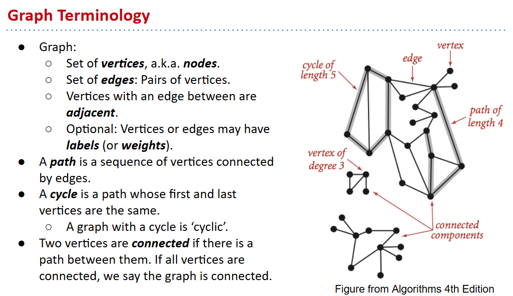
## 图论问题
- s-t Path. Is there a path between vertices s and t?
- Shortest s-t Path. What is the shortest path between vertices s and t?
- Cycle. Does the graph contain any cycles?
- Euler Tour. Is there a cycle that uses every edge exactly once?
- Hamilton Tour. Is there a cycle that uses every vertex exactly once?
- Connectivity. Is the graph connected, i.e. is there a path between all vertex pairs?
- Biconnectivity. Is there a vertex whose removal disconnects the graph?
- Planarity. Can you draw the graph on a piece of paper with no crossing edges?
- Isomorphism. Are two graphs isomorphic (the same graph in disguise)?

Graph problems: Unobvious which are easy, hard, or computationally intractable.

# Graph Representations
- Common Simplification: Integer Vertices

## API 
```java
public class Graph {
  public Graph(int V):               // Create empty graph with v vertices
  public void addEdge(int v, int w): // add an edge v-w
  Iterable<Integer> adj(int v):      // vertices adjacent to v
  int V():                           // number of vertices
  int E():                           // number of edges
...
```
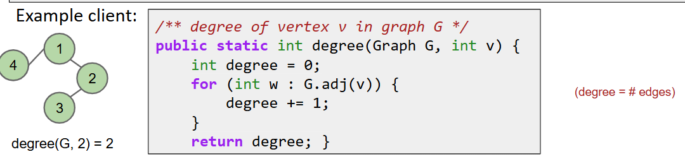
## #1 Adjacency Matrix
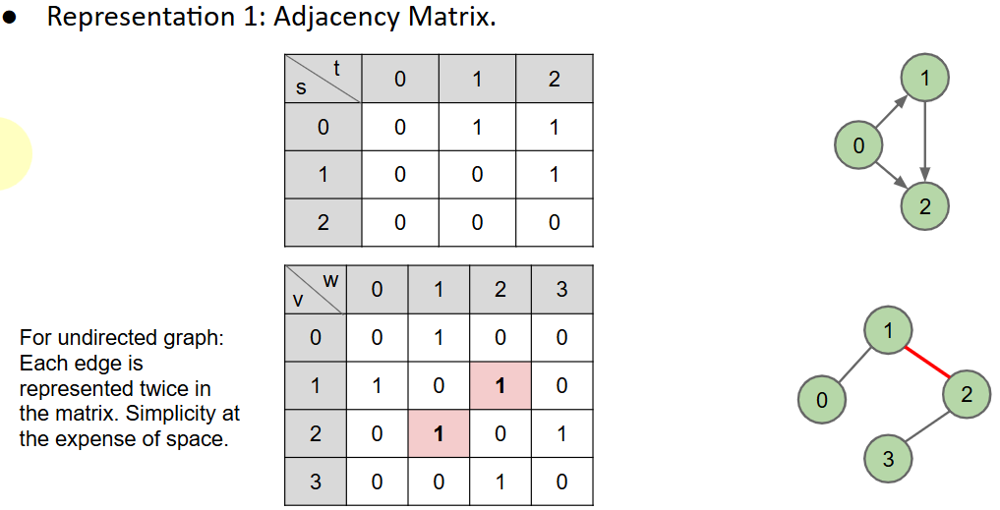
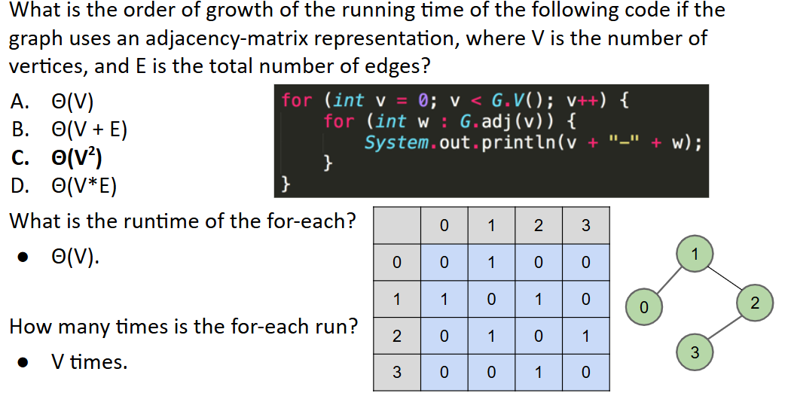

## #2 edge set
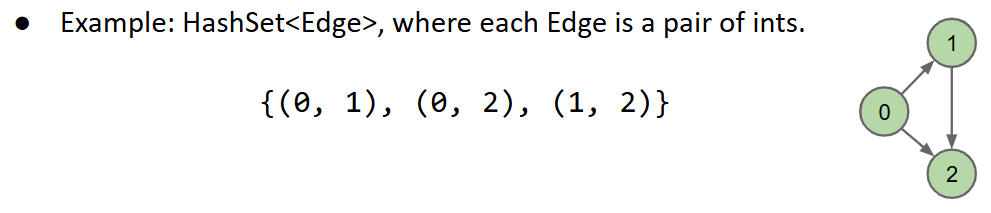

## #3 Adjacency List
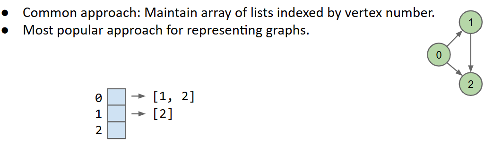
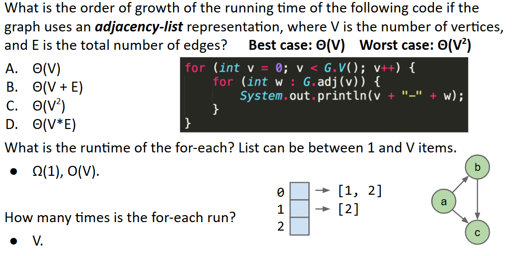
$\Theta(V) \rightarrow \Theta(V^2) $ √
$$
\Theta(V+E)
$$
才是有意思的答案
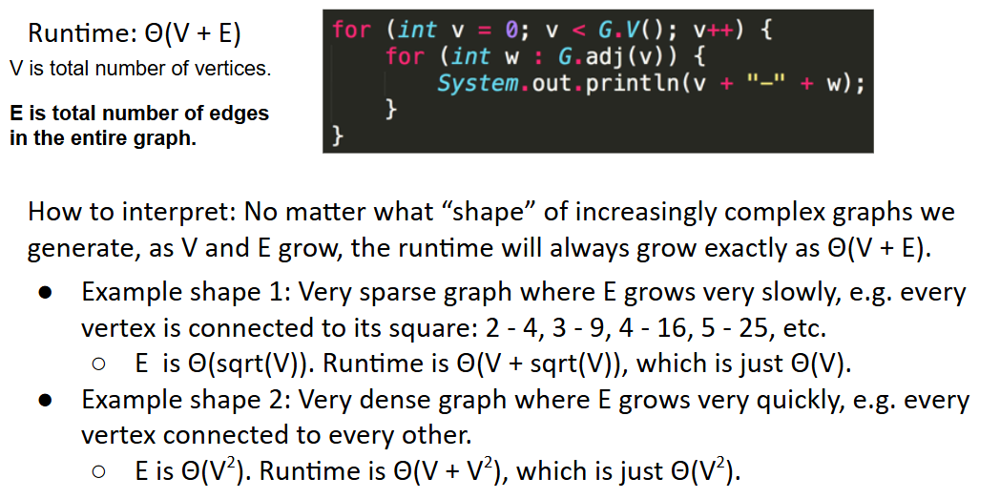

## 总结
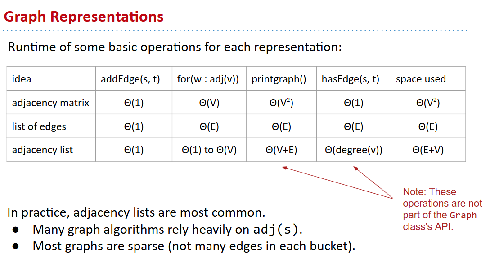
```java
public class Graph {
	private final int V;    private List<Integer>[] adj;
	
	public Graph(int V) {
    	    this.V = V;
    	    adj = (List<Integer>[]) new ArrayList[V]; // cast!
    	    for (int v = 0; v < V; v++) {
             adj[v] = new ArrayList<Integer>();
         }
	} 

	public void addEdge(int v, int w) {
         adj[v].add(w);   adj[w].add(v);
	}

	public Iterable<Integer> adj(int v) {
        return adj[v];
	}
}
```

# Depth First Traversal

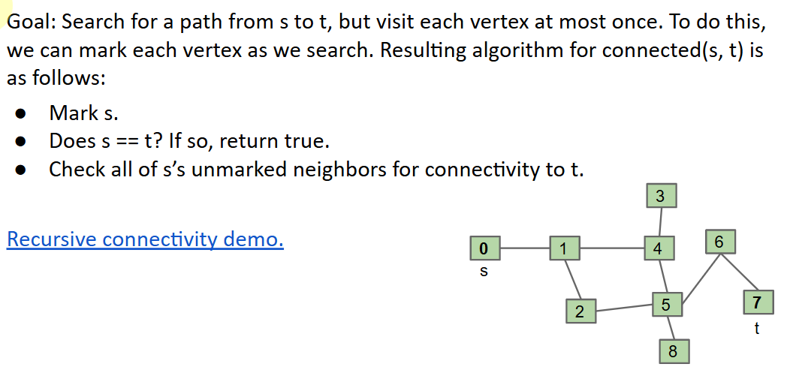
https://docs.google.com/presentation/d/1IJyC4cAogU2x3erW7E3hDz8jWDTLoaaot8u2ebHtpto/pub?start=false&loop=false&delayms=3000

## implementation
```java
public class Paths {
    public Paths(Graph G, int s):    Find all paths from G
    boolean hasPathTo(int v):        is there a path from s to v?
    Iterable<Integer> pathTo(int v): path from s to v (if any)
}
```
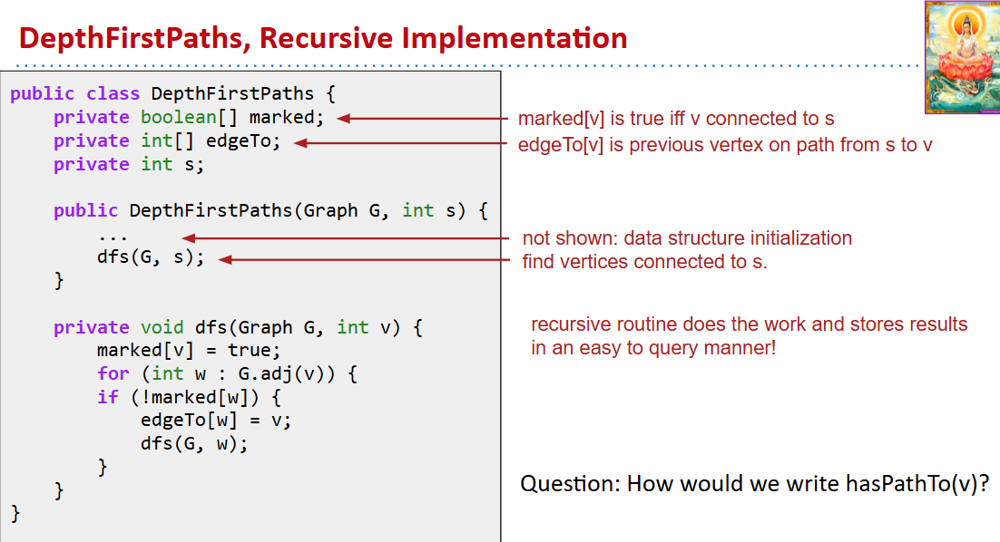

## summary
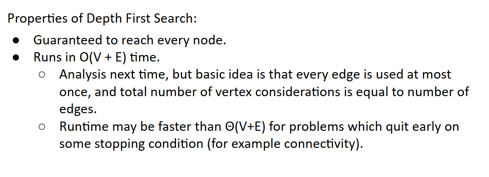
