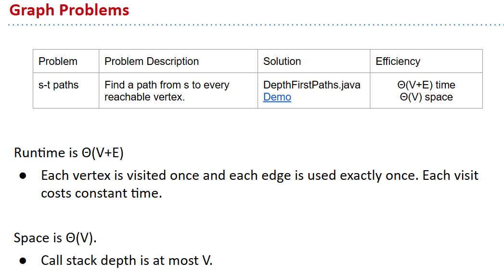

# 61B-28:  Graph Traversals


# Depth First Paths
“Depth First Search” is a more general term for any graph search algorithm that traverses a graph as deep as possible before backtracking.
- The term is used for several slightly different algorithms. For example: 
  - DFS may refer to the version from the previous lecture that doesn’t use any marks (and thus can get caught in a loop).
  - DFS may refer to the version where vertices are marked.
  - DFS may refer to a version where vertices are marked and source edges recorded (as in Depth First Paths).
  - DFS may refer to other algorithms like the “topological sort algorithm” well discuss later in lecture.
And more!


space 分析可能是要考虑runtime的内存占用，因为DFS算法需要递归调用，每一次递归调用都会消耗一定的内存。

# Graph Traversals

应该讲的是BFS


# Topological Sorting

DFS, then reverse the order of the vertices.


```java
public class DepthFirstOrder {
	private boolean[] marked;
	private Stack<Integer> reversePostorder;
	public DepthFirstOrder(Digraph G) {
   	 reversePostorder = new Stack<Integer>();
   	 marked = new boolean[G.V()];
   	for (int v = 0; v < G.V(); v++) {
       	if (!marked[v]) { dfs(G, v); } 
/**
 * Perform DFS of all unmarked vertices.
 * Note: Our algorithm earlier started at vertices with indegree zero. It turns out this
 * algorithm works no matter where you start!
 * */ 

	}
	private void dfs(Digraph G, int v) {
   	    marked[v] = true;
   	    for (int w : G.adj(v)) {
           	if (!marked[w]) { dfs(G, w); } 
         }
         reversePostorder.push(v);  // After each DFS is done, ‘visit’ vertex by putting on a stack.

 	}
	public Iterable<Integer> reversePostorder()
	{ return reversePostorder; }
}
```

## now graph problem summary
本质上还是 DFS


# Breadth First Search

"fringe"（边缘）通常指的是一个数据结构，用于存储等待处理的节点。[see](https://docs.google.com/presentation/d/1EGco7EDfVtrqouiUCQr6iY7Lq5mZmvWrprWm5yIQZTQ/pub?start=false&loop=false&delayms=3000)


```java
public class BreadthFirstPaths {
  private boolean[] marked;
  private int[] edgeTo;
  ...
	
  private void bfs(Graph G, int s) {
  Queue<Integer> fringe = 
          new Queue<Integer>();
  fringe.enqueue(s); // set up starting vertex
  marked[s] = true;
  while (!fringe.isEmpty()) {
    int v = fringe.dequeue();
	/**
	 * for freshly dequeued vertex v, for each neighbor that is unmarked:
	 * Enqueue that neighbor to the fringe.
	 * Mark it.
	 * Set its edgeTo to v.
	*/
    for (int w : G.adj(v)) {
      if (!marked[w]) {
        fringe.enqueue(w);
        marked[w] = true;
        edgeTo[w] = v;
      }
    }
  }
}
```


