# 61-29: Shortest Paths


### pros and cons
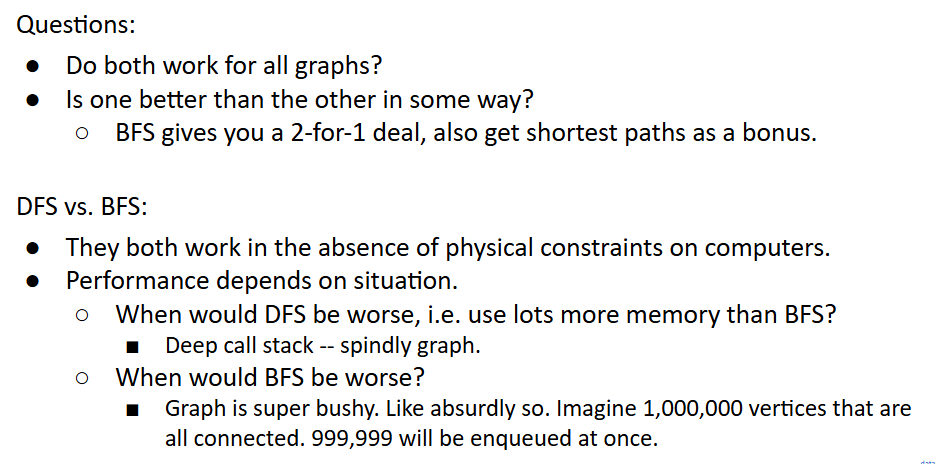

## Graph Problem so far
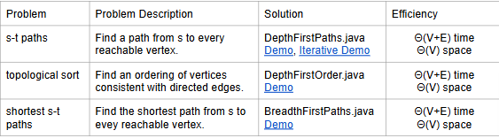
Punchline:
- ***DFS and BFS both traverse entire graphs, just in a different order*** (like preorder, inorder, postorder, and level order for trees).
- Solving graph problems is often a question of identifying the right traversal. Many traversals may work.
  - Example: DFS for topological sort. BFS for shortest paths.
  - Example: DFS or BFS about equally good for checking existence of path.

# Dijkstra’s Algorithm
problem restatement: Find the shortest paths from *source* vertex s to some *target* vertex t.
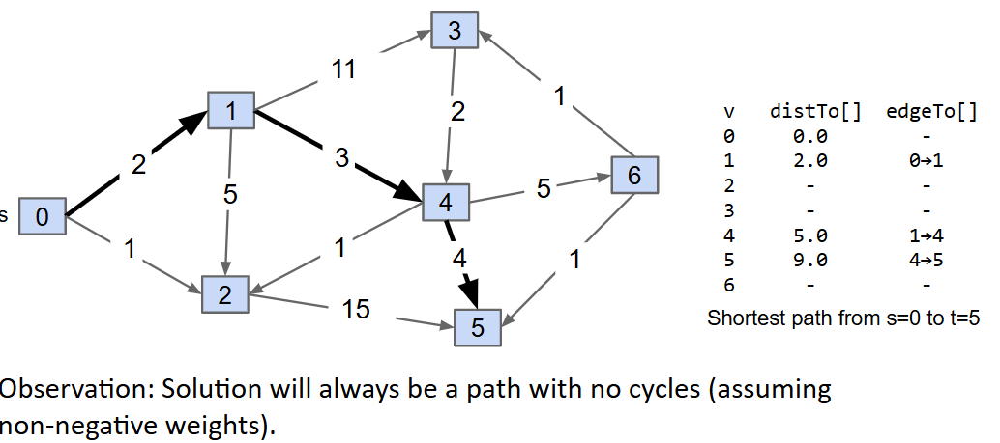
another problem restatement: Find the shortest path from *source* vertex s to *all* other vertices.
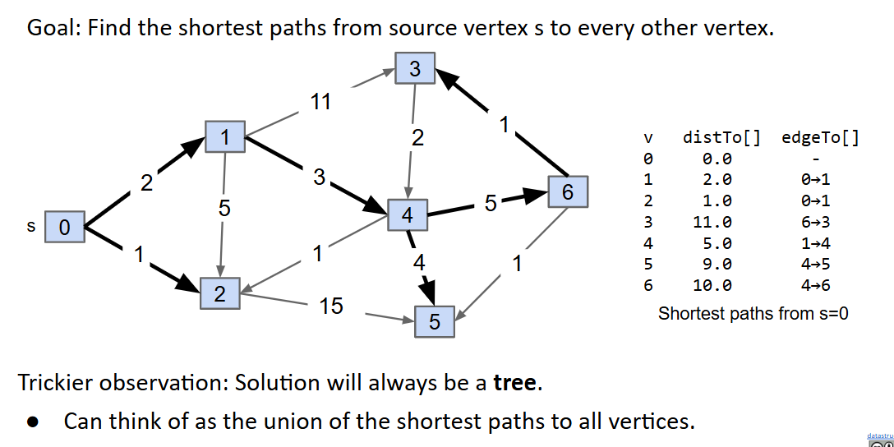
深层解释
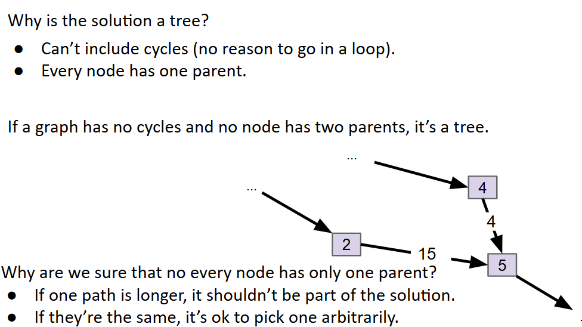

## SPT（Shortest Path Tree） Edge Count
If G is a connected edge-weighted graph with V vertices and E edges, how many edges are in the Shortest Paths Tree of G? [assume every vertex is reachable]

Always V-1: 
- For each vertex, ***there is exactly one input edge (except source).***

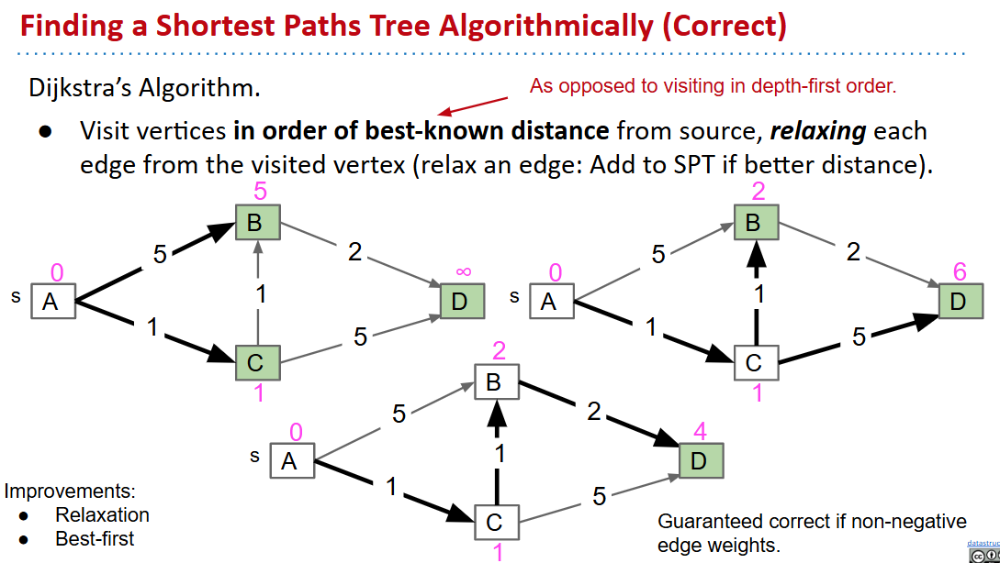
Insert all vertices into fringe PQ, storing vertices in order of distance from source.

Repeat: Remove (closest) vertex v from PQ, and relax all edges pointing from v.


[Dijkstra’s Algorithm Demo Link.](https://docs.google.com/presentation/d/1_bw2z1ggUkquPdhl7gwdVBoTaoJmaZdpkV6MoAgxlJc/pub?start=false&loop=false&delayms=3000)

贪心思想证明
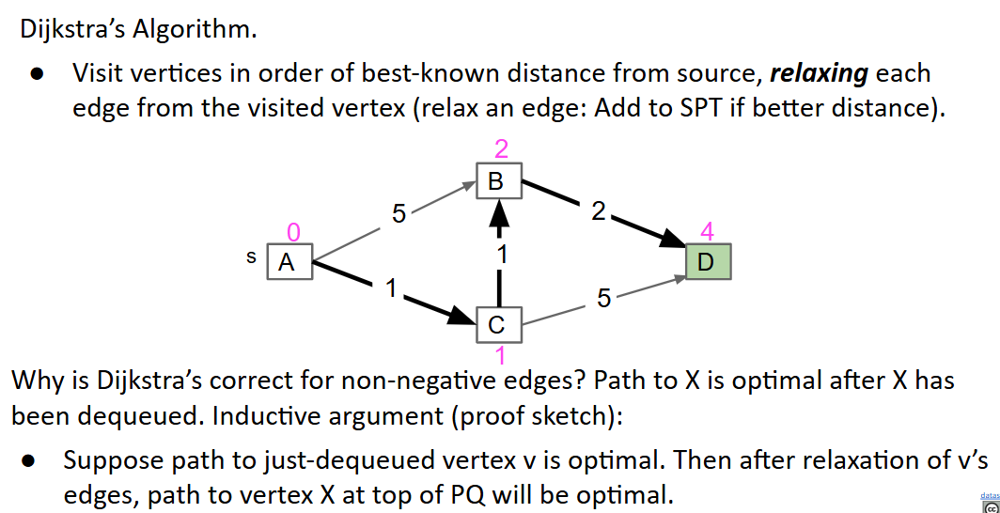

## 伪代码

http://algs4.cs.princeton.edu/44sp/DijkstraSP.java.html

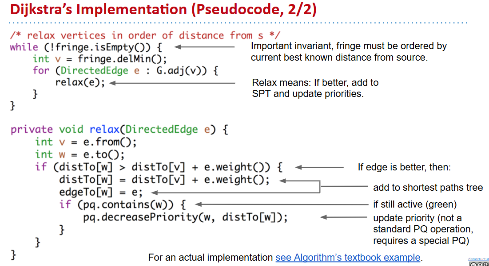

## runtime analysis
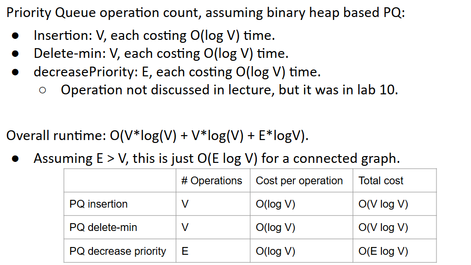

## so far graph problems
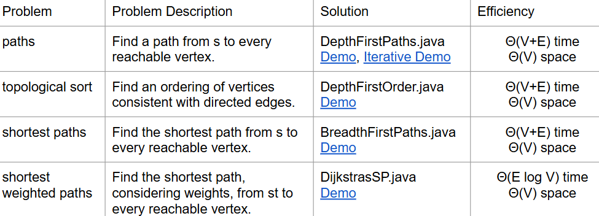

### The Problem with Dijkstra’s
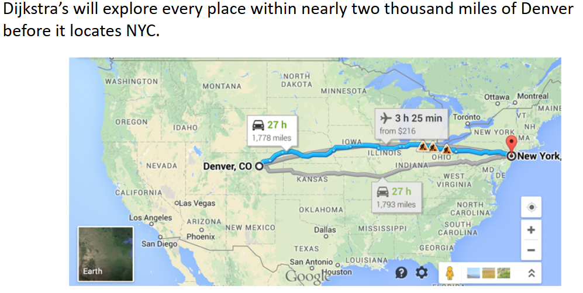

# A* (CS188 Preview)
We have only a single target in mind, so we need a different algorithm. How can we do better?
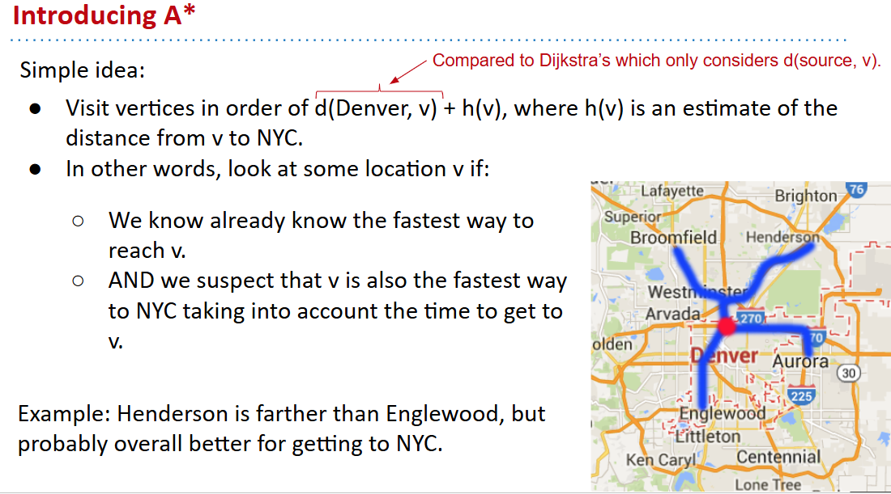

[A* Demo Link](https://docs.google.com/presentation/d/177bRUTdCa60fjExdr9eO04NHm0MRfPtCzvEup1iMccM/edit#slide=id.g771336078_0_180)

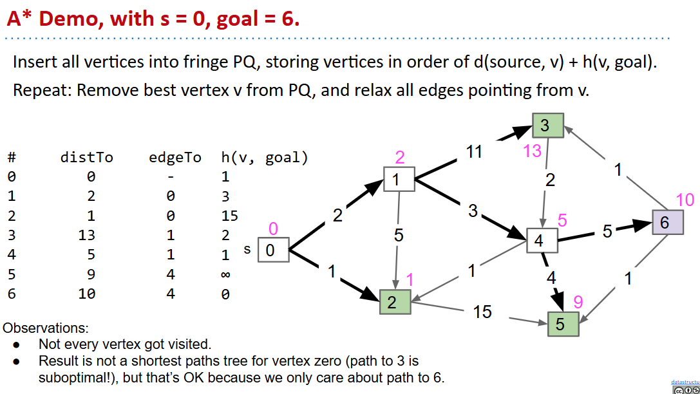
How do we get our estimate?
- Estimate is an arbitrary heuristic h(v).
- heuristic: “using experience to learn and improve”
- Doesn’t have to be perfect!
```java
/** h(v) DOES NOT CHANGE as algorithm runs. */
public method h(v) {
   return computeLineDistance(v.latLong, NYC.latLong);
}
```
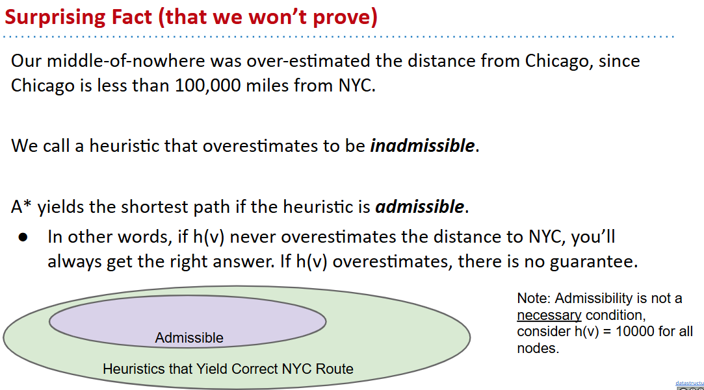

#### 可视化两者对比
http://qiao.github.io/PathFinding.js/visual/

## Summary
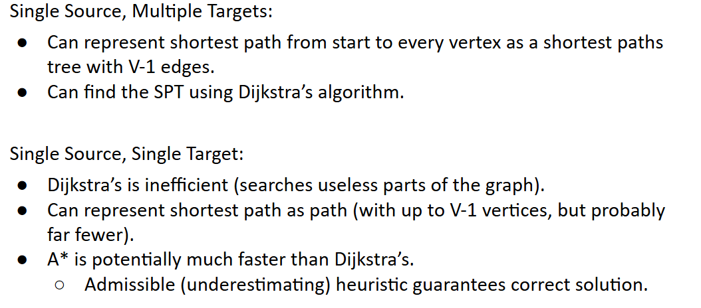

## graph problems so so far
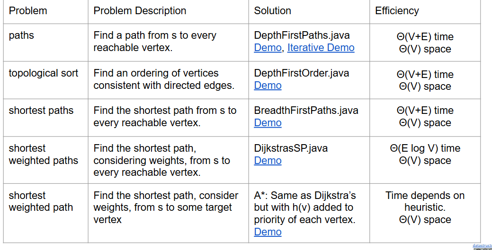


# A* Tree Search vs. A* Graph Search Admissibility vs. Consistency (Extra: See CS188 for more)
[see](https://docs.google.com/presentation/d/1fFAgAna9PrxRK54Whg4TtzduWeaWCp-Pbr7g95wVZss/edit#slide=id.g3639550628_1_13)


# Iterative DFS (Extra)
[see](https://docs.google.com/presentation/d/1fFAgAna9PrxRK54Whg4TtzduWeaWCp-Pbr7g95wVZss/edit#slide=id.g431b6f645db5a43c_114)
