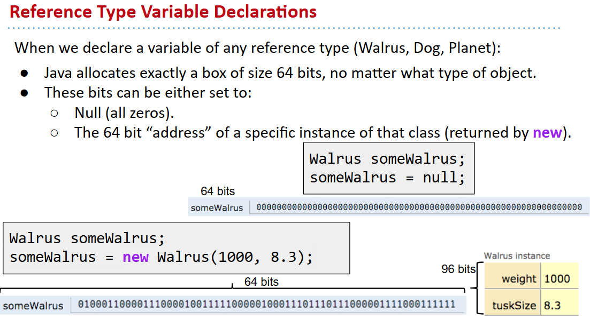
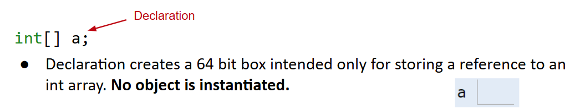
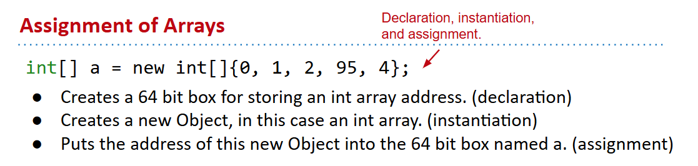

# 61B-3: References, Recursion, and Lists

# Primitive Types
8 primitive types in Java: byte, short, int, long, float, double, boolean, char
Everything else, including arrays, is a reference type.
## The Golden Rule of Equals (GRoE)
Given variables y and x:
- y = x copies all the bits from x into y.

# Reference Types
Everything else, including arrays, is a reference type.

和cpp的区别之一不显式使用指针

# Parameter Passing
- pass by value :yum:
- pass by reference（某种意义上java纯纯pass by value :smirk:）

# Instantiation of Arrays

# IntList and Linked Data Structures
单链表，不赘述

