# 61B-30: Minimum Spanning Trees

# warm up
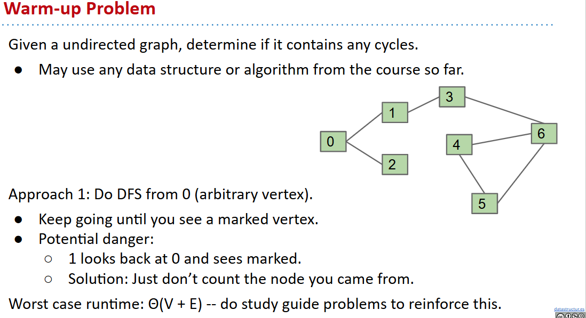
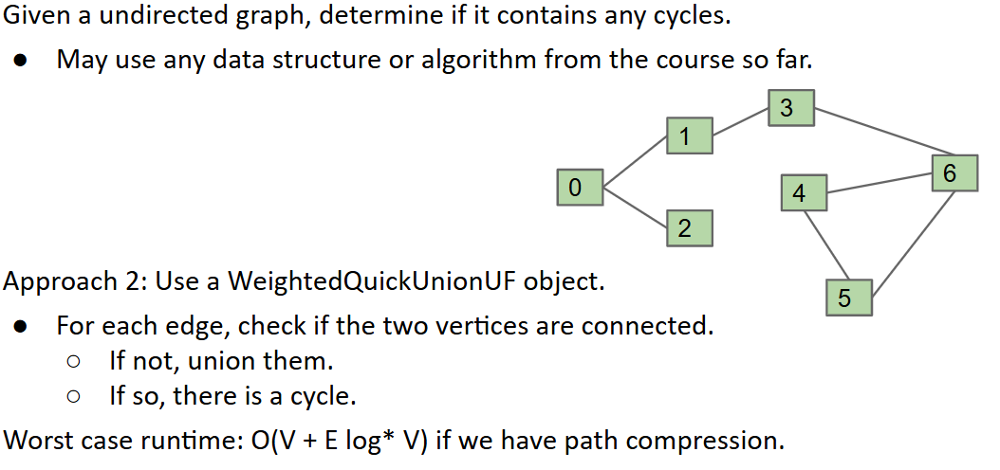

# MST, Cut Property, Generic MST Algorithm
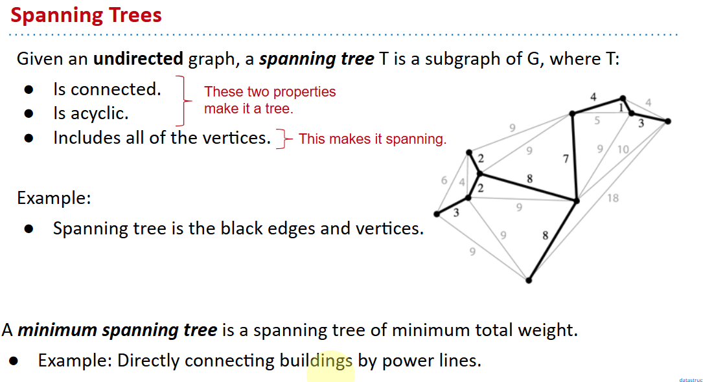
## MST vs SPT
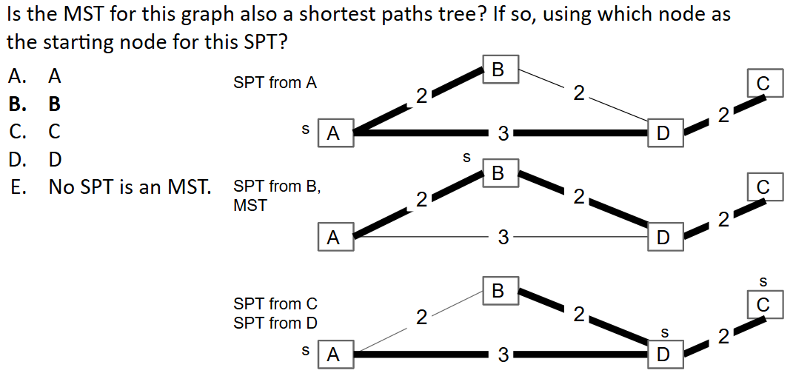
A shortest paths tree depends on the start vertex:
- Because it tells you how to get from a source to EVERYTHING.

There is no source for a MST.

Nonetheless, the MST sometimes happens to be an SPT for a specific vertex.

两者关系不大？
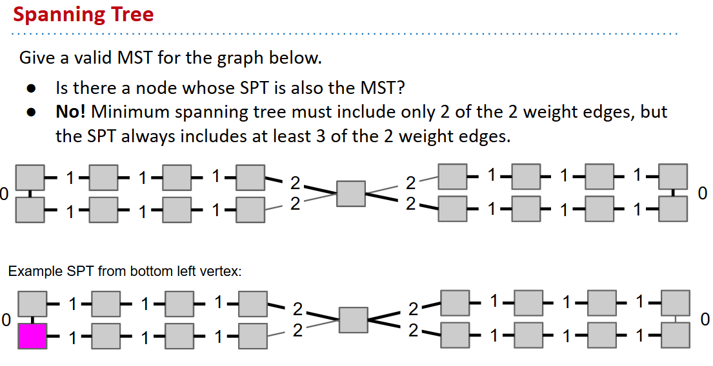
## Cut Property
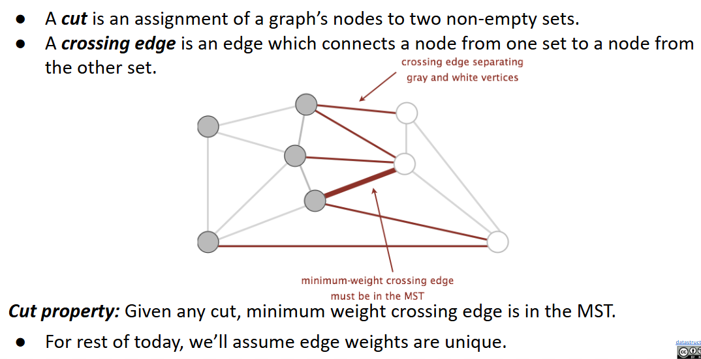
简单证明 cross bridge 一定在 MST 中。
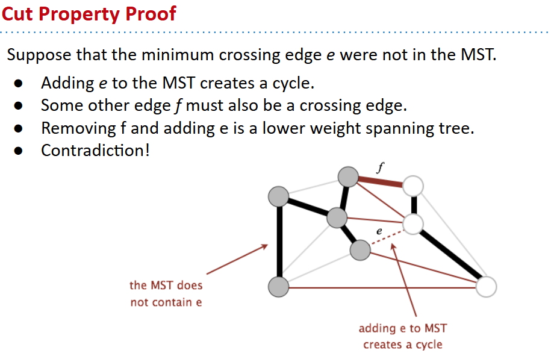
## Generic MST Algorithm
Start with no edges in the MST.
- Find a cut that has no crossing edges in the MST. 
- Add smallest crossing edge to the MST.
- Repeat until V-1 edges.

This should work, but we need some way of finding a cut with no crossing edges!
- Random isn’t a very good idea.

# Prim’s Algorithm
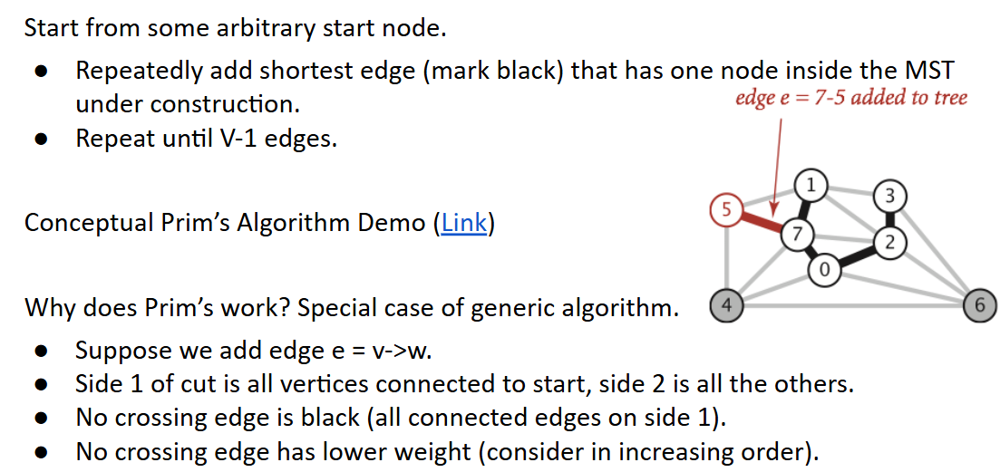
https://docs.google.com/presentation/d/1NFLbVeCuhhaZAM1z3s9zIYGGnhT4M4PWwAc-TLmCJjc/edit#slide=id.g9a60b2f52_0_0

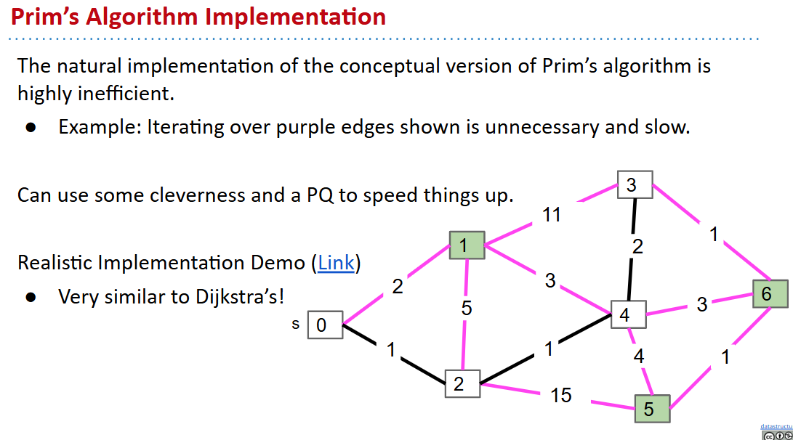
https://docs.google.com/presentation/d/1GPizbySYMsUhnXSXKvbqV4UhPCvrt750MiqPPgU-eCY/edit#slide=id.g9a60b2f52_0_0
## Prim’s vs. Dijkstra’s
Prim’s and Dijkstra’s algorithms are exactly the same, except Dijkstra’s considers “distance from the source”, and Prim’s considers “distance from the tree.”

Visit order:
- Dijkstra’s algorithm visits vertices in order of distance from the source.
- Prim’s algorithm visits vertices in order of distance from the MST under construction.

Relaxation:
- Relaxation in Dijkstra’s considers an edge better based on distance to source.
- Relaxation in Prim’s considers an edge better based on distance to tree.

## pseudocode

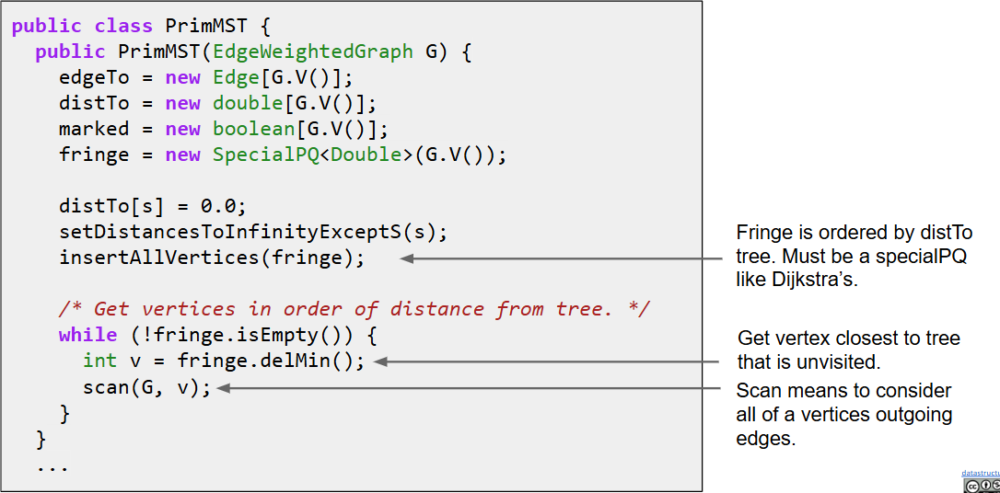

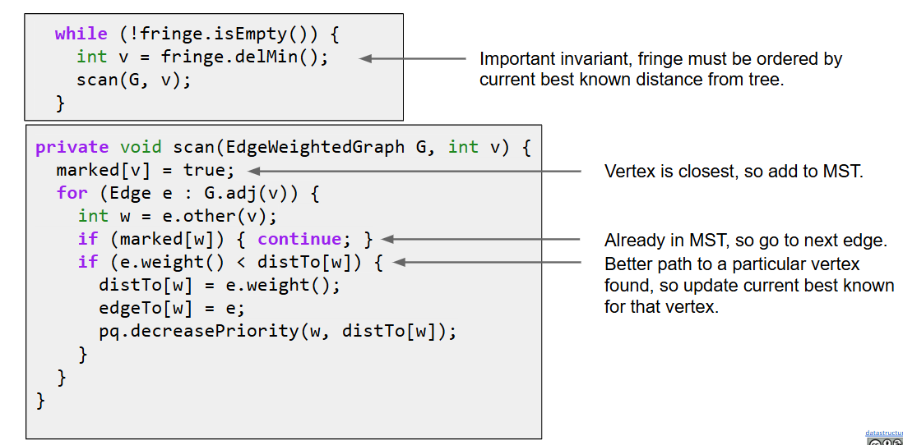

## runtime
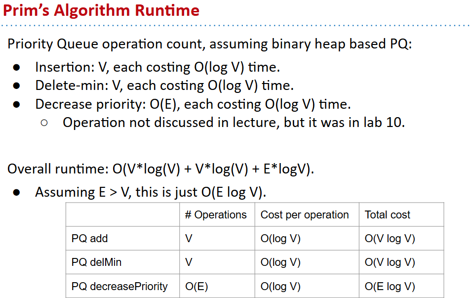

# Kruskal’s Algorithm
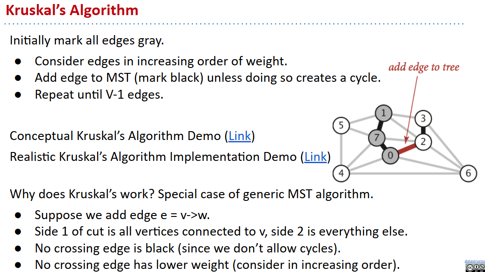

[conceptual](https://docs.google.com/presentation/d/1RhRSYs9Jbc335P24p7vR-6PLXZUl-1EmeDtqieL9ad8/edit?usp=sharing)
[real](https://docs.google.com/presentation/d/1KpNiR7aLIEG9sm7HgX29nvf3yLD8_vdQEPa0ktQfuYc/edit?usp=sharing)

## Kruskal’s Algorithm Pseudocode
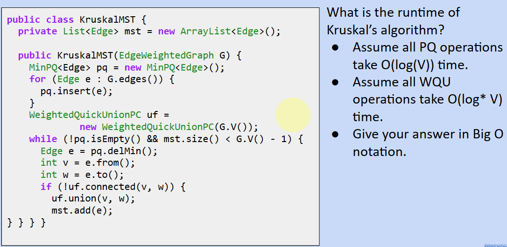
## runtime
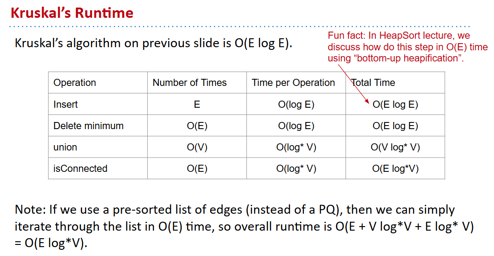

## Summary
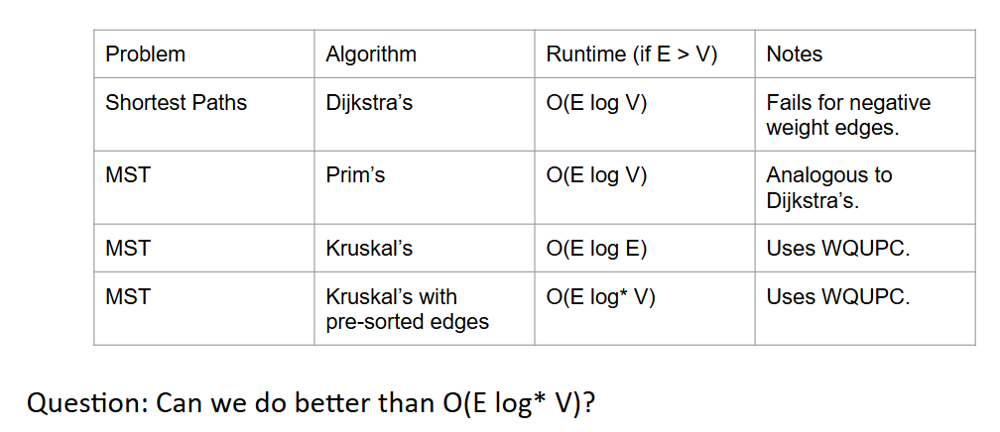
https://docs.google.com/presentation/d/1I8GSEL0CgT09_JjSUF7MfoRMJkyzPjo8lKRd8XdOaRA/edit#slide=id.g772f8a8e2_0_117

SOTA of compare-based MST algorithms :up:
