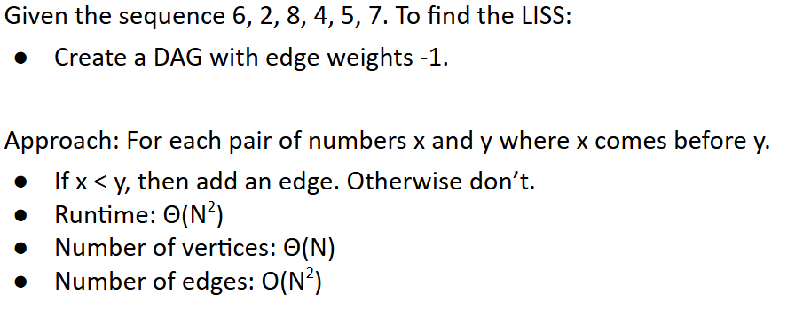

# 61B-31: Dynamic Programming

# Shortest Paths in a DAG (Directed Acyclic Graphs)

# Dynamic Programming

## the DAG SPT algorithm
The DAG SPT algorithm can be thought of as solving increasingly large subproblems:
- Distance from source to source is very easy, and is just zero.
- We then tackle distances to vertices that are a bit farther to the right.
- We repeat this until we get all the way to the end of the graph.

Problems grow larger and larger.
- By “large” we informally mean depending on more and more of the earlier subproblems.

This approach of solving increasingly large subproblems is sometimes called **dynamic programming**.

a simple and powerful idea for solving “big problems”:
- Identify a collection of subproblems.
- Solve subproblems one by one, working from smallest to largest.
- Use the answers to the smaller problems to help solve the larger ones. 

Identification of the “right” subproblems is often quite tricky.
- Largely beyond scope of CS61B.
- You’ll study this in much more detail in CS170.

# Longest Increasing Subsequence

The Longest Increasing Subsequence (LIS) problem is a classic dynamic programming problem.
## LLIS
Related problem: Find the length of the longest increasing subsequence (LLIS).

动用负数大变小

# LIS Using Dynamic Programming
还是对LLIS进行考量

Can think of the Q values as ***memoized*** answers to shorter subproblems.

Q(K) is the length of the longest subsequence ending at K.

Thus, length of the longest subsequence is just the maximum of all Q.

no DAG version

## summary of LLIS solutions
### #1

### #2a

### #2b

# Runtime for Approach 1 (Extra)
https://docs.google.com/presentation/d/1RlGUoB0bvKlHkxZXogmWGEzsI9ZXRWlg3ngf1FJkpac/edit#slide=id.g1298bbb99e_0_1920

取决于怎么建立DAG

