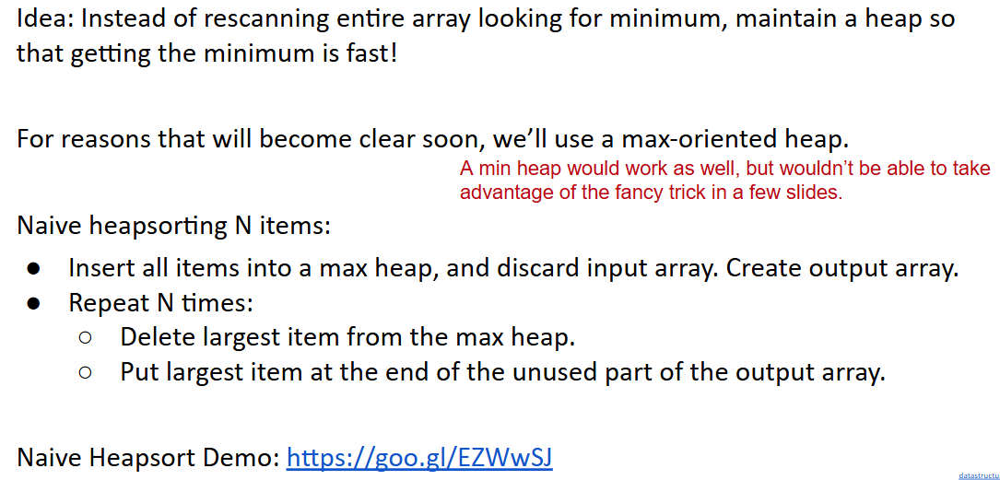
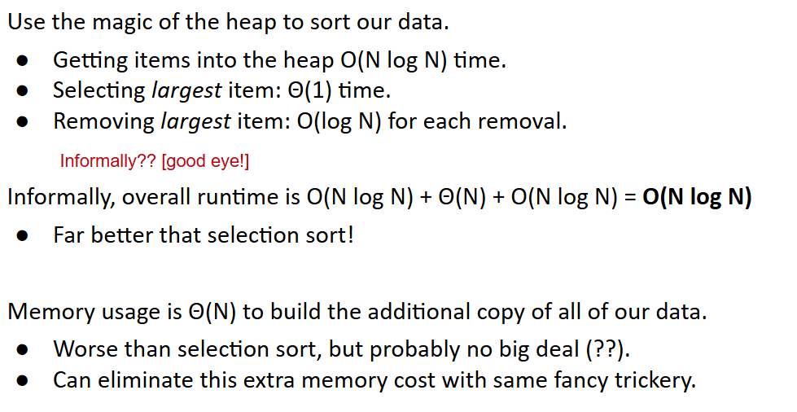

# 61B-32: Basic Sorting Algorithms

## definitions
A sort is a permutation (re-arrangement) of a sequence of elements that brings them into order according to some total order. A total order ≼ is:
- Total: x ≼ y or y ≼ x for all x, y
- Reflexive: x ≼ x
- Antisymmetric: x ≼ y and y ≼ x iff x = y (x and y are equivalent).
- Transitive: x ≼ y and y ≼ z implies x ≼ z.

In Java, total order is typically specified by compareTo or compare methods.
- May be inconsistent with equals! For example sorting an array of Strings by length has items that are equivalent, but not equal, e.g. “cat” and “dog”.

Goal of sorting:
- Given a sequence of elements with Z inversions.
- Perform a sequence of operations that reduces inversions to 0.

## Performance definition
Characterizations of the runtime efficiency are sometimes called the time complexity of an algorithm. Examples:
- DFS has time complexity Θ(V+E).

Characterizations of the **“extra”** memory usage of an algorithm is sometimes called the space complexity of an algorithm.
- DFS has space complexity Θ(V).
  - Note that the graph takes up space Θ(V+E), but we don’t count this as part of the runtime of DFS, ***since we’re only accounting for the extra space that DFS uses.***

# Selection Sort and Heapsort
selection Sort Properties: 

直接选择法 in Chinese

$Θ(N^2)$ time if we use an array (or similar data structure).

## Naive Heapsort: Leveraging a Max-Oriented Heap

分析

