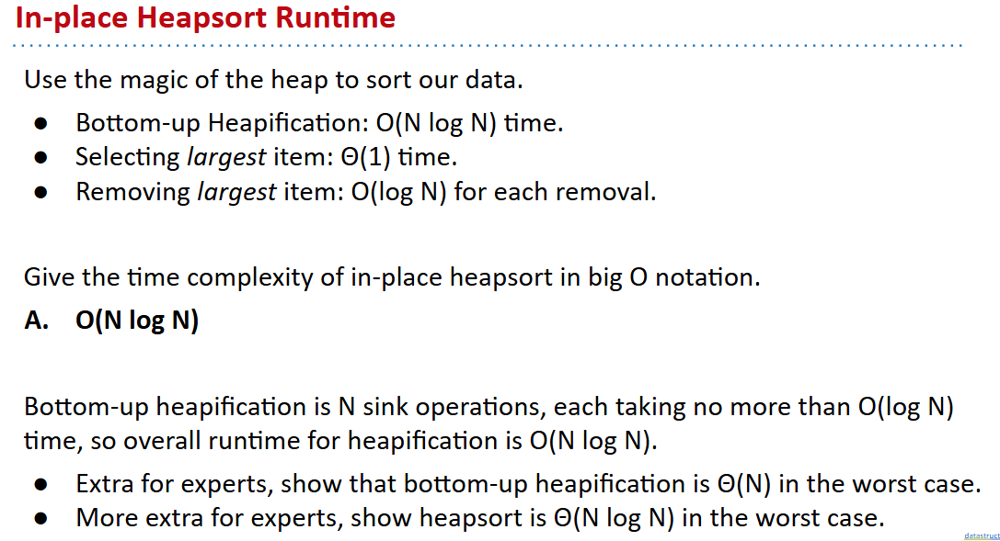
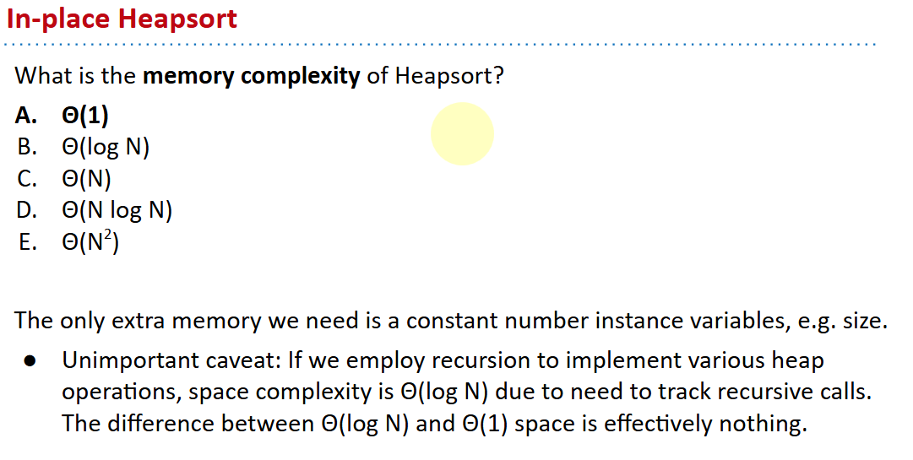
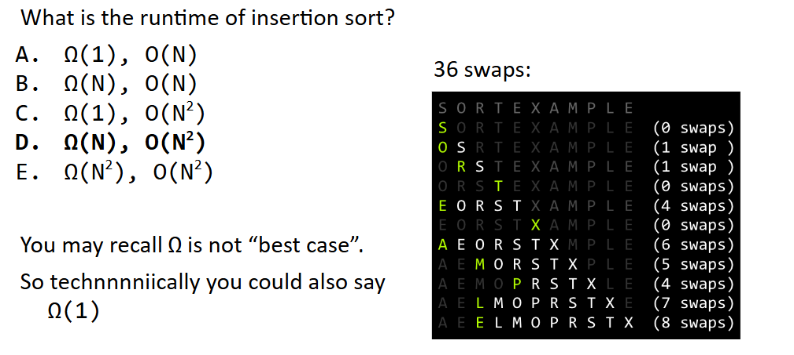
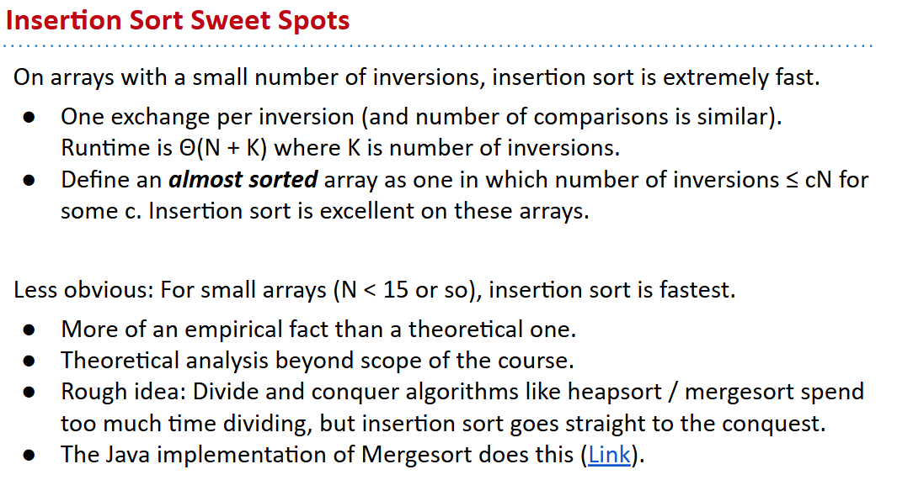
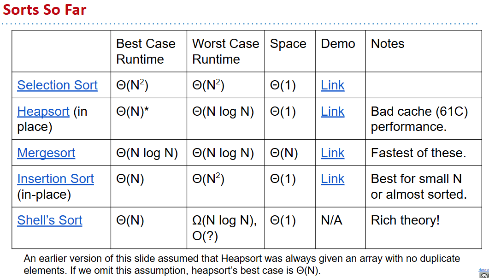

# 61B-32: Basic Sorting Algorithms

## definitions
A sort is a permutation (re-arrangement) of a sequence of elements that brings them into order according to some total order. A total order ≼ is:
- Total: x ≼ y or y ≼ x for all x, y
- Reflexive: x ≼ x
- Antisymmetric: x ≼ y and y ≼ x iff x = y (x and y are equivalent).
- Transitive: x ≼ y and y ≼ z implies x ≼ z.

In Java, total order is typically specified by compareTo or compare methods.
- May be inconsistent with equals! For example sorting an array of Strings by length has items that are equivalent, but not equal, e.g. “cat” and “dog”.

Goal of sorting:
- Given a sequence of elements with Z inversions.
- Perform a sequence of operations that reduces inversions to 0.

## Performance definition
Characterizations of the runtime efficiency are sometimes called the time complexity of an algorithm. Examples:
- DFS has time complexity Θ(V+E).

Characterizations of the **“extra”** memory usage of an algorithm is sometimes called the space complexity of an algorithm.
- DFS has space complexity Θ(V).
  - Note that the graph takes up space Θ(V+E), but we don’t count this as part of the runtime of DFS, ***since we’re only accounting for the extra space that DFS uses.***

# Selection Sort and Heapsort
selection Sort Properties: 

直接选择法 in Chinese

$Θ(N^2)$ time if we use an array (or similar data structure).

## Naive Heapsort: Leveraging a Max-Oriented Heap

分析

## in-place Heapsort
[demo](https://docs.google.com/presentation/d/1z1lCiLSVLKoyUOIFspy1vxyEbe329ntLAVDQP3xjmnU/edit?usp=sharing)
### performance analysis

# Merge Sort

[demo](https://docs.google.com/presentation/d/1h-gS13kKWSKd_5gt2FPXLYigFY4jf5rBkNFl3qZzRRw/edit)

Time complexity, [analysis from previous lecture](https://docs.google.com/presentation/d/1-RTOdwBNFVIMTxMh3LSJuePMAz5lFGRudwI3myX99gg/edit#slide=id.g8d0b1deb4_0364): Θ(N log N runtime)
Space complexity with aux array: Costs Θ(N) memory.

Also possible to do in-place merge sort, but algorithm is very complicated, and runtime performance suffers by a significant constant factor.

# Insertion Sort
General strategy: 
Starting with an empty output sequence.
Add each item from input, inserting into output at right point.

Naive approach, build entirely new output: [Demo](http://goo.gl/bVyVCS)

## in-place Insertion Sort
[Demo](https://docs.google.com/presentation/d/10b9aRqpGJu8pUk8OpfqUIEEm8ou-zmmC7b_BE5wgNg0/edit?usp=sharing)
有点像冒泡？

看上去没什么好的表现？

# Shell’s Sort (Extra) (Not on Exam)

# so far summary

