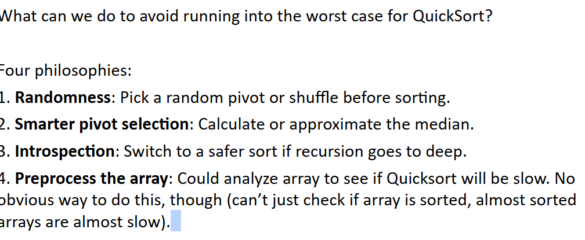

# 61B-33: Quick Sort

# Backstory, Partitioning

# Quick Sort
Partition Sort, a.k.a. Quicksort

# Quicksort Runtime

Theoretical analysis:
- Best case: Θ(N log N)
- Worst case: Θ(N2)

Compare this to Mergesort.
- Best case: Θ(N log N)
- Worst case: Θ(N log N)

Recall that Θ(N log N) vs. Θ(N2) is a really big deal. So how can Quicksort be the fastest sort empirically? *Because on average it is Θ(N log N).*
Rigorous proof requires probability theory + calculus, but intuition + empirical analysis will hopefully convince you.

***Argument #2: Quicksort is BST Sort*** :thinking: 

### so far summary

# Avoiding the Quicksort Worst Case

## summary so far

