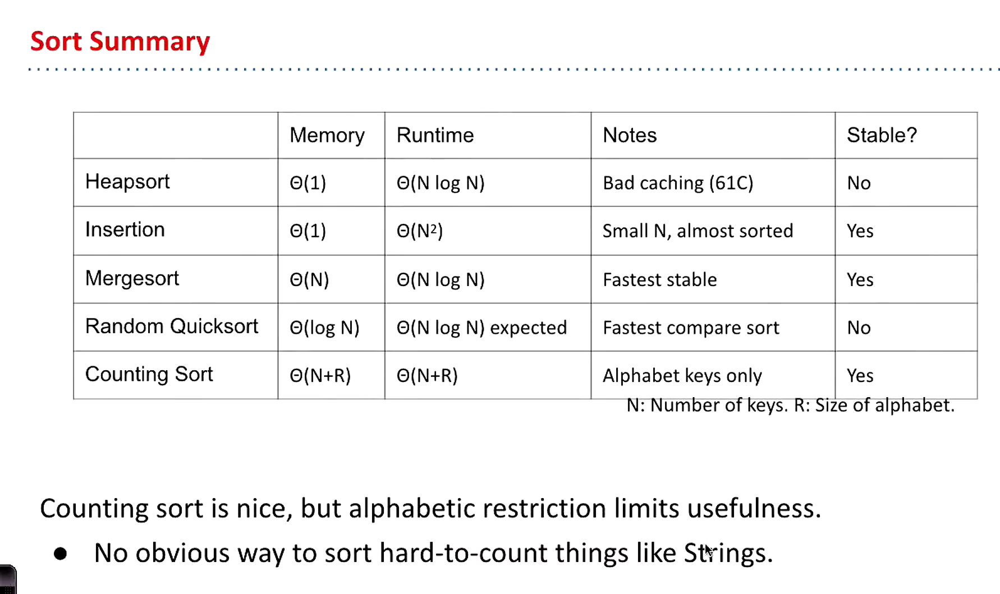
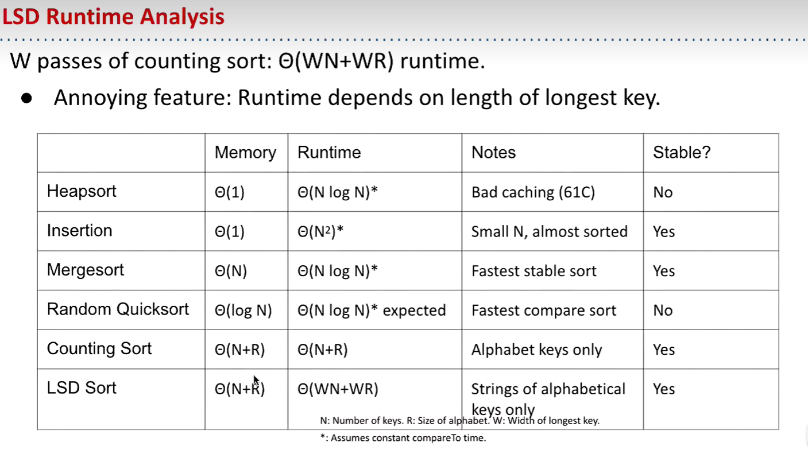

# 61B-36: Radix Sorts

# radix sort
不用comparisons的排序算法，时间复杂度O(dn)，d为最大数的位数，n为待排序数的个数。

空间换时间

bucket sort

counting sort:
1. 找出待排序数的最大值max，确定计数数组的长度为max+1。
2. 遍历待排序数，将每个数的个位数值作为索引，将该索引对应的计数数组元素加1。
3. 遍历计数数组，将每个元素的值作为索引，将该索引对应的元素值输出到结果数组中。

runtime: O(n+k)

LSD radix sort: least significant digit radix sort 
1. 找出待排序数的最大值max，确定计数数组的长度为10。
2. 遍历待排序数，将每个数的个位数值作为索引，将该索引对应的计数数组元素加1。

LSD sort vs merge sort:

similar strings:LSD sort is better

dissimilar strings:merge sort is better

MSD radix sort: most significant digit radix sort 
1. 找出待排序数的最大值max，确定计数数组的长度为10。
2. 遍历待排序数，将每个数的个位数值作为索引，将该索引对应的计数数组元素加1。
3. 遍历计数数组，将每个元素的值作为索引，将该索引对应的元素值输出到结果数组中。

runtime: O(n+k)
