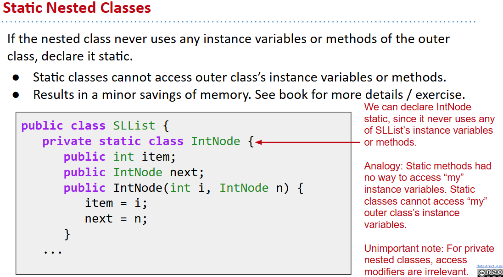
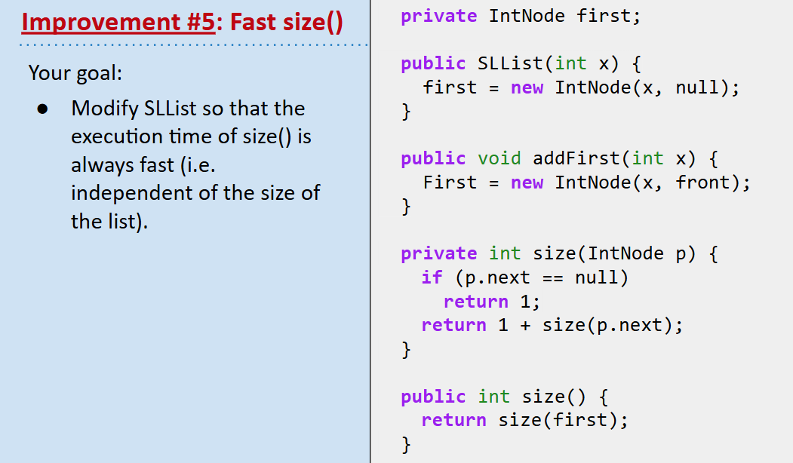
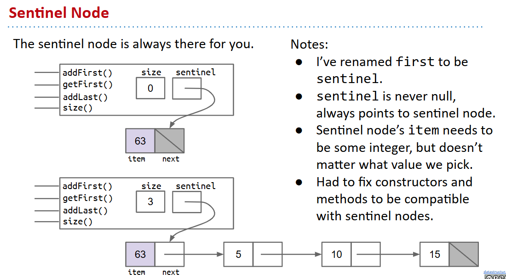

# 61B-4: SLLists, Nested Classes, Sentinel Nodes


# From IntList to SLList
事实是在SLList里面添加一个Intlist数据成员

# Public vs. Private or Nested Classes
介绍了`private`
## Nested Classes
```java
public class SLList {
   public class IntNode {
      public int item;
      public IntNode next;
      public IntNode(int i, IntNode n) {
         item = i;
         next = n;
      }
   }

   private IntNode first; 
   public SLList(int x) {
      first = new IntNode(x, null);
   } ...
}
```



# addLast() and size()
讨论recursion和iteration两种思路，略过

空间换时间初见


# Sentinel Nodes
- 对边界现象（空指针）的讨论和保护
- 简化代码`.addLast(x)`

