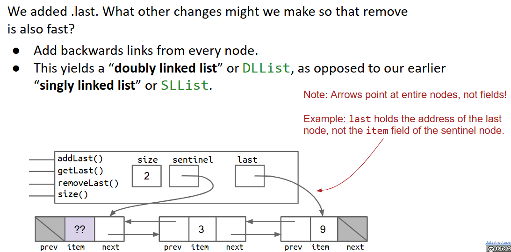
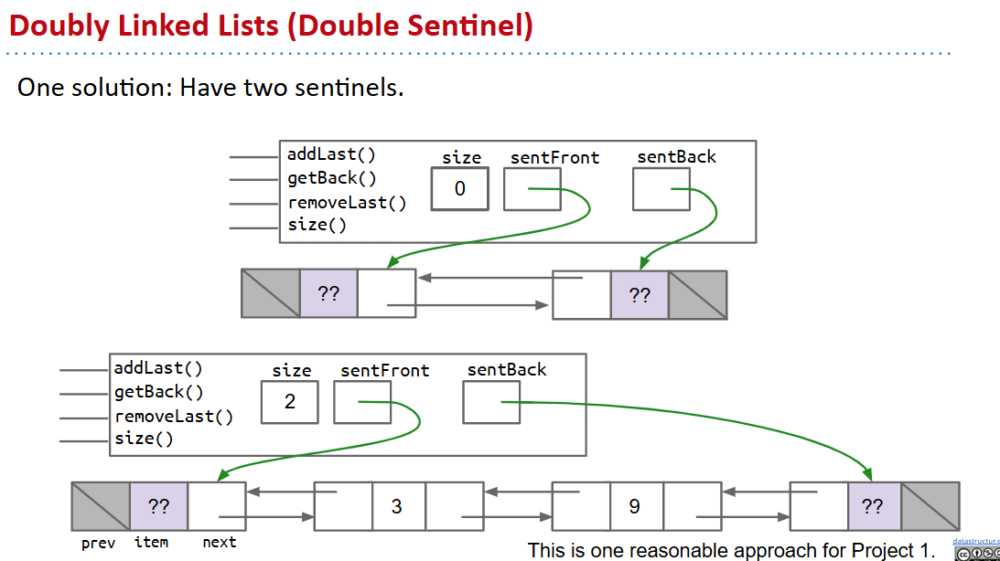
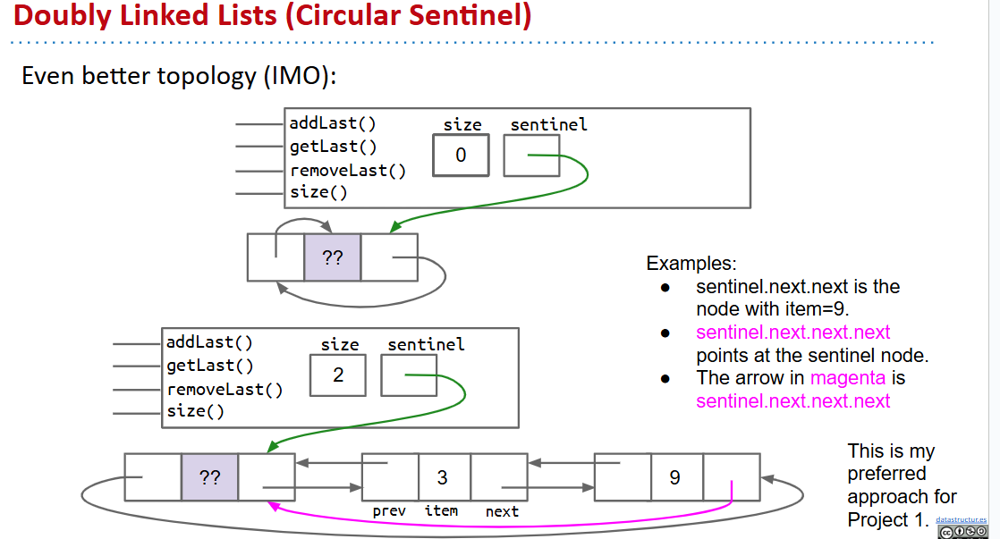
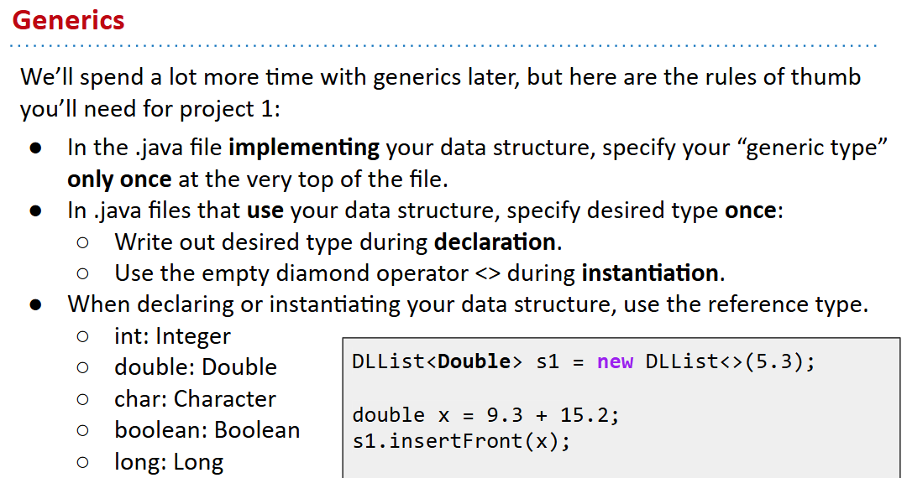
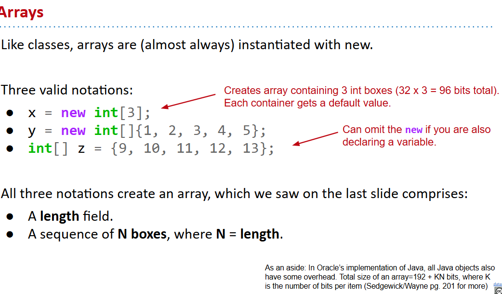
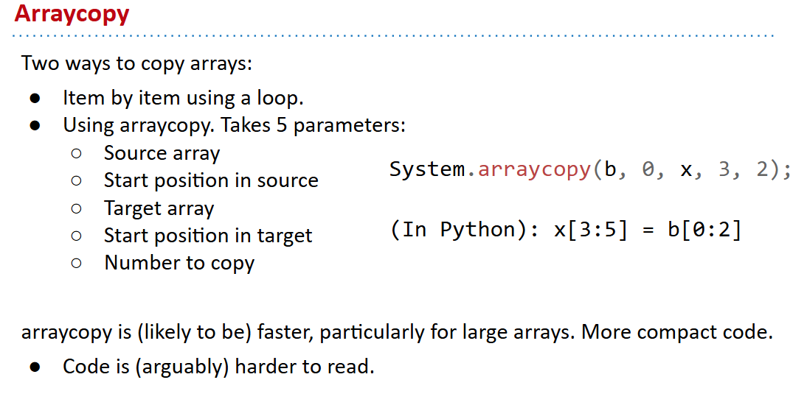
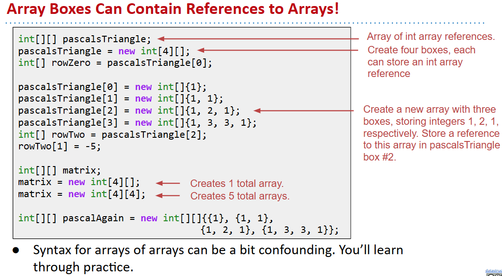
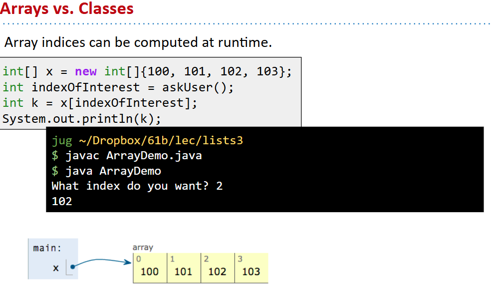
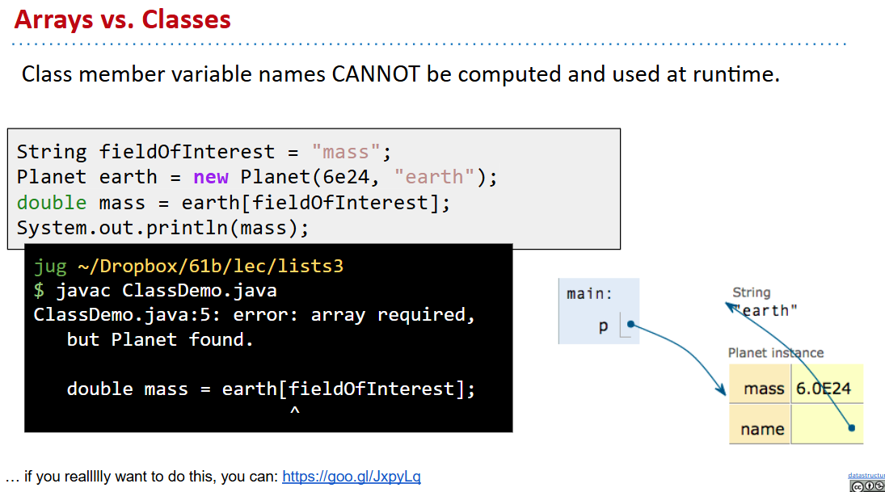
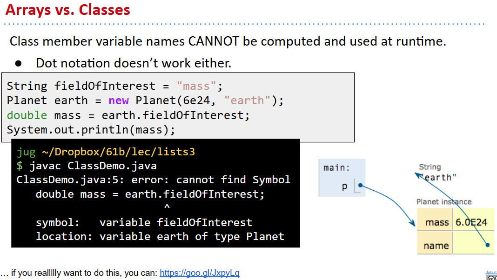

# 61B-5: DLLists, Arrays


# Doubly Linked Lists





注意只有sentinel时要讨论一些特殊情况，特别是环状链表。

# Generic Lists 泛型列表

```java
public class SLList<BleepBlorp> {
   private IntNode sentinel;
   private int size;


   public class IntNode {
      public BleepBlorp item;
      public IntNode next;
      ...
   }
   ...
}

SLList<Integer> s1 = new SLList<>(5);
s1.insertFront(10);
 
SLList<String> s2 = new SLList<>("hi");
s2.insertFront("apple");
```


# Arrays, AList

介绍了`System.arraycopy()`用来resize


# 2D Arrays


# Arrays vs. Classes
array的runtime动态索引（和cpp不一样）

class runtime


