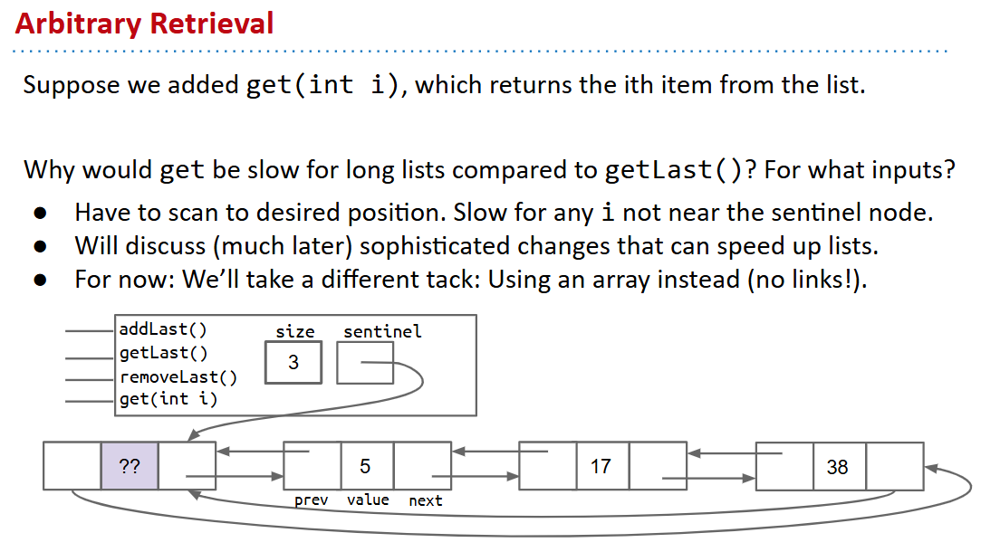
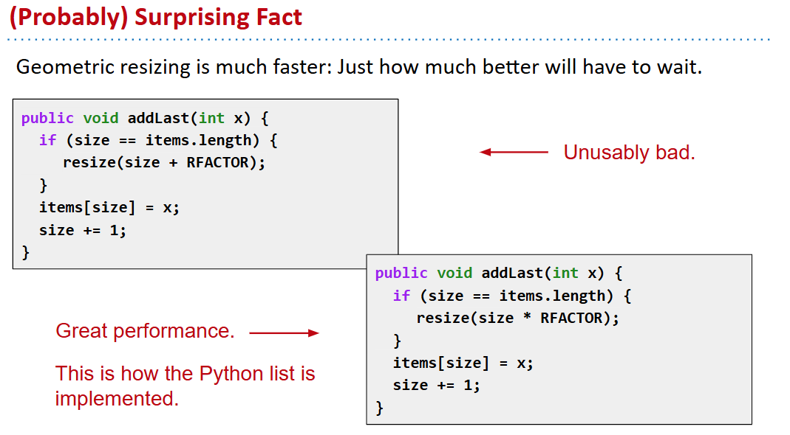
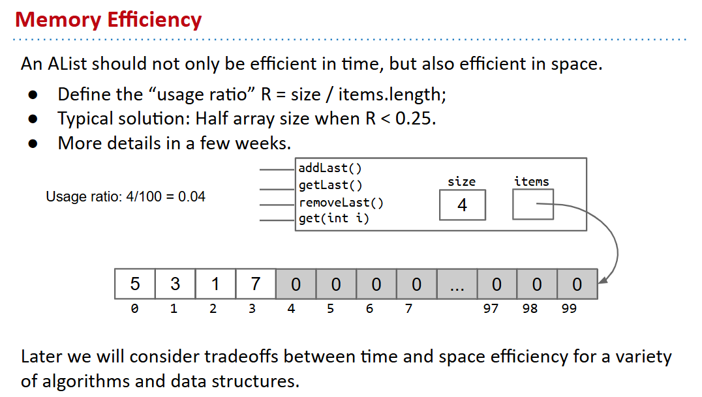

# 61B-6: ALists, Resizing, vs. SLists


# A Last Look at Linked Lists


# Naive Array Lists
```java
public class AList {
  private int[] items;    
  private int size;
 
  public AList() {
    items = new int[100];  size = 0;
  }
 
  public void addLast(int x) {
    items[size] = x;
    size += 1;
  }
 
  public int getLast() {
    return items[size - 1];
  }
 
  public int get(int i) {
    return items[i];
  }

  public int size() {
    return size;
  }
}
```

# Resizing Arrays
```java
public void addLast(int x) {
  if (size == items.length) {
    int[] a = new int[size + 1];
    System.arraycopy(items, 0, a, 0, size);
    items = a;  	
  }
  items[size] = x;
  size += 1;
}

private void resize(int capacity) {
  int[] a = new int[capacity];
  System.arraycopy(items, 0, a, 0, size);
  items = a;
}
 
public void addLast(int x) {
  if (size == items.length) {
	resize(size + 1);
  }
  items[size] = x;
  size += 1;
}

```

几何resize

## memory usage 仔细考量


# Generic ALists
```java
public class AList<Glorp> {
  private Glorp[] items;    
  private int size;
 
  public AList() {
    items = (Glorp []) new Object[8];  
    size = 0;
  }
 
  private void resize(int cap) {
    Glorp[] a = (Glorp []) new Object[cap]; // reinterprets as Glorp[]
    System.arraycopy(items, 0, 
                     a, 0, size);
    items = a;
  }

  public Glorp get(int i) {
    return items[i];
  }
  public Glorp deleteBack() {
  Glorp returnItem = getBack();
  items[size - 1] = null; // to help garbage collection
  size -= 1;  	
  return returnItem;
}
...
```

