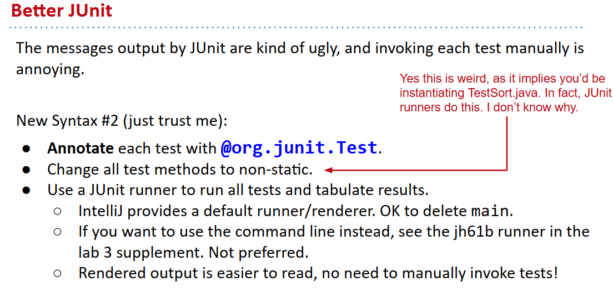

# 61B-7: Testing


# Ad Hoc Testing vs. JUnit

```java
public class TestSort {
  /** Tests the sort method of the Sort class. */  
  public static testSort() {
    String[] input = {"cows", "dwell", "above", "clouds"};
    String[] expected = {"above", "cows", "clouds", "dwell"};
    Sort.sort(input);
 
    org.junit.Assert.assertArrayEquals(expected, input);
  }
 
  public static void main(String[] args) {
    testSort();
  }
}
```

# Selection Sort
简单介绍一下了，关注点在junit


# Simpler JUnit Tests 



# ADD, TDD, Integration Testing


# More On JUnit (Extra)


