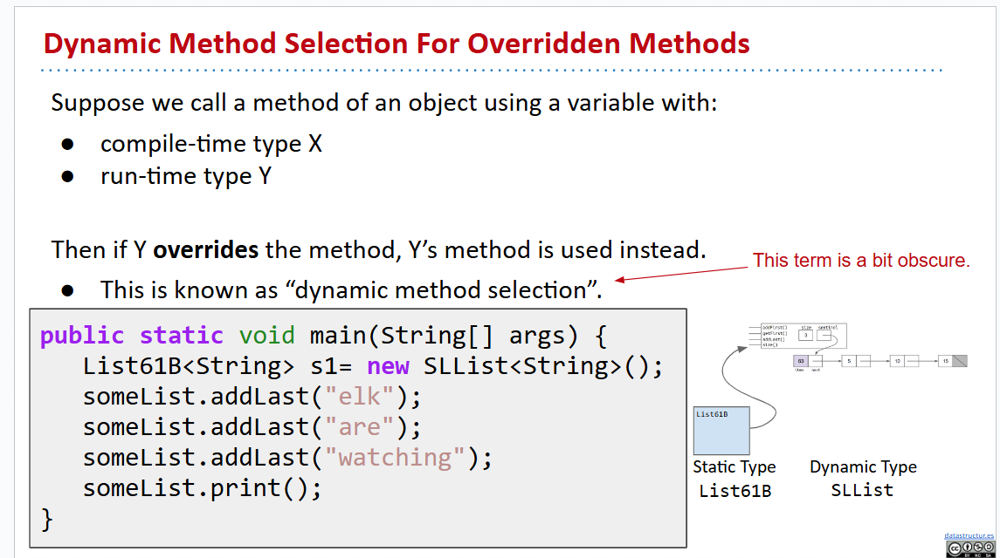
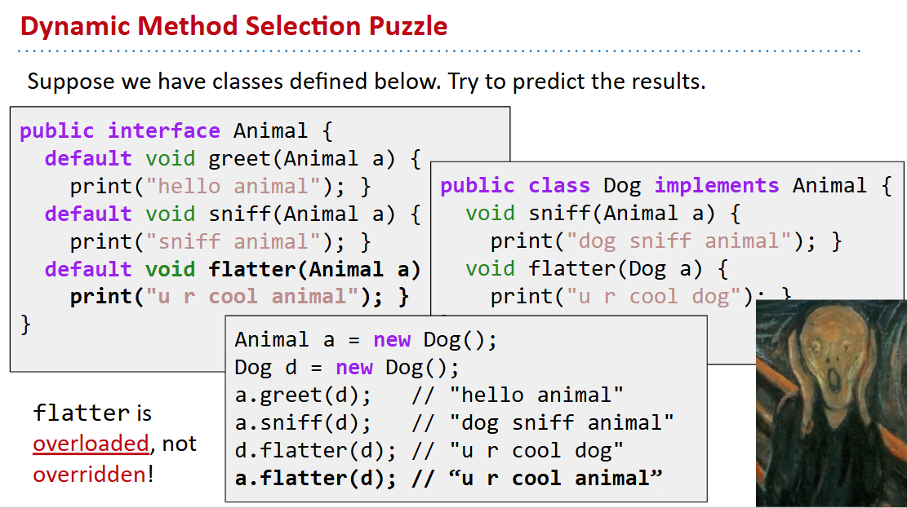

# 61B-8: Inheritance, Implements


but hard to maintain!
# Hypernyms, Hyponyms, and Interface Inheritance


## interface 
```java
public interface List61B<Item> {
   public void addFirst(Item x);
   public void addLast(Item y);
   public Item getFirst();
   public Item getLast();
   public Item removeLast();
   public Item get(int i);
   public void insert(Item x, int position);
   public int  size();
}
```

# Overriding vs. Overloading

override注意加上`@Override`!!!

# Interface Inheritance
基类存放指针问题
Answer: If X is a superclass of Y, then memory boxes for X may contain Y.
- An AList is-a List.
- Therefore List variables can hold ALList addresses.

# Implementation Inheritance: Default Methods
```java
public interface List61B<Item> {
   public void addFirst(Item x);
   public void addLast(Item y);
   public Item getFirst();
   public Item getLast();
   public Item removeLast();
   public Item get(int i);
   public void insert(Item x, int position);
   public int size();  
   default public void print() {
      for (int i = 0; i < size(); i += 1) {
         System.out.print(get(i) + " ");
      }
      System.out.println();
   }
}
```

# Static and Dynamic Type, Dynamic Method Selection :warning: :warning: :warning:



# More Dynamic Method Selection, Overloading vs. Overriding :warning: :warning: :warning:
*紧紧盯住细节！*

# Interface vs. Implementation Inheritance


