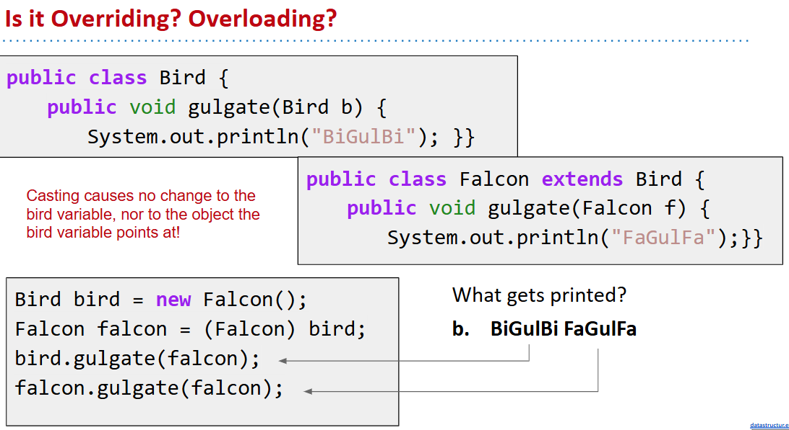

# 61B-9: Extends, Casting, Higher Order Functions


# Implementation Inheritance: Extends

`extends`
- Because of extends, RotatingSLList inherits all members of SLList:
- All instance and static variables. （注意public, private, protected的区别）
- All methods.
- All nested classes.
- Constructors are not inherited.

`super`
```java
public class VengefulSLList<Item> extends SLList<Item> {
private SLList<Item> deletedItems;
	public VengefulSLList() {
       deletedItems = new SLList<Item>();
	}
  
	@Override
	public Item removeLast() {
    		Item oldBack = super.removeLast();
    		deletedItems.addLast(oldBack);
    		return oldBack;
	}
 
	public void printLostItems() {
    		deletedItems.print();
	}
}
```
注意没有`super.super`的情况
## constructor


## Object class


# Encapsulation
## Module
**Module**: A set of methods that work together as a whole to perform some task or set of related tasks. 

Implementation Inheritance Breaks Encapsulation

注意private 还有 反复自我调用↓


# Type Checking and Casting


子类赋值给基类可以，反之不行


# Dynamic Method Selection and Casting Puzzle



# Higher Order Functions (A First Look)
执行类似f(f(x))的操作
Java7及之前不能使用函数指针，考虑实体化一个函数对象


Java8及其以后：

一张图总结继承

