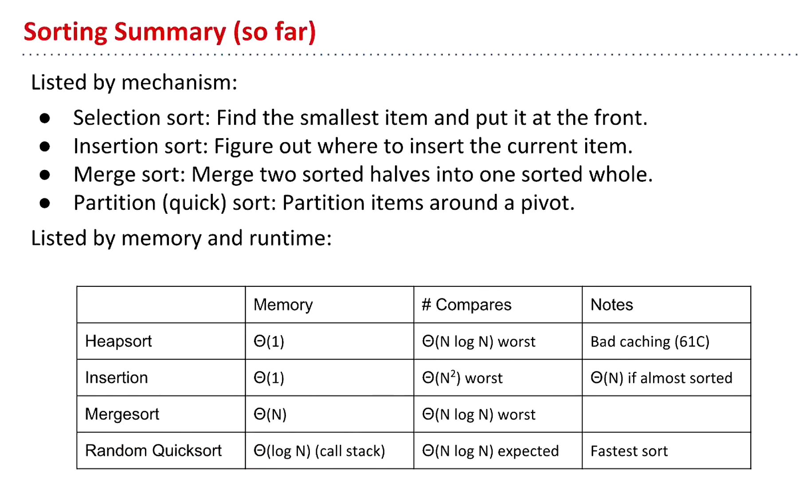

# 61B-34

# More quick sort, Stability, Shuffling

## quick sort VS merge sort

QuicksortL3S = left + 3-scan + shuffle

Quicksort_LTHS:

Tony Hoare partition scheme:
- L ptr 仅仅指向小的
- G ptr 仅仅指向大的
- ptr walk towards to each other, stopping on a hated item
  - 两个都停下来的话， 交换一下， 然后移动其中一个
  - when ptrs cross, done.
- 和G交换pivot

## Not random
smarter pivot selection:
**median**
Quicksort_PickTH

考虑了如何计算数组地址的复杂度， 以及如何选择pivot的复杂度。

worst case:
$$
\Theta(NlogN)
$$

但实际上并没有那么好，因为计算中位数的复杂度是$$\Theta(N)$$。耗费了更多时间。

## quick select--using partitioning

worst case:

a sorted array
$$
\Theta(N^2)
$$

on average:

$$
N + N/2 + N/4 +... + 1 = \Theta(N)
$$

## stability

for stable sort, we need to keep the relative order of equal elements

Is insertion sort stable?

yes, it is stable.

Is quick sort stable?

depends on the partitioning scheme.

## adaptive
array.sort() is adaptive
查看java官方文档

## shuffling
- random number and then sort

