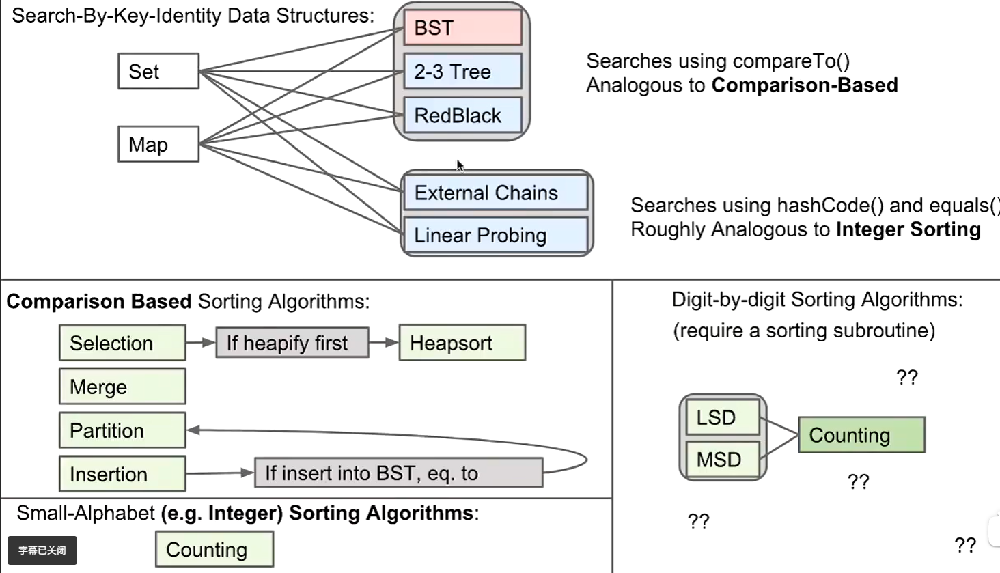
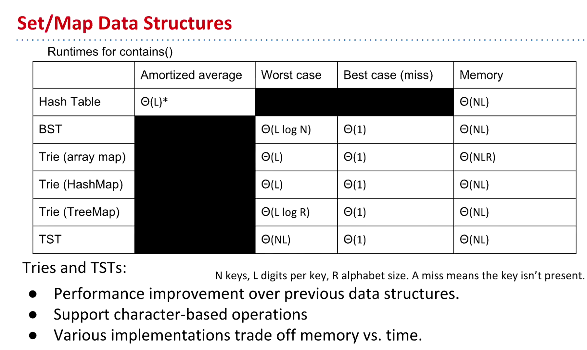

# 61B-37:overview, Tries


## Overview


## Tries——前缀树/字典树
usages:
- prefix matching
- approximate matching

```java
keysWithPrefix(String prefix) // returns all keys in the trie that start with the given prefix
longestPrefixOf(String query) // returns the longest key in the trie that is a prefix of the query
```

## implementation
```java
private class Node{
    boolean exists;
    Map<Character, Node> links;
    public Node(){
        links = new TreeMap<>();
        exists = false;
    }
}
```
## T9 keyboard

## Ternary search Tries
```java
public class TSTSet<Value>{
    private Node<Value> root;
    private static class Node<Value>{
        private char c;
        private Node<Value> lo, mid, hi;
    }
}
```
但是这种实现方式表现不佳

