# CS186-L1: Introduction + SQL I

大纲进程：
[sheet](https://docs.google.com/spreadsheets/d/1BWr5C8ZNC8Z6muMxHtxUX4Ut5p7AMvl_OLd9BbldEy0/edit?pli=1&gid=0#gid=0)

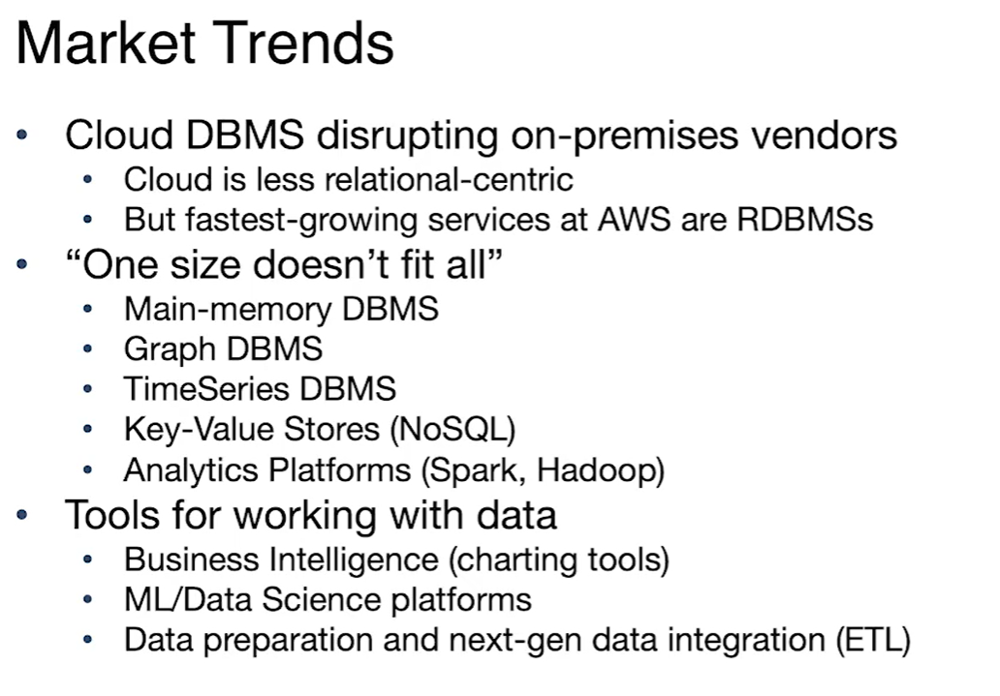
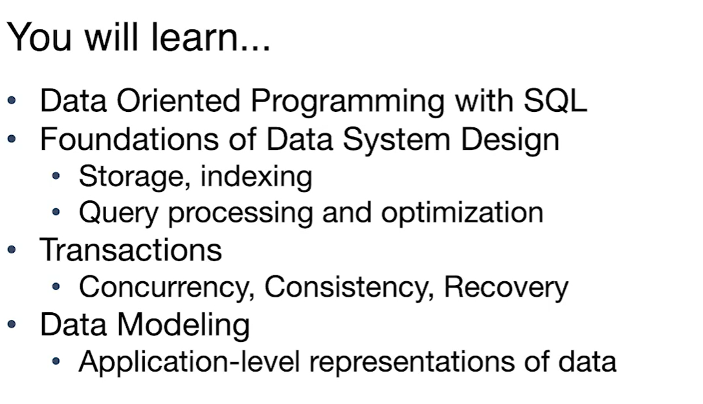
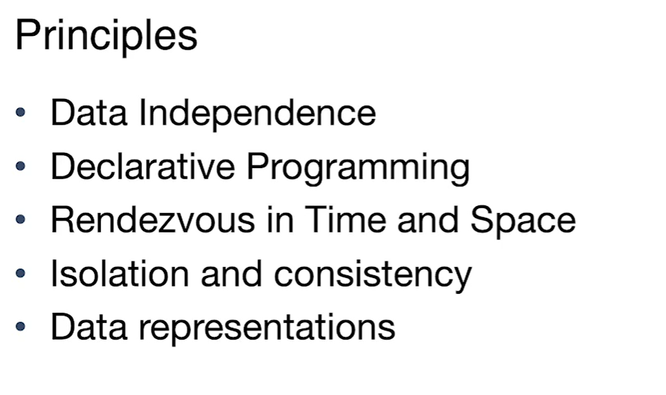


# SQL I

## pros and cons
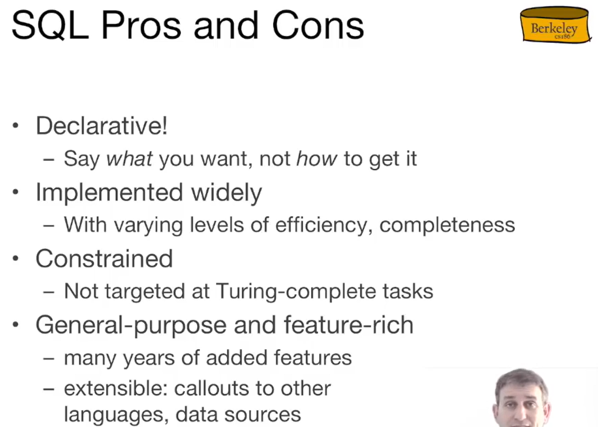

## relational Terminology and concepts
- ***database***: set of name relations
- ***relation***(table):
  - schema: descriptions "metadata"
    - fixed, unique attribute names, *atomic* types
  - instance: set of data 符合description
    - often changed, can duplicate
    - multiset of tuples or "rows"
- ***attribute*** (column,field)
- ***tuple*** (row,record),怀疑一些python概念也来自于此

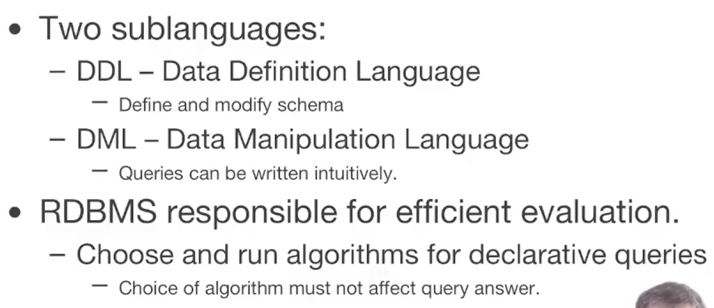

## DDL (Data Definition Language)

```sql
CREATE TABLE myTable (
    ID INTEGER,
    myName CHAR(50),
    Age INTEGER,
    Salary FLOAT,
    PRIMARY KEY (ID, myName),

    FOREIGN KEY (ID) REFERENCES myOtherTable(ID),
    FOREIGN KEY (myName) REFERENCES myOtherTable(myName)
);
```
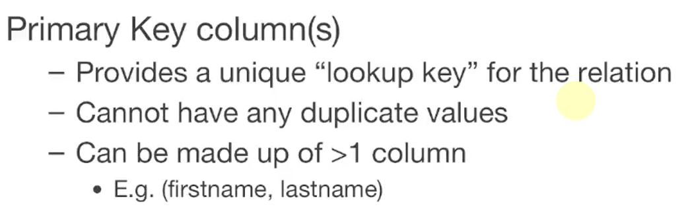

```sql
SELECT [DISTINCT] <column expression list>
FROM <single_table>
[WHERE <predicate>]
```

ORDER BY
Lexicographic order by default 字典序
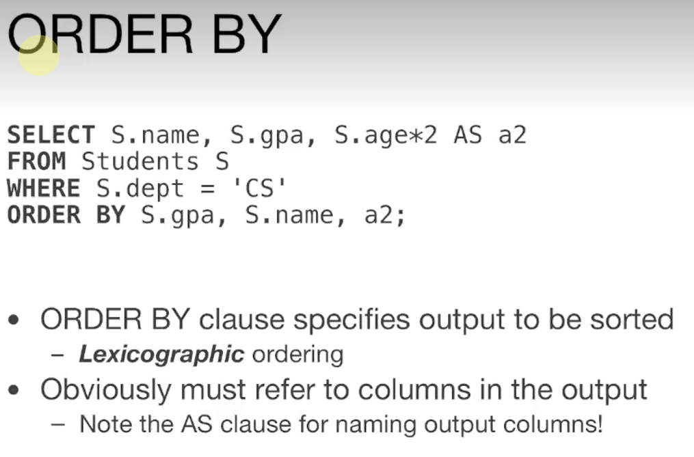
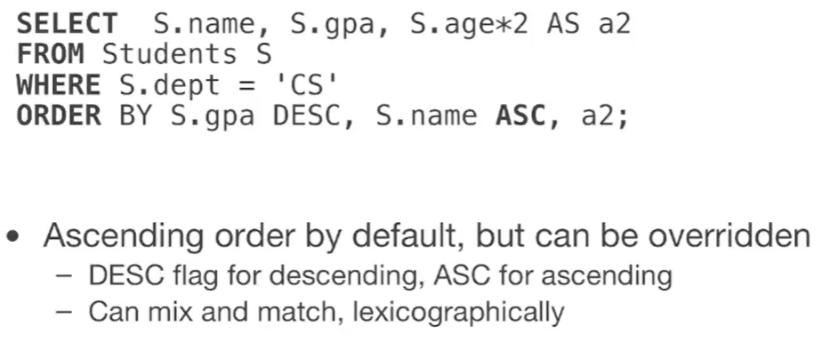

LIMIT
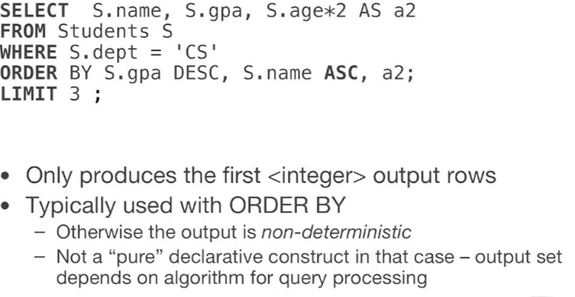

# Aggregation functions

- AVG: average
- COUNT: count the number of rows
- MAX: maximum value
- MIN: minimum value
- SUM: sum of values


```sql
SELECT AVG(Salary)
FROM myTable;
```
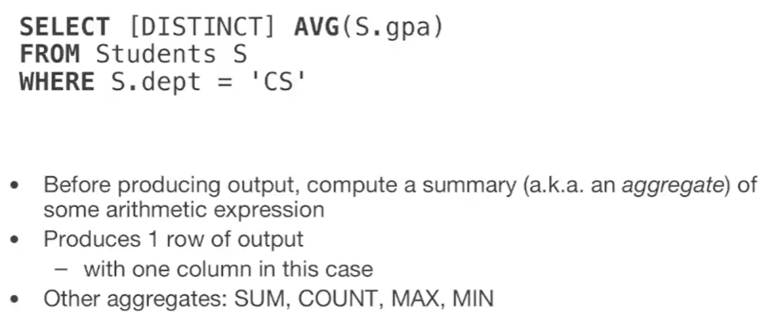

GROUP BY
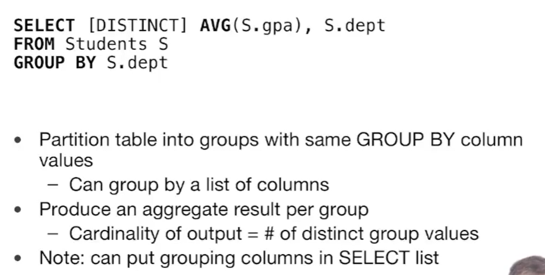

HAVING
```sql
SELECT AVG(Salary)
FROM myTable
GROUP BY Age
HAVING AVG(Salary) > 50000;
```

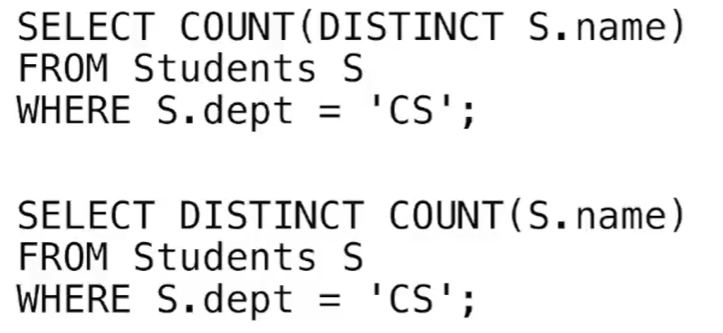

