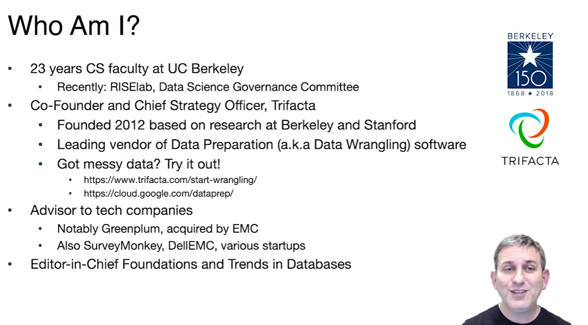

# CS186-L1: Introduction

1	8/23	Introduction			(projects due 1 day after date here)	
2	8/28	SQL I	5	SQL		
2	8/30	SQL II	5			
3	9/4	Disk, Buffers, Files I	9.1, 9.3, 9.4			
3	9/6	Disks, Buffers, Files II	9.5 - 9.7		SQL	
4	9/11	B+-Trees	10	B+-Tree		
4	9/13	Indexes and B+-tree refinements	9-10			
5	9/18	Buffer Management	9.4			
5	9/20	free (no lecture)	N/A			
6	9/25	Sorting and Hashing	9.1, 13.1-13.3, 13.4.2		B+-Tree	
6	9/27	Relational Algebra	4.1-4.2, 12			
7	10/2	Midterm 1		Joins		
7	10/4	Iterators & Joins	12, 14			
8	10/9	more time for previous lecture				
8	10/11	Parallel Query Processing	22.1-22.4			
9	10/16	Query Optimization: Plan Space	19	Query Opt	Joins	
9	10/18	Query Optimization: Costs and Search	19			
10	10/23	Unstructured Data: Searching Text				
10	10/25	DB Design: Entity-Relationship Models	15			
11	10/30	DB Design: FDs and Normalization	15		QueryOpt	
11	11/1	Midterm 2				
12	11/6	Transactions & Concurrency I	16,17			
12	11/8	Transactions & Concurrency 2	16, 17	Transactions		
13	11/13	Recovery	18			
13	11/15	Web Infrastructure: Ranking, Crawling				
14	11/20	Distributed Transactions				
14	11/22	THANKSGIVING BREAK				
15	11/27	Replication, Consistency, NoSQL	N/A		Transactions	
15	11/29	Big Data, Data Wrangling, Class Conclusion	N/A			
RRR	12/4		N/A			
[sheet](https://docs.google.com/spreadsheets/d/1BWr5C8ZNC8Z6muMxHtxUX4Ut5p7AMvl_OLd9BbldEy0/edit?pli=1&gid=0#gid=0)

