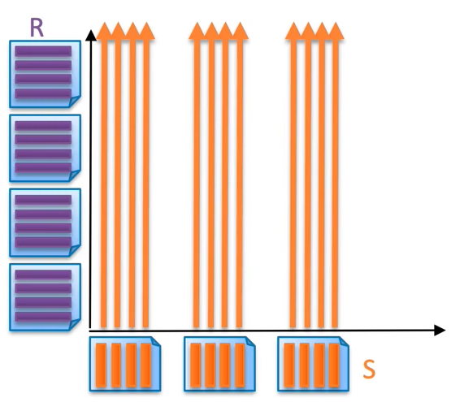

# CS186-L10: Iterators & Joins


## Intro


relational operator: tuples(in other way, relations) in, tuples out
```java
abstract class Iterator {
    // set up the children and the dataflow graph    
    void setup(List<Iterator> inputs); 
    void init(args); // state
    tuple next(); // returns the next tuple
    void close();
}
```


### presudo code
####  select
on the fly :thinking:
```java
    init() {
        child.init();
        pred = predicate;
        current = null;
    }

    next() {
        while (current != EOF && !pred(current)) {
            current = child.next();
        }
    }

    close() {
        child.close();
    }
```

#### heap scan
want to find out the empty record id 
```java
    init(relation) {
        heap = open heap file for the relation;
        cur_page = heap.first_page();
        cur_slot = cur_page.first_slot();
    }

    next() {
        if (cur_page == null) return EOF;
        current = [cur_page, cur_slot]; // return the id
        // advance to the next slot
        cur_slot = cur_page.next_slot(cur_slot);
        if (cur_slot == null) {
            // advance to the next page, first slot
            cur_page = heap.next_page(cur_page);
            if (cur_page != null) cur_slot = cur_page.first_slot();
        }
        return current;
    }

    close() {
        heap.close();
    }
```

#### sort (two pass)


#### Group By
assume that already sorted, and notice that only contain ONE tuple at a time ===> memory efficient


### A single thread

side note:
- how does the block operator work with the streaming operator
- Sort use disk internally
- we do not store the operator output in disk ===> stream through the call stack

## Join operators
### Simple Nested Loops Join
[see the course note, not that hard to understand](https://cs186berkeley.net/sp21/resources/static/notes/n08-Joins.pdf)

$[R] + [R]|S|$

$[S] + [S]|R|$ 顺序很重要！

### Pages Nested Loops Join

$[R]+[R][S]$

### Chunk Nested Loops Join

$[R] + \lceil(\frac{[R]}{B-2})\rceil[S]$

### Index Nested Loops Join

$[R] + |R|*(cost\ of\ index\ lookup)$


#### cost of index lookup
- unclustered: (# of matching s tuples for each r **tuple**) $\times$ (access cost of per s tuple)
- clustered: (# of matching s tuples for each r **pages**) $\times$ (access cost of per s page)

### Sort-Merge Join
依次滚两个纸带，对齐，归并。
$Sort(R) + Sort(S) + ([R]+[S])$

worst $|R|[S]$ , too many dups 

#### a refinement of the sort-merge join

note that if join and sort, will cost around 9500 > 7500

so sort and join can allow us to get the ORDER BY free :thinking: here comes the refinement

重点在于对sorting最后一次merge的优化，因为可以 track R和S的最小值，于是开始join的步骤即可

### Naive Hash Join
- Requires equality predicate: equi-join and natural join
- assume that $R$ is small enough to fit in memory
- algorithm:
    - hash $R$ into hash table
    - scan $S$ (can be huge file) and probe $R$
- requires $R$ < (B-2)*hash_fill_factor

### Grace Hash Join
- Requires equality predicate: equi-join and natural join
- algorithm:
    - **partition** tuples from $R$ and $S$
    - **Build & Probe** a separate hash table for each partition
      - assume that each partition is small enough to fit in memory
        - recurse if necessary


cost:
$3([R]+[S])$


so it is a good choice for large $S$ and small $R$

Hybrid Hash Join is not included :thinking:

## Summary

