# CS186-L11:  Query Opt: Plan Space

## Intro
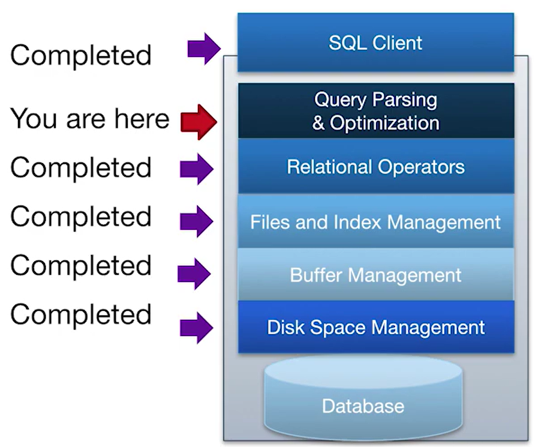
??? I am here right now :smile:
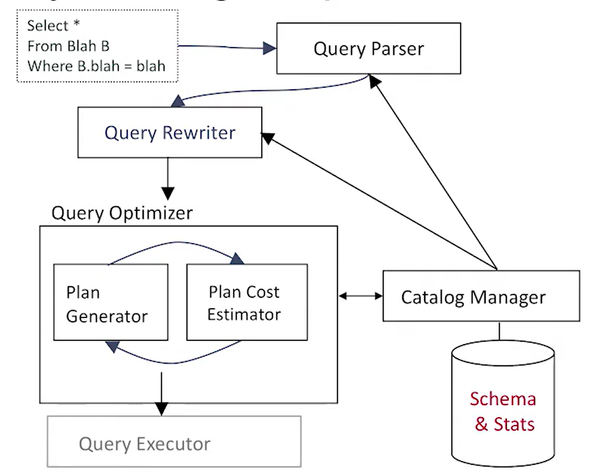
省流：拿进来sql，转换成relational algebra，然后树形图展示，考虑不同的实现方式，然后给出优化方案。

***考虑不同的实现方式***
- plan space: how many plans?
- cost estimation
- search strategy

## algebra equivalences
### selections, projections and Cartesian products
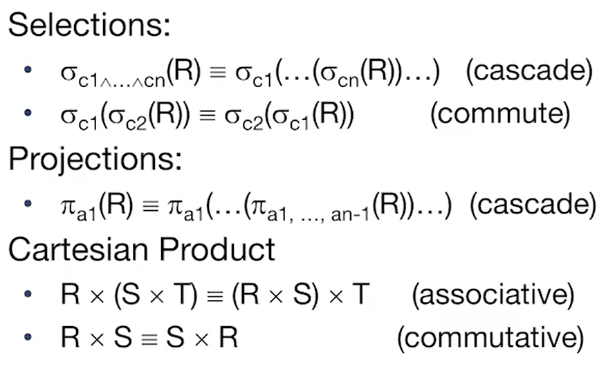
在数据库查询的关系代数中，**projections（投影）** 是一种操作，它用于从一个关系中选择特定的属性列。我们来看一下投影的性质以及如何理解它。投影（Projections）的性质表明了它们可以被 **级联（cascade）** 使用。这意味着多个投影操作可以逐步应用于关系 `R` 上，每一步选择一个或多个属性列：

\[
\pi_{a_1}(R) \equiv \pi_{a_1}(...(\pi_{a_1, ..., a_{n-1}}(R))...)
\]

级联（Cascade）
- 级联的含义是指多个投影操作可以按顺序应用。在级联的情况下，我们可以将多个投影操作结合起来，依次减少关系的属性。

- 例如，假设我们有一个关系 `R`，它有属性集合 `{a_1, a_2, a_3, a_4}`。如果我们应用 \(\pi_{a_1, a_2}(R)\)，我们得到的结果是仅有 `a_1` 和 `a_2` 属性的关系。
- 接着，我们可以在这个结果上再次应用 \(\pi_{a_1}(R)\)，最终得到只有 `a_1` 属性的关系。

这种级联性质可以被理解为将多个投影操作合并成一个操作。

### joins 
结合律？交换律？
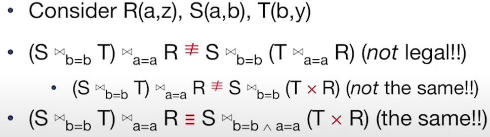
结合律一般不成立，交换律是成立的（由前面的Cartesian product可知）。有一个理解点：叉积 $\times$ 的范围变大了
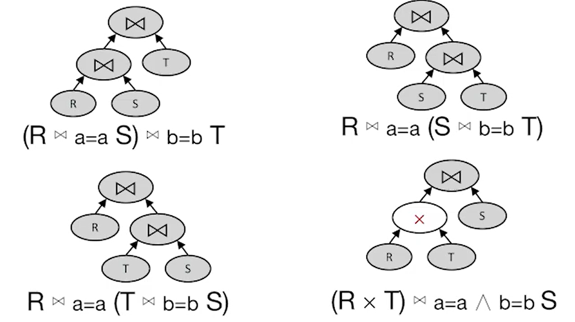

## Some Heuristics
### selections
selection is cheap, while join is expensive :yum:
- apply selections as soon as you have relevant columns
- 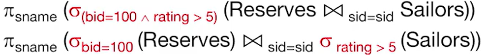

### projections
- keep the number of columns as small as possible, and avoid unnecessary columns
- 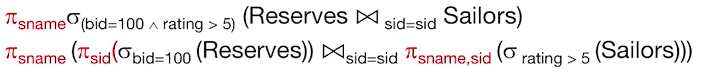

### joins
- always try to avoid cross-product joins, use appropriate indexes

## Physical Equivalences
- base table access: with single-table selections and projections
  - heap scan
  - index scan
- equi-joins: 等值连接，在等值连接中，我们将两个关系（表）中的行合并，前提是它们的指定列具有相同的值。
  - chunk nested loops join
  - index nested loops join
  - sort-merge join
  - grace hash join
- non-equi-joins:
  - block nested loops join

## example
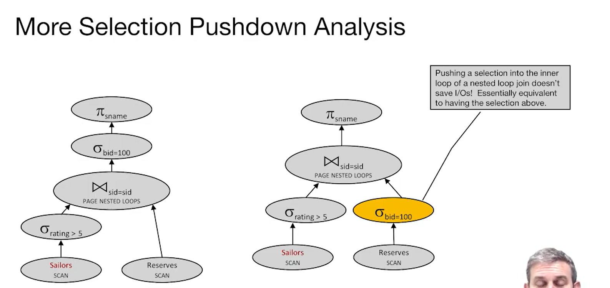
嵌套循环连接（Nested Loop Join） 的工作方式是在外层循环中对一个表（通常是较小的表）逐行扫描，然后在内层循环中对另一个表（通常是较大的表）进行匹配。执行计划的右侧图示意了选择条件下推到嵌套循环的内层。

关键原因：

下推后的选择并未减少内层扫描的次数：在嵌套循环连接中，即使选择条件 σ_bid=100 被推入内层循环，仍然需要对 Reserves 表（即右侧表）进行完整扫描，以查找符合 sid 连接条件的所有行。由于内层循环需要对 Reserves 表进行扫描来匹配外层表 Sailors 的每一行，选择条件下推并不会减少内层表的扫描次数。

选择条件的下推等同于在连接之后应用选择：这意味着在大多数情况下，条件的下推与在连接操作之后再应用选择条件的效果几乎相同。在这种特定的情况下，选择条件不会减少 Reserves 表的扫描，因为无论如何都必须扫描整个表以匹配 sid。

交换位置
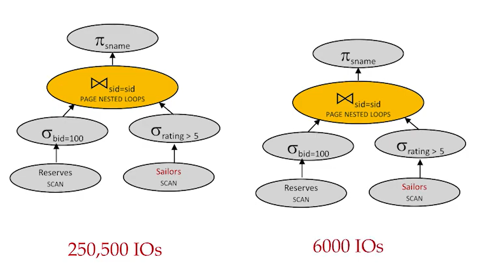
引入物化视图（Materialized View）可以减少扫描次数，增加少量物化开销
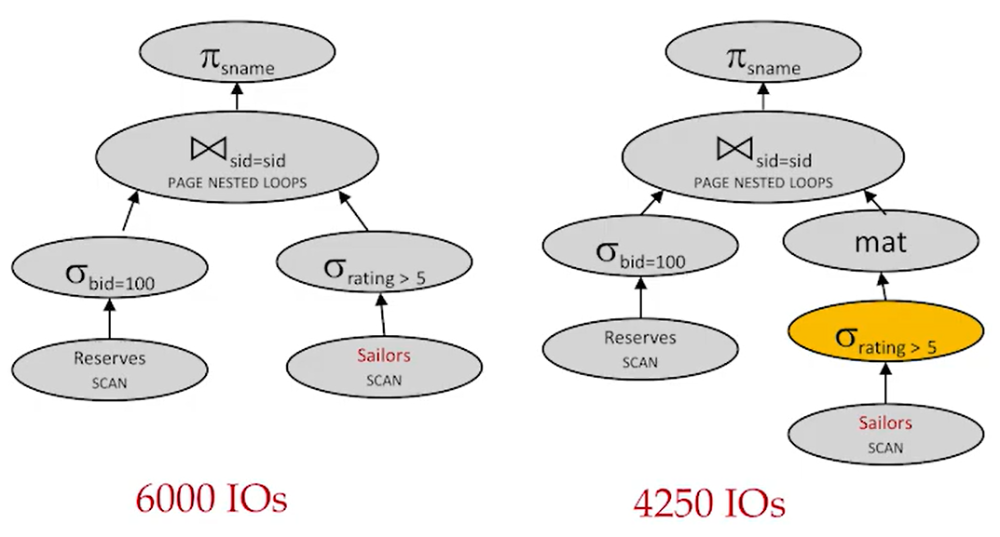
更换join种类
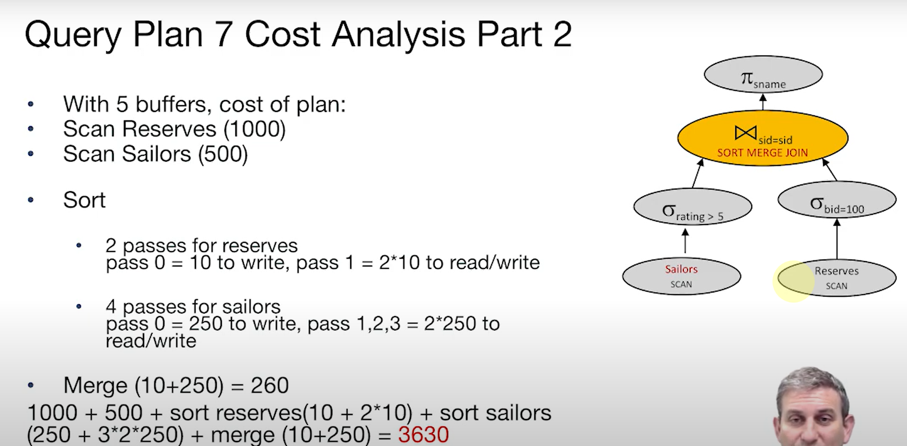
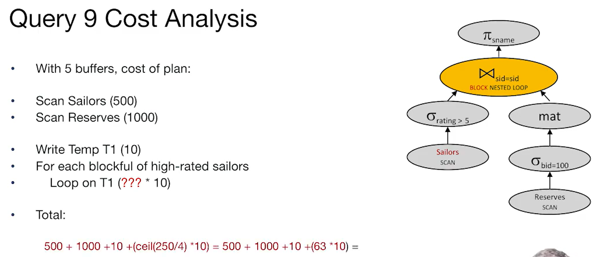
下放projections，可能会出现一个buffer搞定左边的情况
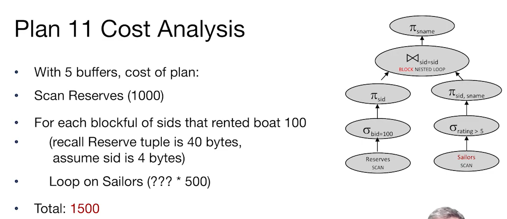
考虑physical equivalence
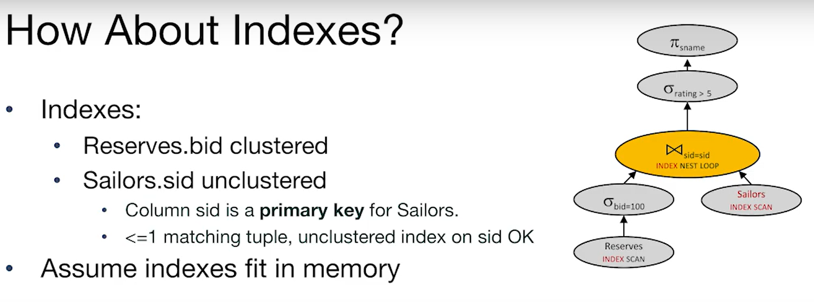
*cluster使得数据以page为单位读取*
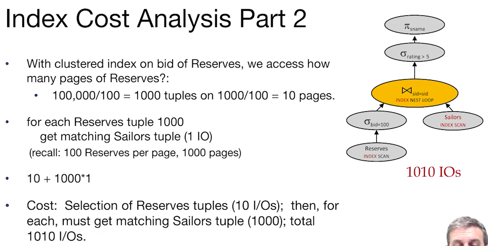

## Summary
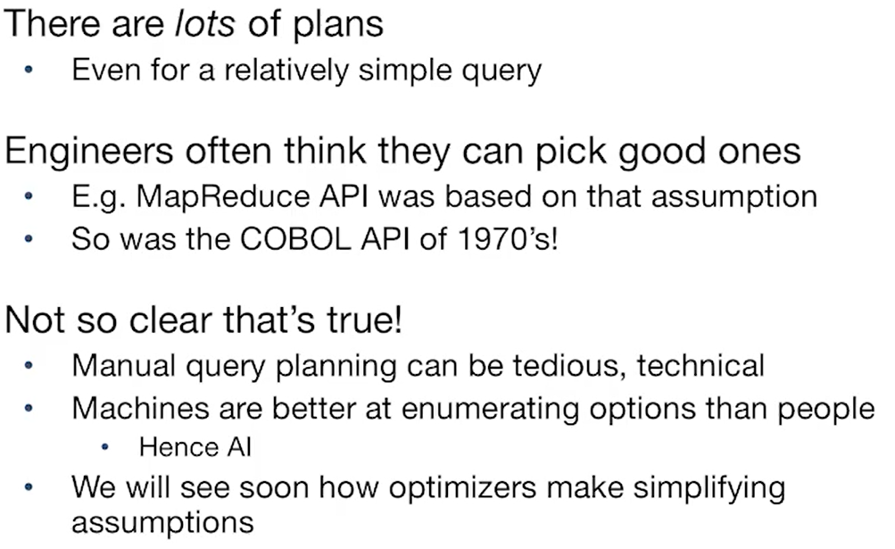
