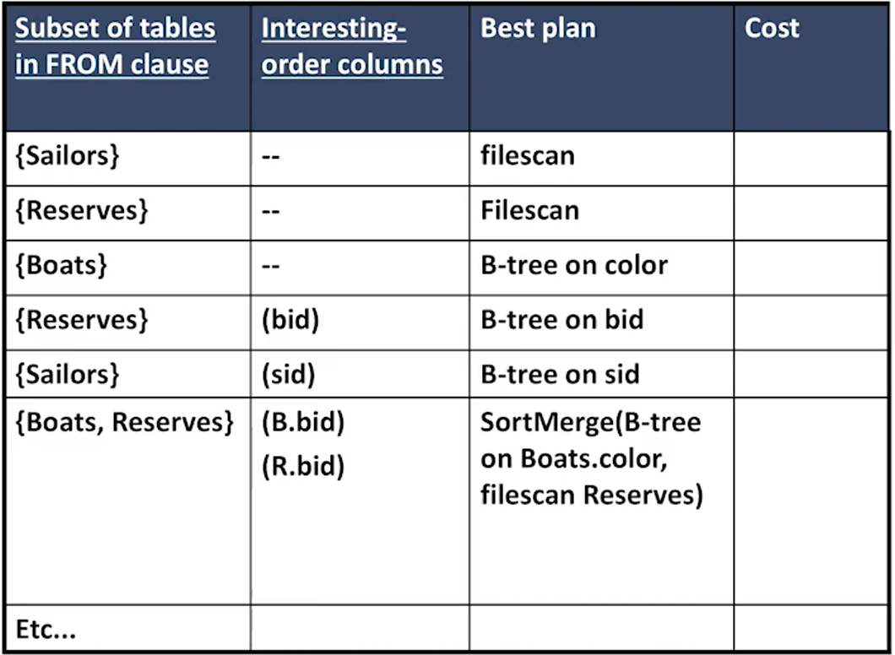

# CS186-L12: Query Opt: Costs & Search

## Intro

An important property of query optimization is that we have no way of knowing how many I/Os a plan will cost until we execute that plan. [see note 9](https://cs186berkeley.net/sp21/resources/static/notes/n09-QueryOpt.pdf)

## example background

## plan space overview
对physical properties的描述，关注的点在于不同过程对hash or sort的要求

## Cost Estimation
讨论的假设

注意predicate之间独立，以及只是关注IO

量化的信息点，catalog

### selectivity
#### formula

side note:
- 等值join的理解见下图的bunny :rabbit:
- 

#### histograms for selectivity estimation

但是这节课用的是等宽的直方图:smirk:，然后所有的条件相互独立，selectivity根据直方图显示的频率计算得出

#### selectivity for join query 
$$
\Large
R\Join_{p} \sigma_{q}(S) \equiv \sigma_{p}(R \times \sigma_{q}(S)) \equiv \sigma_{p \land q}(R \times S)
$$
所以 $ s = s_p s_q $注意叉积产生的size变化

## Search Algorithm
### single table plan
###### 没有听懂？？？

十分粗糙的估计

###### 没有听懂？？？
### multi-table plan
借鉴DP思想，将join的过程分解为多个子问题，每个子问题都可以单独估计cost，然后将子问题的cost累加起来

但是可能出现子计划并非最优的情况，然而对全局最优

中间结果附加了Order，可能对下游任务有积极影响，故考虑保留

列举plan技巧

对于多过程的plan枚举，DP table同样可以延展

