# CS186-L13: Transactions & Concurrency I

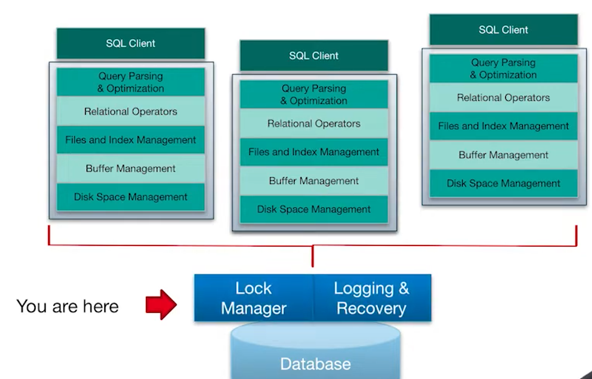 :tada:

## Intro 
transaction's principle ACID
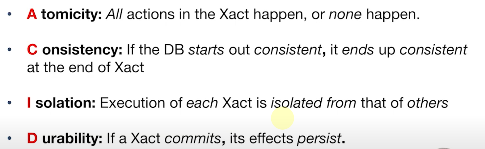

### Isolation (Concurrency)
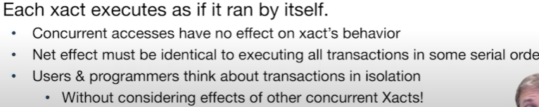
however, do not consider serial execution :sweat_smile:
### Atomicity and Durability
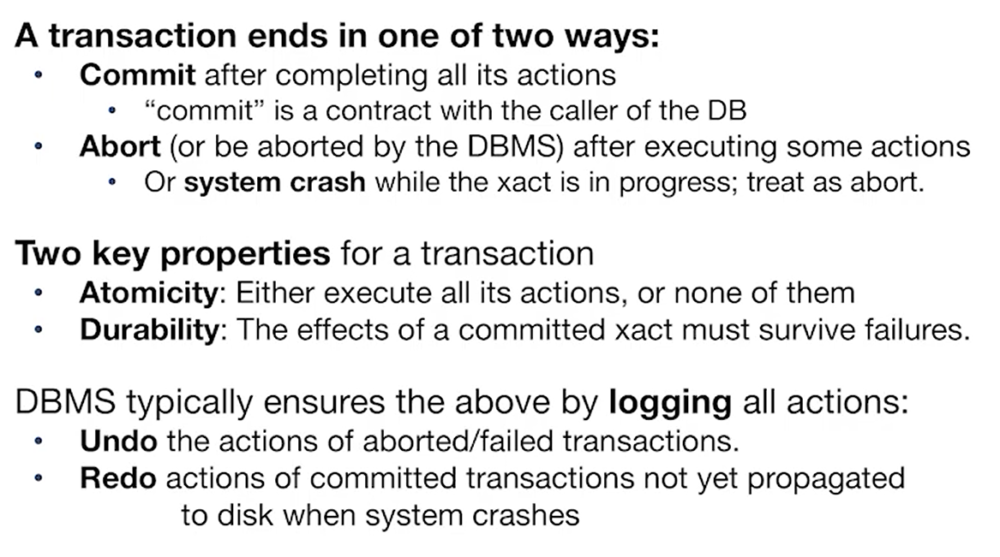
### Consistency
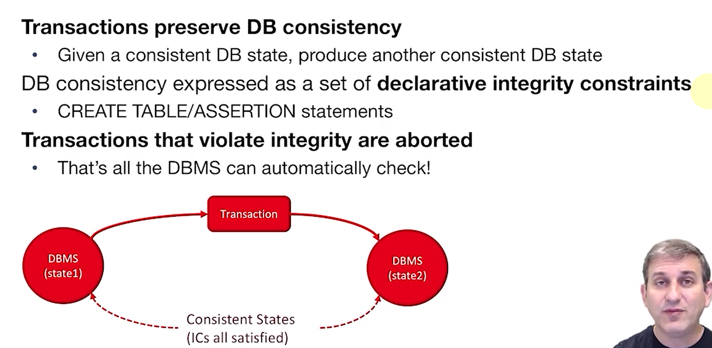

## Concurrency Control
基本符号表达
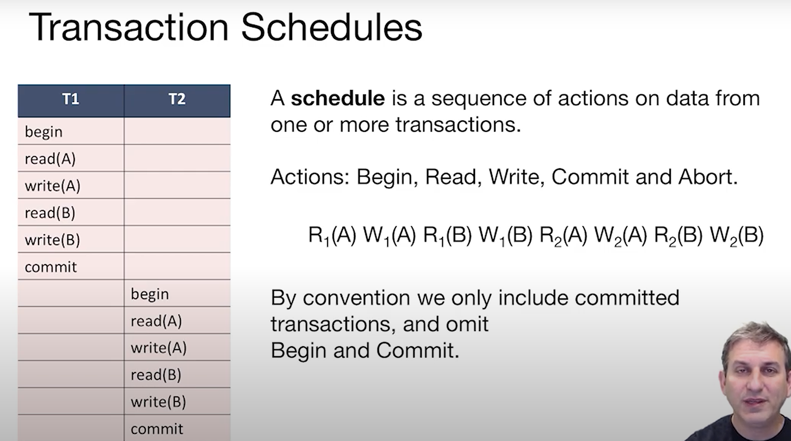

序列等价性：
- $Def1:$ **Serial Schedule**
  - each transaction executes in a serial order, one after the other, without any intervening
- $Def2:$ schedules **Equivalent**
  - involve same transaction
  - each transaction's actions are the same order
  - both transactions have the same effect on the database's final state
- $Def3:$ **Serializable**
  - if a schedule is serializable, then it is equivalent to some serial schedule

### Conflict Serializability
#### conflict operations?
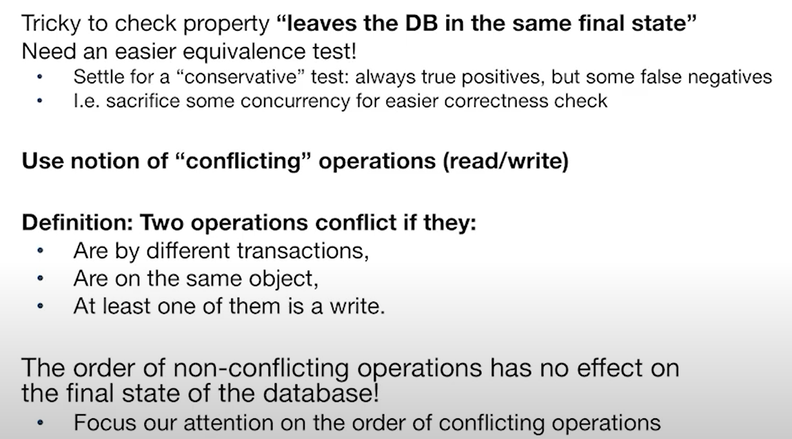
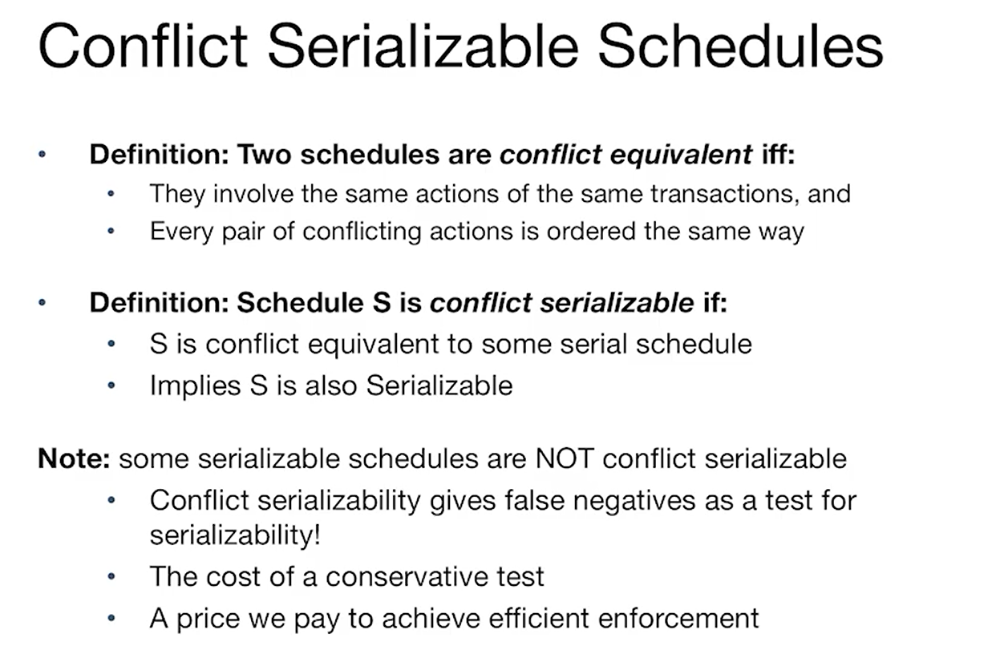
**Intuitive Understanding of Conflict Serializable**
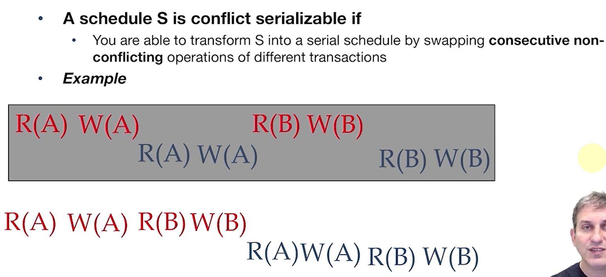

**Conflict Dependency Graph**
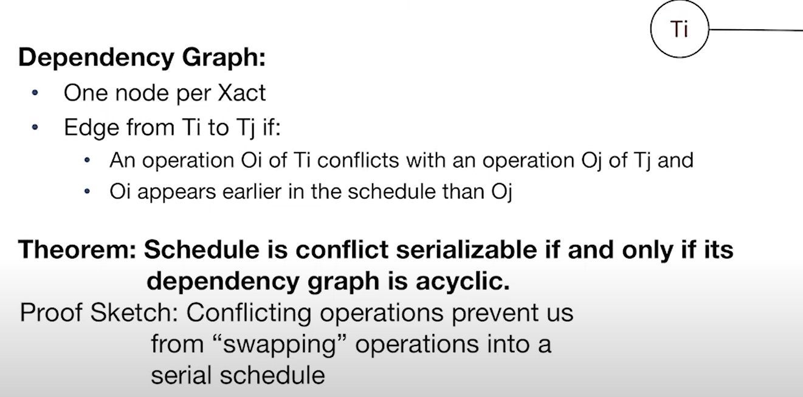

### View Serializability
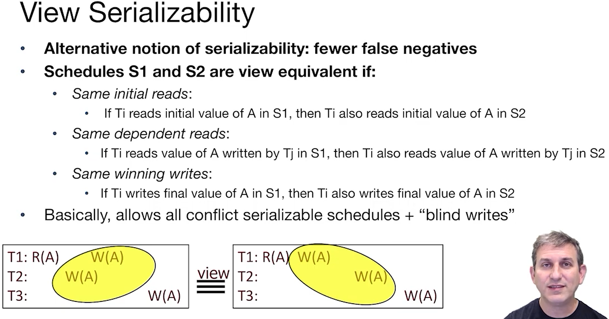

## Conclusion
Neither definition allows all schedules that are actually serializable.

because they can not check the meaning of the operation :smiling_imp:
