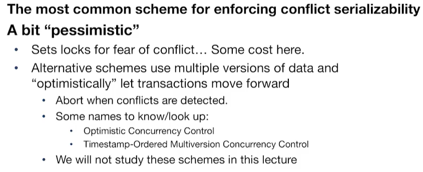
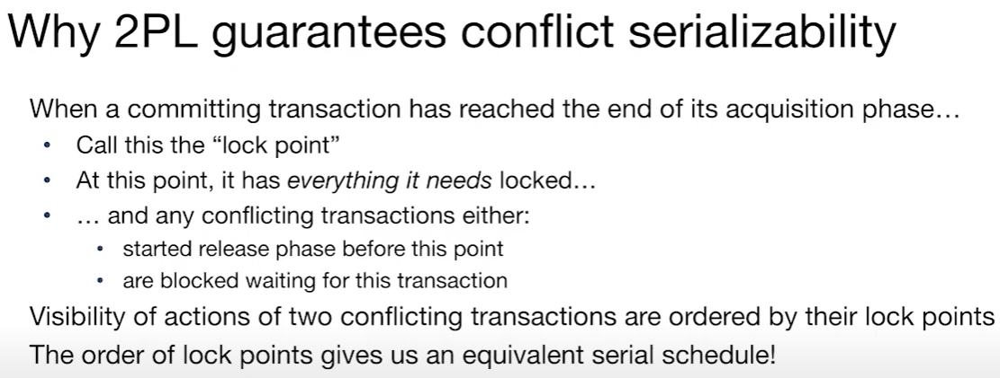
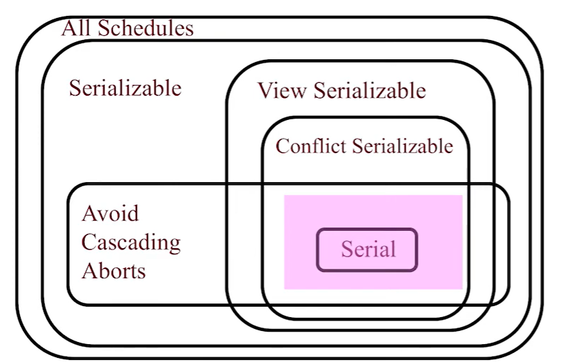
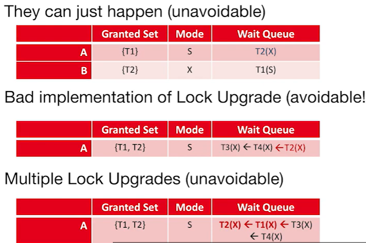
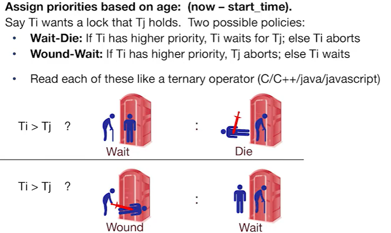
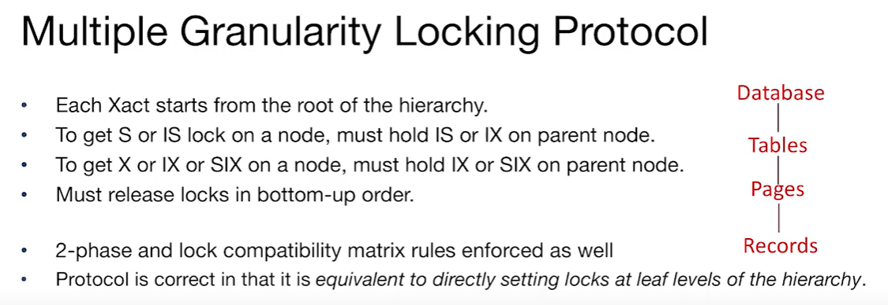
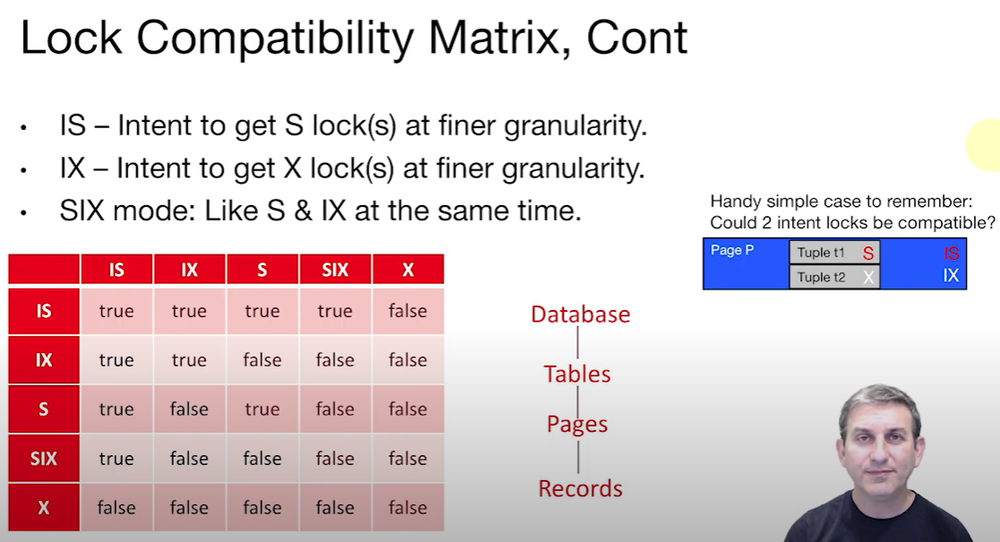
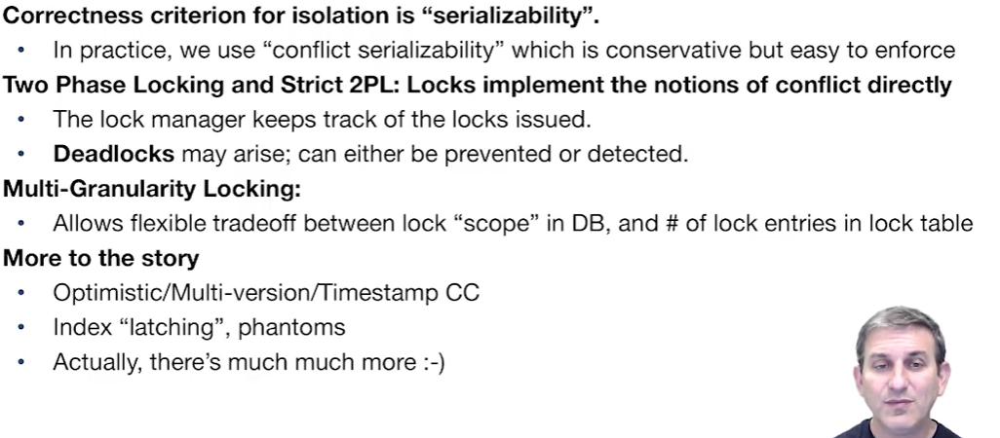

# CS186-L14: Transactions & Concurrency II

## Two Phase Locking (2PL)

## Strict 2PL
same as 2PL, but with stricter definition of ***release locks at once***

pink area is the Strict 2PL 

## Lock Management
there is a lock manager, which maintains a hash table keyed on names of objects being locked

## Deadlocks
:thinking:
### why happen?

side note:
- prioritize upgrades can avoid #2

unlike the OS which can have a fixed order of required sources......

### avoiding deadlocks
#### timeout
first, TIMEOUT is a not so bad idea :thinking:

#### two patterns
then...

why can work out?
- young at best wait, at worst die
- order by age, so no circle
- if re-start or "hurt/wound", time stamp won't change

#### deadlock detection
try to construct a graph of all the locks and wait-for relationships :thinking:

as long as there is a **cycle**, deadlock happens!

exp: most cycle is 2-3 nodes

## Lock Granularity
at which level should i lock? tuples? pages? tables? or database?

multi-granularity locking is helpful!

数据库锁的兼容性矩阵（Lock Compatibility Matrix）

数据库锁的兼容性矩阵用于定义不同类型的锁在数据库系统中能否同时共存，避免在多用户并发环境下产生数据不一致的问题。这个矩阵展示了当一个事务持有某种类型的锁时，另一个事务能否在同一资源上获得另一种类型的锁。

锁类型的基本含义：

- **IS (Intent Share)：** 意图在更细粒度（如记录级别）上获取共享锁（S锁）。
- **IX (Intent Exclusive)：** 意图在更细粒度上获取排他锁（X锁）。
- **S (Share)：** 共享锁，允许多个事务同时读取数据，但不允许修改。
- **X (Exclusive)：** 排他锁，独占锁，禁止其他事务读取或修改数据。
- **SIX (Shared Intent Exclusive)：** 同时持有S锁和IX锁。事务希望对较粗粒度的对象进行共享访问，同时在更细粒度的对象上进行排他修改。

#### 1. **IS 锁的兼容性：**
   - **IS vs IS:** `true`，多个事务可以在同一资源上放置IS锁，表示它们都有意在更细粒度上获得S锁。
   - **IS vs IX:** `true`，IS和IX锁可以同时存在，意味着一个事务意图获取共享锁，而另一个事务意图获取排他锁，两者在粗粒度上并不冲突。
   - **IS vs S:** `true`，IS锁与S锁兼容，一个事务可以有意获取更细粒度的共享锁，而另一个事务在当前粒度上持有共享锁。
   - **IS vs SIX:** `true`，SIX锁本质上是S锁和IX锁的组合，IS与这两种锁都兼容，因此IS与SIX兼容。
   - **IS vs X:** `false`，IS锁与X锁不兼容，X锁是排他锁，不允许其他任何锁共存。

#### 2. **IX 锁的兼容性：**
   - **IX vs IS:** `true`，见上文解释。
   - **IX vs IX:** `true`，多个事务可以同时表示它们有意在更细粒度上获取排他锁。
   - **IX vs S:** `false`，IX锁与S锁不兼容，排他锁意图与共享锁发生冲突。
   - **IX vs SIX:** `false`，SIX锁包含共享锁部分，与IX锁不兼容。
   - **IX vs X:** `false`，排他锁之间无法共存。

#### 3. **S 锁的兼容性：**
   - **S vs IS:** `true`，见上文解释。
   - **S vs IX:** `false`，见上文解释。
   - **S vs S:** `true`，多个事务可以共享读取资源，因此S锁彼此兼容。
   - **S vs SIX:** `false`，因为SIX锁中包含IX锁部分，而S与IX不兼容。
   - **S vs X:** `false`，共享锁与排他锁不兼容。

#### 4. **SIX 锁的兼容性：**
   - **SIX vs IS:** `true`，见上文解释。
   - **SIX vs IX:** `false`，见上文解释。
   - **SIX vs S:** `false`，见上文解释。
   - **SIX vs SIX:** `false`，两个SIX锁不兼容，因为SIX锁包含排他意图。
   - **SIX vs X:** `false`，排他锁与SIX锁不兼容。

#### 5. **X 锁的兼容性：**
   - **X vs IS:** `false`，见上文解释。
   - **X vs IX:** `false`，见上文解释。
   - **X vs S:** `false`，见上文解释。
   - **X vs SIX:** `false`，见上文解释。
   - **X vs X:** `false`，两个排他锁不能共存。

## Summary

