# CS186-L15: DB Design: Entity-Relationship Models

## Overview
how to design a database instead of DBMS! :thinking:
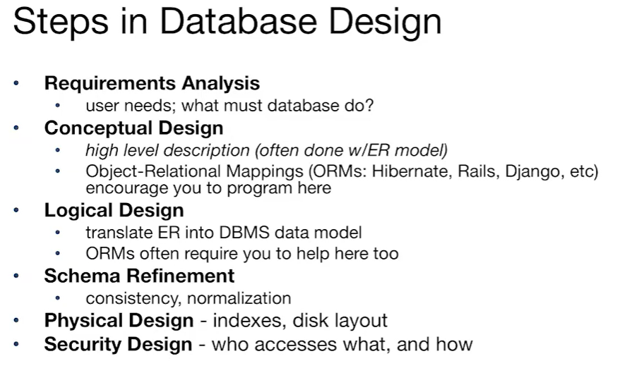

this class mainly focuses on the conceptual design

## Data Models and Relational Levels of Abstraction
### def in Data model

### abstractions
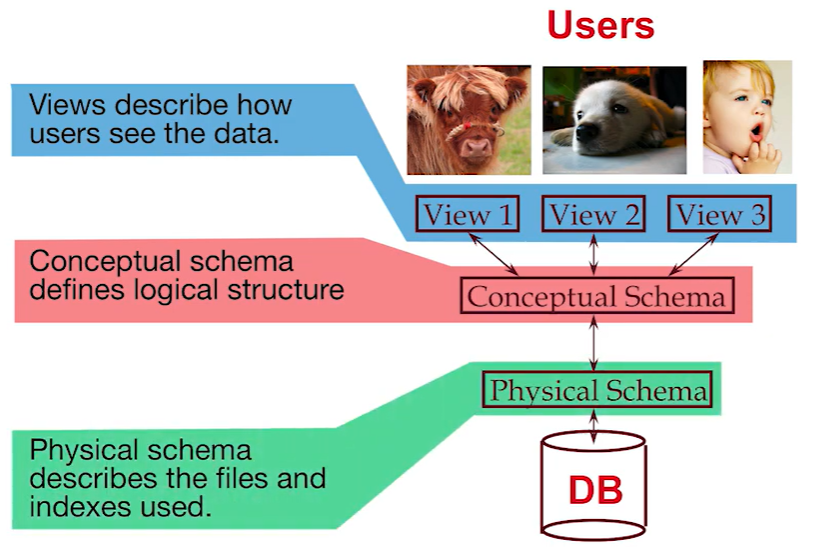
example
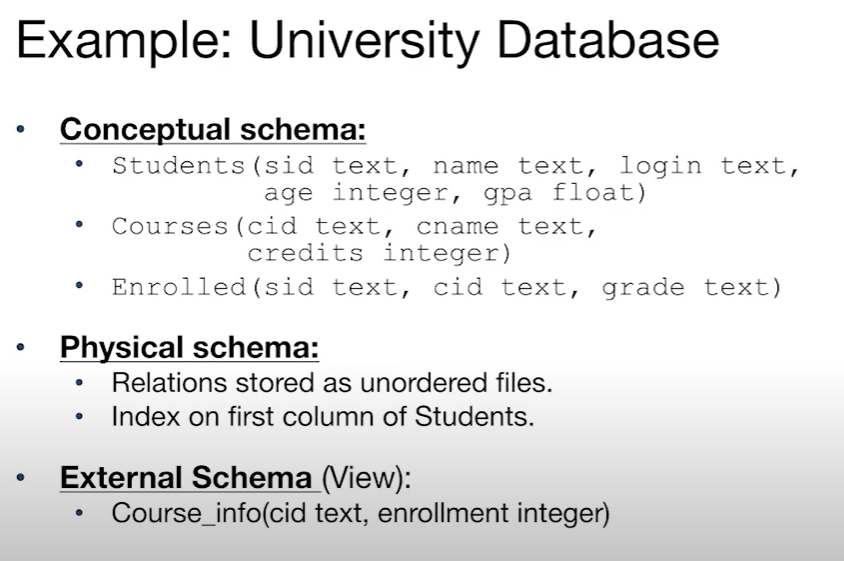

## Data Independence
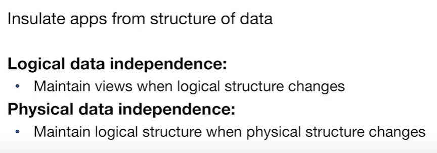

## Entity-Relationship Model (ERM)

### Def
- **Entity**: a real-world object that can be described and identified by a set of attributes
- **Entity Set**: a collection of similar entities
  - all entities in an entity set have the same attributes
  - each entity set has a key
  - each attribute has a domain
- **Relationship**: a connection between two entity sets
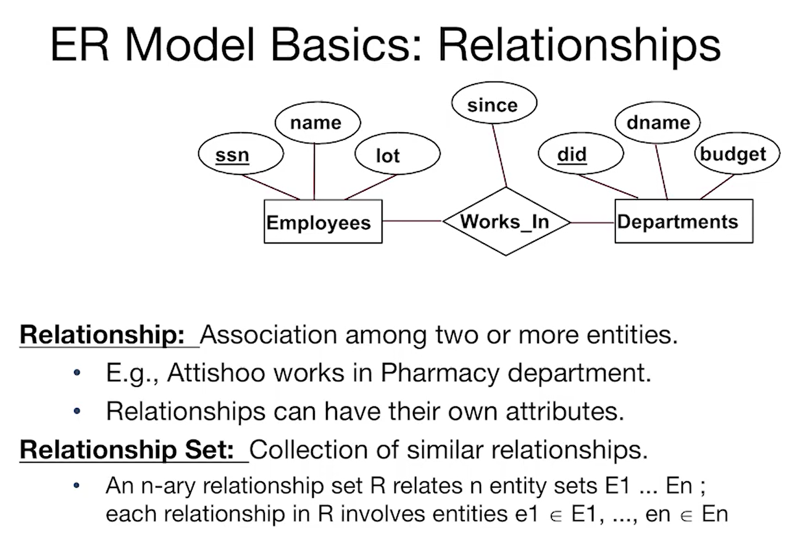

## Key and Participation Constraints
### Key Constraints
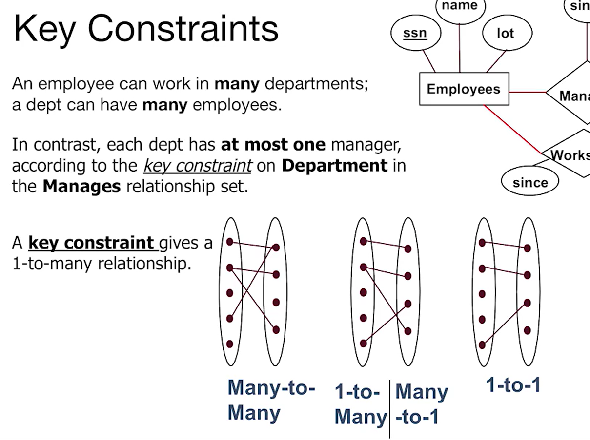
### Participation Constraints
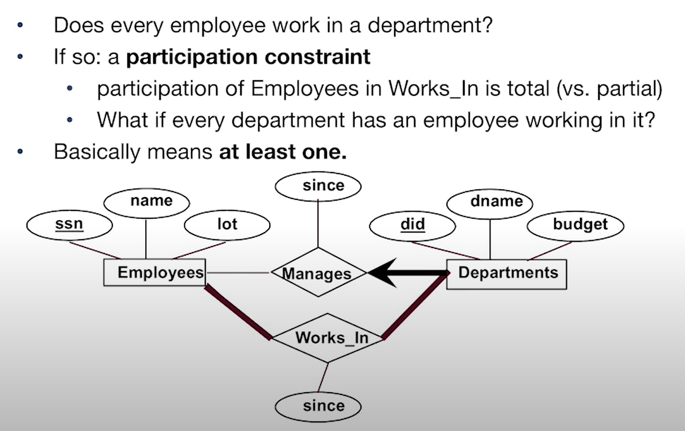

## Weak Entity 
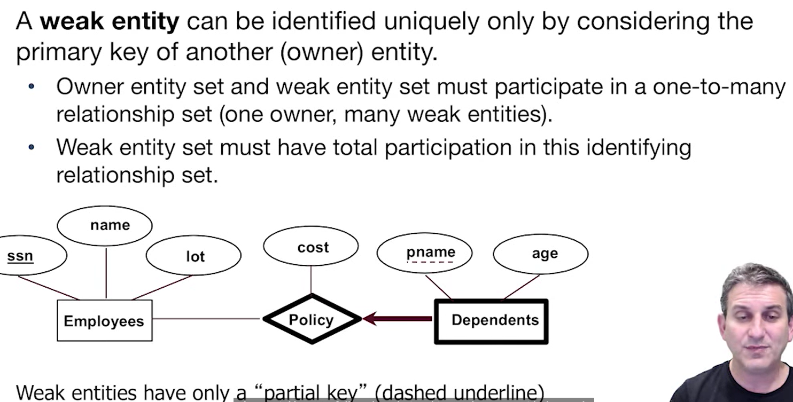

## Alternative Notation and Terminology
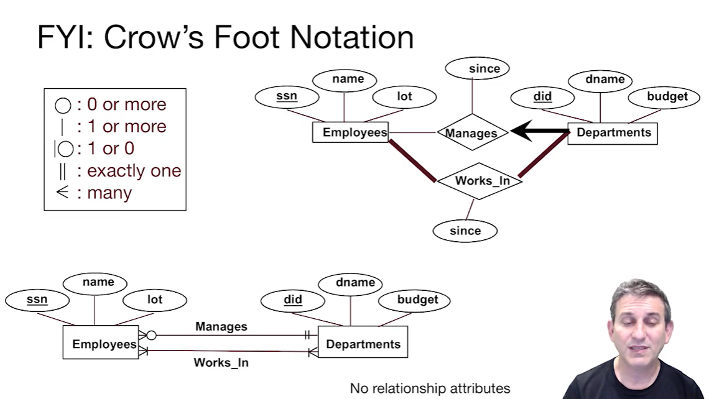
decoder graph :sweat_smile:
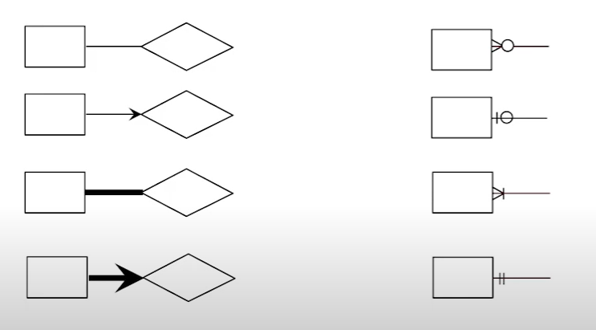
math notation :sweat_smile:
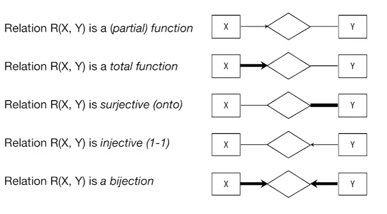

## Binary vs Ternary Relationships
