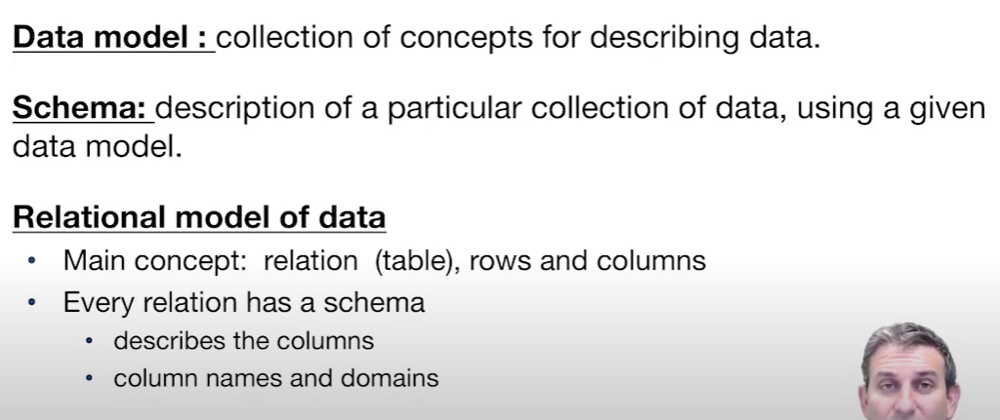
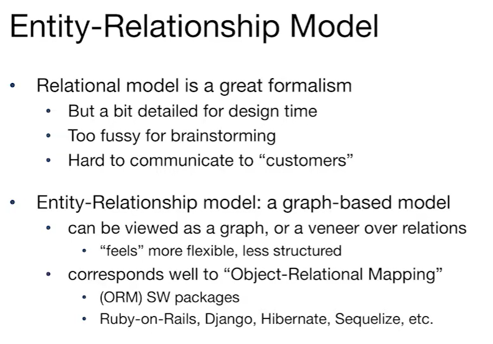
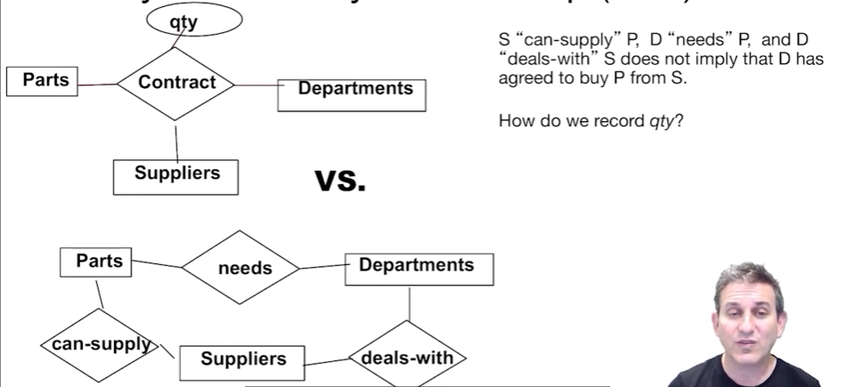
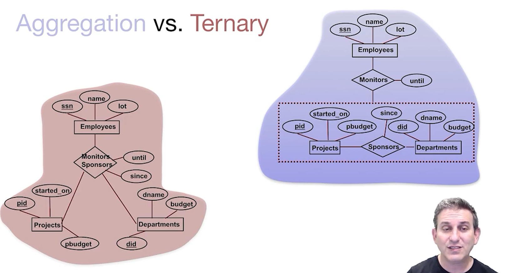
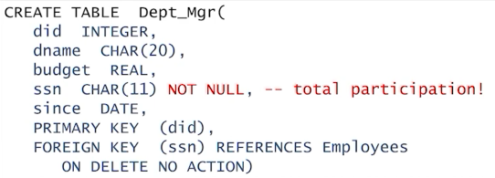
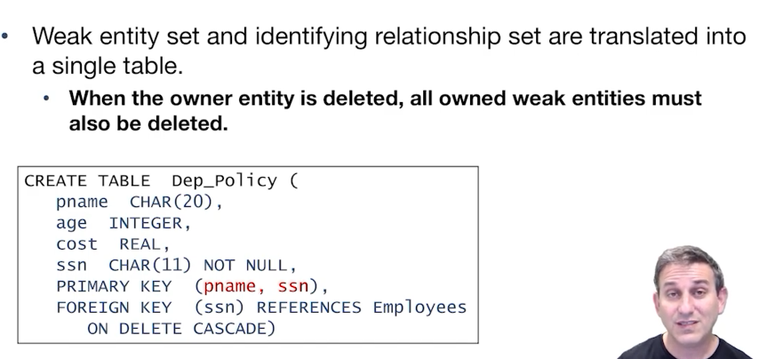

# CS186-L15: DB Design: Entity-Relationship Models

## Overview
how to design a database instead of DBMS! :thinking:

this class mainly focuses on the conceptual design

## Data Models and Relational Levels of Abstraction
### def in Data model

### abstractions

example

## Data Independence

## Entity-Relationship Model (ERM)

### Def
- **Entity**: a real-world object that can be described and identified by a set of attributes
- **Entity Set**: a collection of similar entities
  - all entities in an entity set have the same attributes
  - each entity set has a key
  - each attribute has a domain
- **Relationship**: a connection between two entity sets

## Key and Participation Constraints
### Key Constraints

### Participation Constraints

## Weak Entity 

## Alternative Notation and Terminology

decoder graph :sweat_smile:

math notation :sweat_smile:

## Binary vs Ternary Relationships

上面的更加紧密并且可以记录qty

## Aggregation and Ternary Relationships

## Entities vs Attributes
**Remember**: 
- attributes can not have nested attributes (*atomic attributes* only), if you want to represent nested attributes, use entities instead :thinking:
- entity or attribute? depends on the context!

## Entities vs Relationships
必要时拆出来新的实体来构建新的关系

## Converting ER to Relational
- Entity Set: table
- **many-to-many** Relationship Set: 
  - keys for participating entities, forming a **superkey** for the relation
  - all other attributes
- Key Constraints: think carefully about the uniqueness of the primary key!
- Participation Constraints: usually using NOT NULL
  - 
- Weak Entity Set: 
  - 
