# CS186-L16: DB Design: FDs and Normalization

## Functional Dependencies
big picture
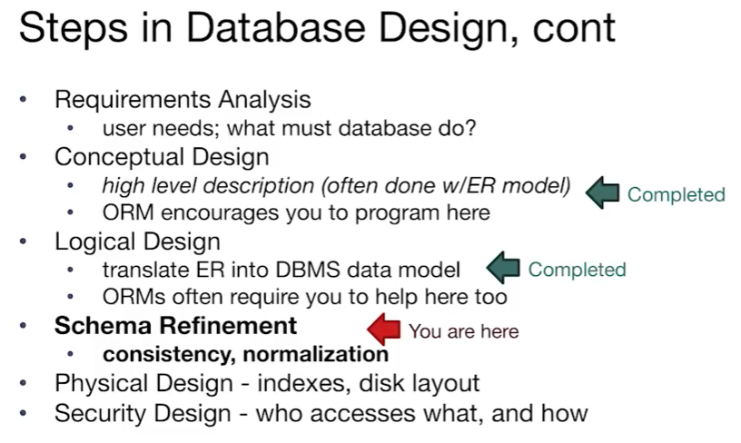
### Def

- **X -> Y** means X determines Y, X and Y can be a single column or multiple columns
- **F+** means that to be the set of all FDs that are implied by F
### terminology
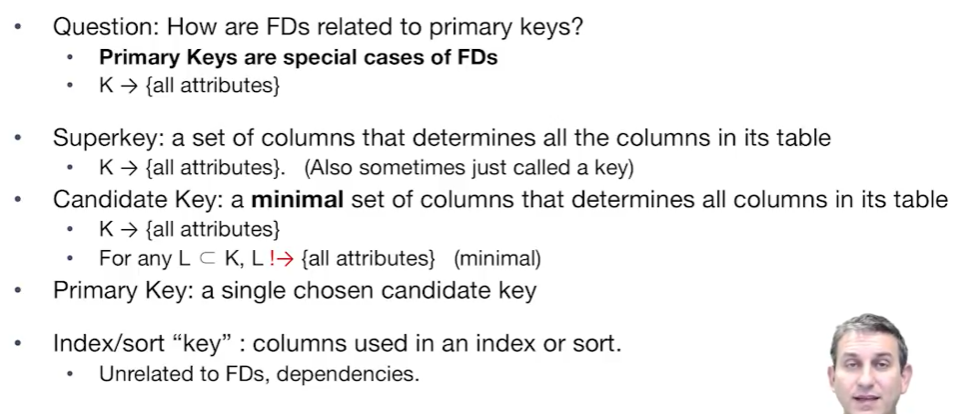

## Anomalies
可以用FD分解relation从而避免冗余
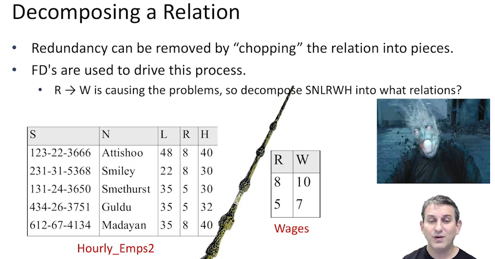

## Armstrongs Axioms
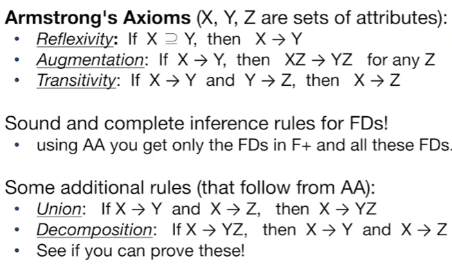

## Attribute Closure
wanna check if X->Y is in F+
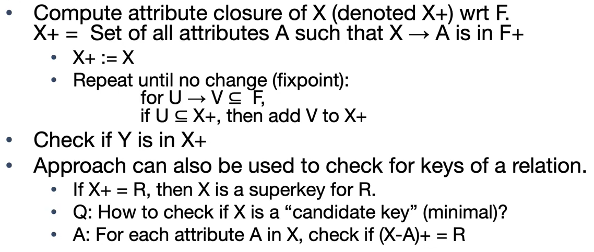

## BCNF and other Normal Forms
### Basic Normal Form
NF is a def of data model!
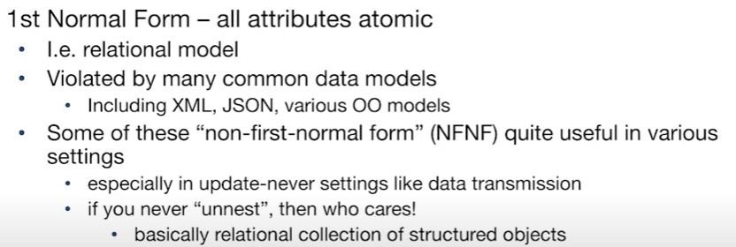

### Boyce-Codd Normal Form
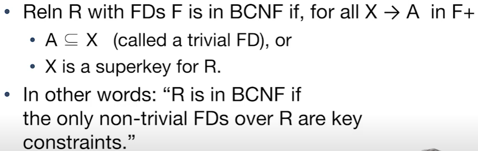

## Lossless Join Decompositions
Def: decomposition won't create new attributes, and will cover the original attributes (不是完全无重叠分割)

### Problems with Decompositions
- can ***loss*** info and unable to reconstruct the original data
    - do not loss data actually, in fact, we gain some dirty data
    - 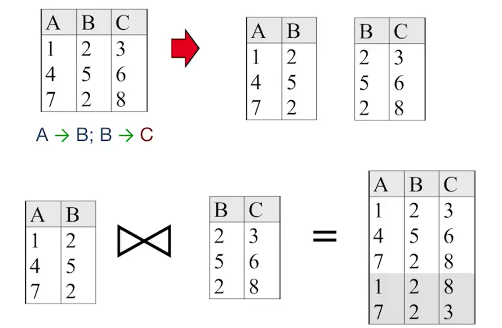
- Dependency check may require *joins*
- some queries may be more expensive, since *join* is required

### Lossless Join Decompositions
定义
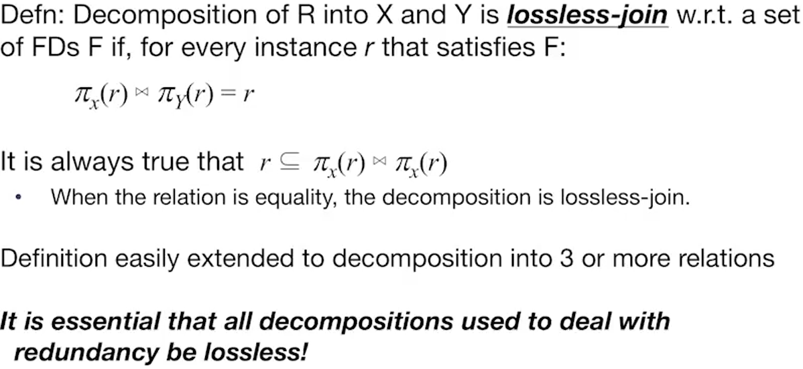
定理
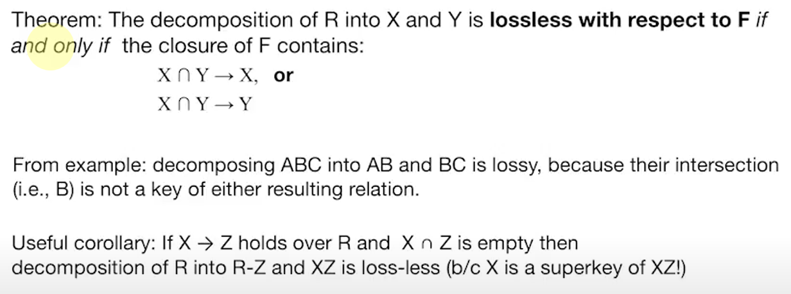

## Dependency Preservation and BCNF Decomposition
Def: Projection of set of FDs F:
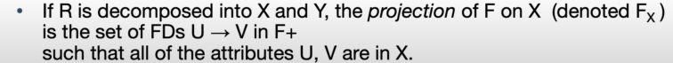
Def: Dependency Preserving Decomposition
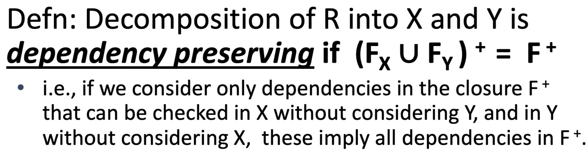

### BCNF Decomposition
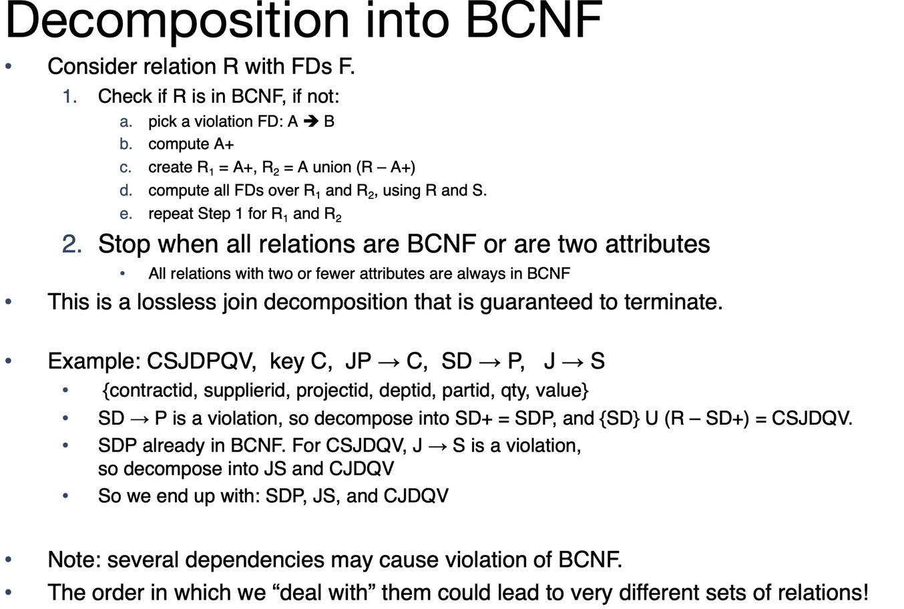
###### 没有听懂
但是dependency没有保留
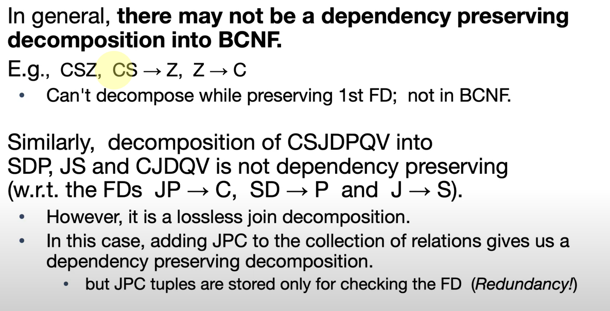
所以BCNF可以lossless，但是不一定保留所有的dependency

