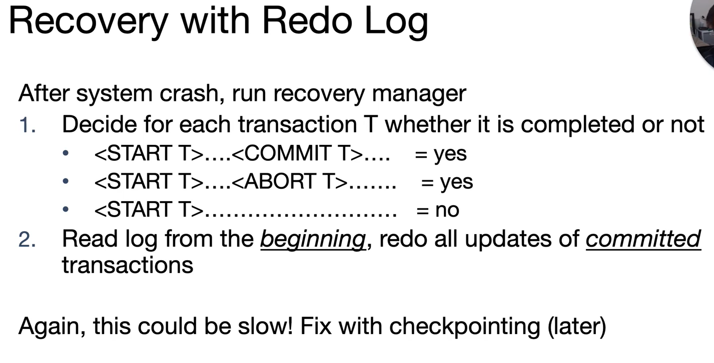

# CS186-L17: Recovery


## Need for Atomicity and Durability, SQL support for Transactions


## Strawman Solution

**No Steal/Force policy**

seem like no a good choice for recovery
- not scalable in buffer
- if crash in 2a, inconsistencies will occur

## STEAL / NO FORCE, UNDO and REDO

### STEAL/NO FORCE
- no force: 
  - problem: sys crash before dirty page of a committed transaction is written to disk
  - solution: flush as little as possible, in a convenient space, prior to commit. allows REDOing modifications

- STEAL:
  - must remember the old value of flushed pages to support ***undo***

### pattern


## Intro to Write-Ahead Logging (WAL)
- Log: a ordered list of log records to allow redo/undo
  - log records: **<XID, pageID, offset, length, old data, new data>**
  - and other info

- Write-Ahead Logging (WAL):
- 1. force the log record before the data page is written to disk
- 2. force all log records before a transaction is committed
- #1 with UNDO guarantee Atomicity and #2 with REDO guarantee Durability ===> steal/no force implementation

对于每个log record，有一个对应的Log Sequence Number (LSN)来标识它在日志中的位置，我们对最近（lately）的LSN们感兴趣，flushedLSN, pageLSN等等

## Undo logging
Rule:

和WAL有点不一样，注意U2，COMMIT放在最后！

presudo code:


## Redo logging
No steal/no force

from beginning to end, redo all log records that are committed

incomplete? do nothing!

两者对比

## ARIES logging
Log records format belike:

注意有许多不同的log record种类，构成上有不一样的地方

prevLSN ===> linkedlist


dirty page ===> as long as it is in memory, it is dirty :grinning:

物理空间的抽象分布

## ARIES and Checkpointing
Checkpoint:
- idea: *save the DB state periodically to disk*, so that we don't need to always process entire log records during recovery
- During a checkpoint:
  - stop accepting new transactions
  - wait for all active transactions to commit or abort
  - flush log to disk
  - flush dirty pages to disk
  - write a checkpoint record to the log, *flush log again*
  - At this point, changes by committed transactions are written to disk, and aborted transactions are rolled back.

Fuzzy Checkpoint:
- save state of all txns and pages status
  - some txns can be running during checkpoint and dirty pages not flushed yet

data structure and idea: write-ahead log :thinking:


## ARIES logging during normal execution, commit and abort
### Normal Execution
基本上就是把上述的链表实现一遍，注意(WAL)概念和定义即可
### Commit and Abort
同样注意管理四个区域：Transaction Table, Log, Buffer Pool, and Dirty Page Table


比较经典的example


## ARIES Recovery, Overview and Analysis, Redo and Undo Phases

### Analysis Phase:
- 1. ***scan forward from the last checkpoint,*** 
  - **END** record? rm Xact form Xact table, do not care anymore
  - **UPDATE** record? if its page P not in DPT, add it to DPT, set its recLSN = LSN
  - **!END** record? 
    - if not in X table, add it to X table
    - set lastLSN = LSN
    - change X's state to COMMITTED if see a commit record, ABORTED if see an abort record
- 2. at the end of Analysis Phase,
  - for any X in X table in COMMITTED state, 
    - write a corresponding END record to the log record
    - and rm  X from X table
  - now X table can tell which X were active at time of crash
    - change status of running X to ABORTED and write an ABORT record to the log
  - DPT says which dirty pages might not have been flushed to disk yet

### Redo Phase:
- 1. ***scan forward from the smallest recLSN in DPT,***
  - For each update log record or CLR with a given LSN, REDO the action unless:
    - affected page is not in DPT
    - affected page is in DPT, but has recLSN > LSN
    - pageLSN in DB >= LSN
  - to REDO an action:
    - reapply logged action
    - set pageLSN in DB to LSN. NO additional logging, no forcing

### Undo Phase:
- 1. ***scan backward from the CRASH point,***
  - simple solution
    - 
  - do at once 

```java
toUndo = {lastLSNs of all X in X table}
while !toUndo.isEmpty():
    thisLR = toUndo.find_and_remove_largest_LSN()
    if thisLR.type == CLR:
        if thisLR.undoNextLSN != NULL:
            toUndo.add(thisLR.undoNextLSN)
        else: 
            write an END record for thisLR.xid in the log
    else:
        if thisLR.type == UPDATE:
            write a CLR record for the undo in the log
            undo the update in the database
        if this.LR.type != NULL:
            toUndo.add(thisLR.undoPrevLSN)
        elif thisLR.type == NULL:
            write an END record for thisLR.xid in the log
```

## FAQ


