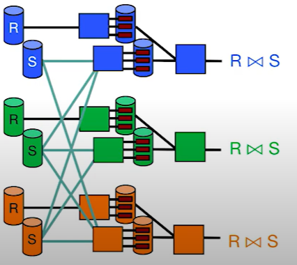

# CS186-L18: Parallel Query Processing

## Intro to Parallelism

## Architectures and Software Structures

we will focus on the shared-nothing here :yum:

## Kinds of Query Parallelism

side note:
- intra: single
- inter: multiple at the same level

## Parallel Data Acceess
### Data Partitioning across Machines

Round robin means that each machine haves the same shuffled data
### parallel scans
scan and merge

$\sigma_p$ : an operator that skip entire sites that have no matching tuples in *range or hash partitioning*

### lookup by key
if data partitioned on function of key, then Route lookup only to the relevant nodes

otherwise, broadcast lookup to all nodes

### insert
if on function of key, insert only to the relevant nodes

else insert to any nodes

insert an unique key seems to be same

### parallel hash join
#### naive hash join

#### grace hash join
Pass one is like hashing above, but do it 2x-- once for each relation being joined

Pass two is local grace hash join per node

## sort-merge join

回到均分问题了

然后和上面一样读取分配两次for join

## parallel aggregation/grouping

naive group by:

## Symmetric Hash Joins
sort and hash can break the pipeline......

## one-sided and Broadcast Joins
### one-sided joins
one is sorted/hashed

### broadcast joins
one is small

