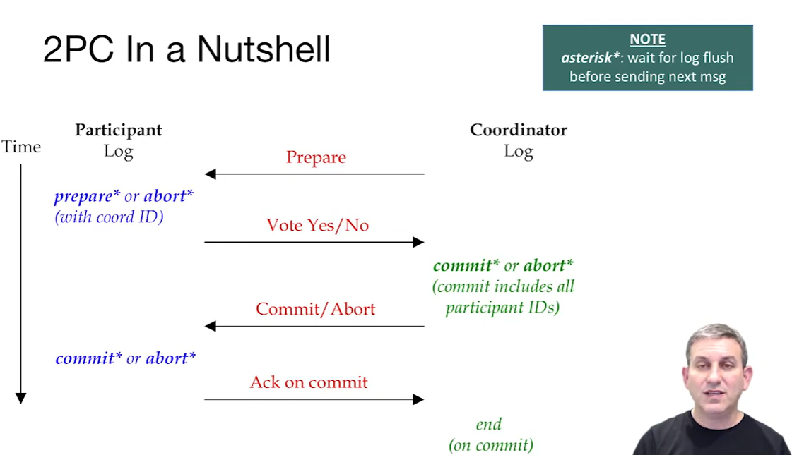

# CS186-L19:  Distributed Transactions

distributed == parallel shared nothing architecture

## Intro

## Distributed Locking
each nodes has lock table locally, can manage the pages/tuples easily, but when it comes to Table, there should be a global lock table （or distributed lock tables）and a *coordinator* to manage the access to the table.

## Distributed Deadlocks Detection

合并全局waits

## Distributed Commit
全局投票

### 2PC

## The Recovery Processes
crash situations

##  2PC, Locking and Availability

2PC + Strict 2PL locking

what if a node is down? some locks can still be held by other nodes......

## Summary

