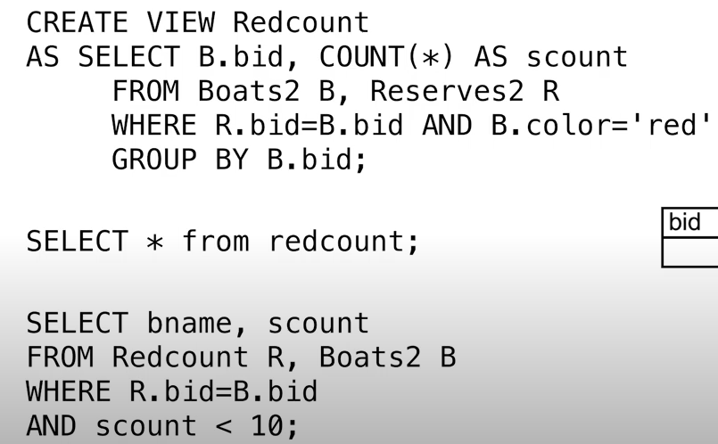

# CS186-L2: SQLⅡ


# 怎么读懂SQL语句？
1. FROM
2. WHERE, to eliminate *rows*
3. SELECT
4. GROUP BY
5. HAVING, to eliminate *groups*
6. DISTINCT
7. ORDER BY, LIMIT, OFFSET等等格式化输出

# Join Queries
## cross product
生成所有的组合，然后过滤掉不符合条件的组合，但是低效

考虑以下sql，更加简洁
```sql  
SELECT S.sid, sname, bid
FROM Sailors AS S, Reserves AS R
WHERE S.sid = R.sid
```

## self join and more aliases
```sql
SELECT x.sname, x.age, 
       y.sname AS sname2, y.age AS age2
FROM Sailors AS x, Sailors AS y
WHERE x.age > y.age
```

## inner/natural join
where clause :up: :nerd_face:
看下面
```sql
select s.*, r.bid
from sailors as s inner join reserves as r
on s.sid = r.sid
```


## left outer join
- returns all matched rows, and preserves all unmatched rows from the left table of the join clause

`NULL`出现

`FULL OUTER JOIN`等等同理
```sql
select r.sid, r.bid, b.bname
from reserves as r full outer join boats as b
on r.bid = b.bid
```

# Arithmetic Expressions
注意SELECT和WHERE
```sql
SELECT salary * 1.1 AS new_salary
FROM Employees
WHERE 2*salary > 10000
```
use sql as calculator :nerd_face:
```sql
SELECT 
    log(1000) as three,
    exp(ln(2)) as two,
    cos(pi()) as zero,
    ln(2*3) = ln(2) + ln(3) as sanity;
```

# string functions
old way :raised_eyebrow:
```sql
SELECT s.sname
FROM Sailors AS s
WHERE s.sname LIKE 'a_%'
```
new way :sunglasses: use regular expressions!
```sql
SELECT s.sname
FROM Sailors AS s
WHERE s.sname ~ 'a.*'
```

# bool and combining
```sql
SELECT r.sid
FROM boats as b, reserves as r
WHERE b.bid = r.bid AND (b.color = 'blue' OR b.color = 'green')
```

以上两者等价

看下面两个
```sql
SELECT r.sid
FROM boats as b, reserves as r
WHERE b.bid = r.bid AND (b.color = 'blue' AND b.color = 'green')
```
return nothing :exploding_head:

返回即预定了红船又预定了绿船的人 :nerd_face:
# Set Operations
## only set
union, intersect, except, 返回的都是`集合`，没有重复
## multiset
- UNION ALL: 返回所有元素，包括重复元素 `sum`
- INTERSECT ALL: 返回交集，包括重复元素 `min`
- EXCEPT ALL: 返回差集，包括重复元素 `minus`

# Nested Queries
subquery :grinning:
```sql
select s.sname
from sailors as s
where s.sid in (select r.sid 
                 from reserves as r 
                 where r.bid = 6767)
```
`NOT IN` 同理即可

考虑`EXISTS`， 非空即可返回

另一个例子
```sql
select s.sname
from sailors as s
where exists (select * 
                 from reserves as r where r.sid = s.sid and r.bid = 6767)
```
具体来说，查询中包含了一个`EXISTS`条件，这个条件中的子查询是与主查询相关的。每当主查询处理Sailors表中的一行时，都会将该行中的sid值带入子查询中进行计算，以确定这行数据是否满足条件（即是否存在一条对应的Reserves记录）。这样，子查询的计算会随着Sailors表中行的不同而变化，因此需要为每一行重新计算。

这意味着，如果Sailors表中有很多行，子查询也会被执行很多次，这可能会*影响查询的性能*。

考虑`ANY`， `ALL`
```sql
SELECT s.sname
FROM sailors AS s
WHERE s.age > ANY
                  (SELECT AVG(age) 
                  FROM sailors)
```

# 关系除法

这个PPT展示了一个关于“关系除法”（Relational Division）的SQL查询的例子，目的是寻找那些已经预订了所有船只的水手。通过这种查询，我们可以找到那些没有漏掉任何一艘船只预订的水手。

### 理解步骤：

1. **关系除法的定义**：
   - 关系除法是一种复杂的SQL查询操作，用于找到那些在一个集合中对所有元素都满足某个条件的记录。
   - 在这个例子中，我们想找到那些预订了所有船只的水手。

2. **查询的逻辑**：
   - **外层查询**：`SELECT S.sname FROM Sailors S`：选择所有水手的名字。
   - **NOT EXISTS子查询**：这个部分是关键：
     ```sql
     WHERE NOT EXISTS (
       SELECT B.bid
       FROM Boats B
       WHERE NOT EXISTS (
         SELECT R.bid
         FROM Reserves R
         WHERE R.bid = B.bid AND R.sid = S.sid
       )
     )
     ```
   - 逻辑解释：
     - 首先，查询了所有的船只 (`Boats B`)。
     - 对于每艘船，只要存在一艘船 (`B.bid`)，当前水手 (`S.sid`) 没有预订 (`R.sid = S.sid AND R.bid = B.bid`)，那么这个水手就会被排除。
     - 如果对于某个水手，不存在这样一艘他没有预订的船（即`NOT EXISTS`的结果为真），那么这个水手就满足预订了所有船的条件。

3. **结论**：
   - 最终的查询将会返回那些名字是水手并且预订了每一艘船的人。

# ARGMAX 
- find the sailor with the highest rating
```sql
select *
from sailors as s
where s.rating >= ALL
                  (SELECT sailors.rating 
                   FROM sailors)
```

```sql
select *
from sailors as s
where s.rating = (SELECT MAX(sailors.rating) 
                   FROM sailors)
```

注意下面这个 :coffee:
```sql
select *
from sailors as s
order by s.rating desc
limit 1
```

## ARGMAX GROUP BY
提示：借助视图筛选
# Creating Views

有时候不需要建立显式的views
```sql
select b, c
from boats as b, 
(select b.bid, count(*)
from reserves as r, boats as b
where r.bid = b.bid and b.color = 'blue'
group by b.bid) as Reds(bid, c)
where b.bid = Reds.bid
```
有时候CTE（common table expression）表示法更加简洁

注意`WITH`从句后面能建立多个视图，记得加上逗号！

# NULL
## NULL的比较

不要使用`=`，而是使用`IS NULL`或`IS NOT NULL`
- `IS NULL` : 左边是NULL
- `IS NOT NULL` : 左边不是NULL  

## NULL in boolean expressions
首先， 形如`WHERE NULL`是不合法的！

三值逻辑表如下


## NULL in aggregation functions


接下来就是implement! :grinning:
