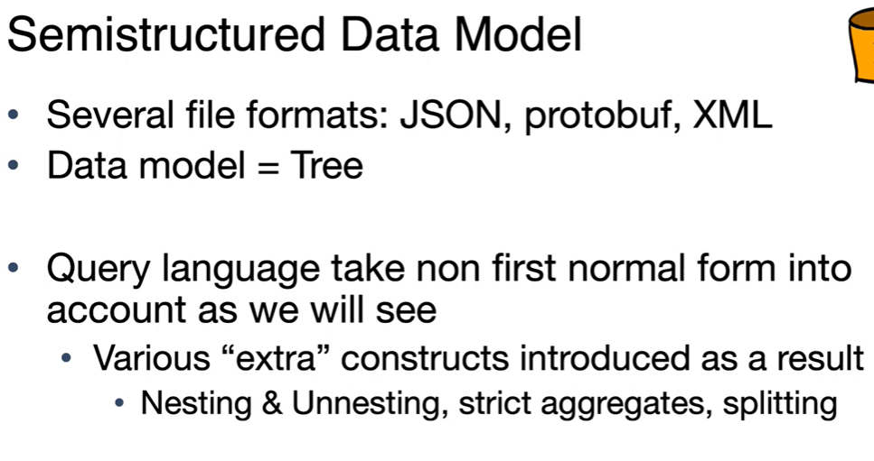

# CS186-L20: NoSQL


## Scaling Relational Databases isn't always the best option
including *partitioning* and *replication*

BUT, consistency is hard to enforce!


## Taxonomy of NoSQL Data Models
### Key-Value Stores
```java
Map<Key, Value>
get/put
```
Distribution / Partitioning, just using hash function
- if no replication, key k is stored on $h(k)$ node
- if multi-way replication, key k is stored on $h_i(k), i=1,2,...,n$ nodes


### Extensible Record Stores

the idea is that do not use a simple key to lookup :thinking:

### Document Stores
#### JSON Documents
using JSON as example


do not store replicated key!

JSON is a Tree :wood:, Self-describing :speech_balloon:, and Flexible :fire:

can store Json in RDBMS
```sql
SELECT # FROM people
WHERE person @> '{"name": "John Doe", "age": 30}';
```

#### mapping between JSON and Relational Data
Relational Data Model ===> JSON Document
easy, note that replicated key can be handled by using a array [  ]

JSON Document ===> Relational Data Model
- using NULL to represent missing values
- nested or replicated data? hard to handle! **multi-tables** may help :thinking:



## Introduction to MongoDB

基本语法
### select and find


```mongo
db.collection.find(<predicate>, optional<projection>) 
db.inventory.find({}) // return all documents
```


### Limit and sort


## MQL Aggregations and Updates


### unwind


### update


## MongoDB internals

